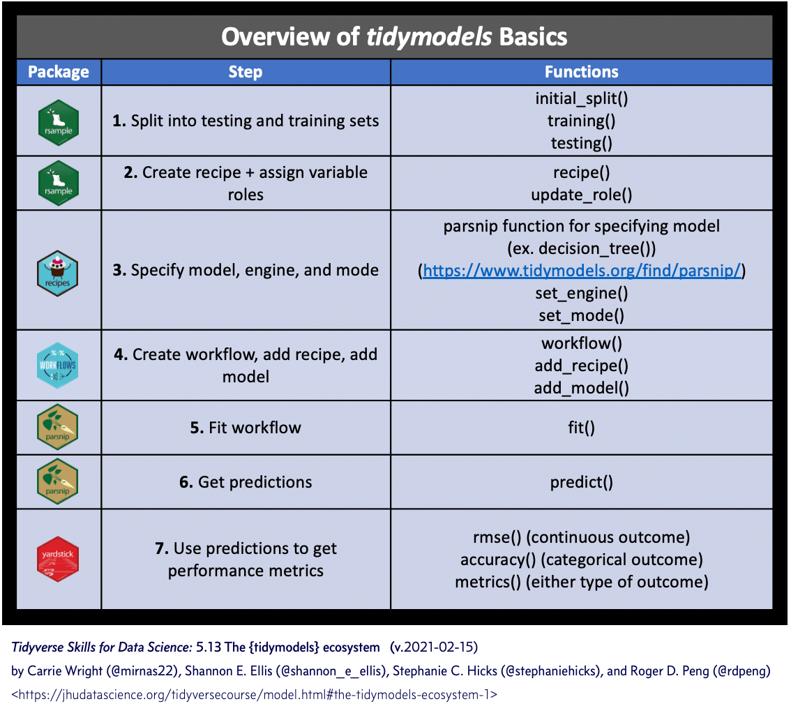
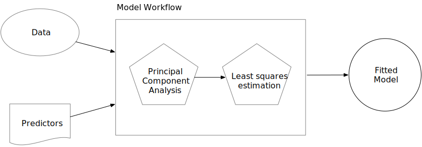

```{r startup, include = FALSE, message = FALSE, warning = FALSE}
knitr::opts_chunk$set(echo=T, eval=T, message=F, warning=F, error=F, comment=NA)
```


# Introduzione 

* Il dataset `ames` contiene dati su 2930 proprietà ad Ames, Iowa, con le seguenti variabili

  * caratteristiche della casa (camere da letto, garage, camino, piscina, veranda, ecc.)
  * posizione (quartiere),
  * informazioni sul lotto (zonazione, forma, dimensione, ecc.),
  * valutazioni di condizione e qualità,
  * prezzo di vendita.

* Esempio discusso in [Tidy Modeling with R](https://www.tmwr.org/)
  - *4. The Ames housing data*
  - *5. Spending our data*
  - *6. Fitting models with `parsnip`*
  - *7. A model workflow*
  - *8. Feature engineering with `recipes`*
  - *9. Judging model effectiveness*
  - *10. Resampling for evaluating performance*
  - *11. Comparing models with resampling*
  - *12. Model tuning and the danger of overfitting*
  
---

```{r}
library(tidyverse)
library(tidymodels)
tidymodels_prefer()
library(modeldata)
library(ggpubr)

data(ames)
dim(ames)
# tipologia di variabili
table(sapply(ames, class))
```

Riferimenti:

* [De Cock (2011)](http://jse.amstat.org/v19n3/decock.pdf)

* [http://jse.amstat.org/v19n3/decock/DataDocumentation.txt](data documentation)


---

.pull-left[
```{r}
gghistogram(ames, x="Sale_Price", bins = 50)
```
]


.pull-right[
```{r}
gghistogram(ames, x="Sale_Price", bins = 50) + scale_x_log10()
```
]

```{r}
ames <- ames %>% mutate(Sale_Price = log10(Sale_Price))
```

---

```{r}
ggscatter(ames, x="Gr_Liv_Area", y="Sale_Price")
```

---

```{r}
library(hexbin)
hexbinplot(Sale_Price ~ Gr_Liv_Area, ames)
```

---

```{r}
hexbinplot(Sale_Price ~ log10(Gr_Liv_Area) | Bldg_Type, ames)
```

---

```{r}
ggplot(ames, aes(x = Latitude, y = Sale_Price)) +
  geom_point(alpha = 0.1) +
  geom_smooth(method = "loess") + 
  theme_bw() 
```

---


```{r}
library(MASS)
ggplot(ames, aes(x = Year_Built, y = Sale_Price)) +
  geom_point(alpha = 0.1) +
  facet_wrap(~ Central_Air, nrow=2) + 
  geom_smooth(method = "rlm") + 
  theme_bw() 
```

---

```{r}
ggscatter(ames, x="Longitude", y="Latitude", color = "Neighborhood") + coord_equal()
```

---

```{r, echo=FALSE,  out.width = '70%'}

```


---

layout: false
class: inverse, middle, center

# 5. Spendere i nostri dati

---

# Training and test

```{r}
set.seed(123)

ames_split <- initial_split(ames, prop = 0.80, strata = Sale_Price)
ames_train <- training(ames_split)
ames_test  <- testing(ames_split)

dim(ames_train)
```

---

background-image: url(https://www.tidymodels.org/start/resampling/img/resampling.svg)
background-size: 60%

---

layout: false
class: inverse, middle, center

# 6. Stima del modello com `parsnip`

---

# Stima del modello

Per stimare i coefficienti del modello
$$y_i = \beta_0 + \beta_1 x_{1i} + \ldots + \beta_p x_{pi}$$
possiamo utilizzare il metodo dei minimi quadrati (penalizzati), e.g. 

```{r, eval = FALSE}
model <- lm(formula, data, ...)

model <- glmnet(x = matrix, y = vector, family = "gaussian", ...)
```

In `tidymodels`, la specificazione di un modello viene unificata:

* Specificare il tipo di modello in base alla sua struttura matematica (ad es. regressione lineare, foresta casuale, K-vicini più vicini, ecc.).

* Specificare il "motore" per la stima del modello, ovvero il pacchetto R da utilizzare.

* Quando richiesto, dichiarare se si tratta di un problema di regressione o di classificazione.

---

```{r}
linear_reg() %>% set_engine("lm")

linear_reg() %>% set_engine("glmnet") 
```

---

```{r}
lm_model <- 
  linear_reg() %>% 
  set_engine("lm")

lm_fit <- 
  lm_model %>% 
  fit(Sale_Price ~ Longitude + Latitude, data = ames_train)

lm_xy_fit <- 
  lm_model %>% 
  fit_xy(
    x = ames_train %>% select(Longitude, Latitude),
    y = ames_train %>% pull(Sale_Price)
    )
# La funzione fit_xy() passa i dati così come sono al modello sottostante. (e.g. non creerà variabili dummy da predittori qualitativi).

tidy(lm_fit)
```

---

# Previsioni

```{r}
ames_test_small <- ames_test %>% slice(1:5)

predict(lm_fit, new_data = ames_test_small) 
```

---

# Alberi di regressione

```{r}
tree_model <- 
  decision_tree(min_n = 2) %>% 
  set_engine("rpart") %>% 
  set_mode("regression")

tree_fit <- 
  tree_model %>% 
  fit(Sale_Price ~ Longitude + Latitude, data = ames_train)

predict(tree_fit, ames_test_small)
```

---

layout: false
class: inverse, middle, center

# 7. Flusso di lavoro per il modello

---


```{r, echo = FALSE, out.width = '80%', warning = FALSE}
knitr::include_graphics("images/bad-workflow.svg")
```


```{r, echo = FALSE, out.width = '80%', warning = FALSE}

```

---

```{r}
lm_wflow <- 
  workflow() %>% 
  add_model(lm_model) %>%
  add_formula(Sale_Price ~ Longitude + Latitude)

lm_wflow

lm_fit <- fit(lm_wflow, ames_train)
```


---

layout: false
class: inverse, middle, center

# 8. Costruzione di variabili con `recipes`

---

```{r}
lm(Sale_Price ~ Neighborhood + log10(Gr_Liv_Area) + Year_Built + Bldg_Type, data = ames)
```

---

```{r}
simple_ames <- 
  recipe(Sale_Price ~ Neighborhood + Gr_Liv_Area + Year_Built + Bldg_Type,
         data = ames_train) %>%
  step_log(Gr_Liv_Area, base = 10) %>% 
  step_dummy(all_nominal_predictors())

simple_ames
```

---

```{r}
simple_ames_trained <- prep(simple_ames, training = ames_train, verbose = TRUE)
simple_ames_juiced <- juice(simple_ames_trained)
dim(simple_ames_juiced)
simple_ames_baked <- bake(simple_ames_trained, new_data = ames_test)
dim(simple_ames_baked)
```

---

```{r}
lm_wflow <- 
  lm_wflow %>% 
  remove_variables() %>% 
  add_recipe(simple_ames)

lm_wflow
```


---

```{r}
ggplot(ames_train, aes(y = Neighborhood)) + 
  geom_bar() + 
  theme_bw() +
  labs(y = NULL)
```

---

# Variabili dummy

```{r}
simple_ames <- 
  recipe(Sale_Price ~ Neighborhood + Gr_Liv_Area + Year_Built + Bldg_Type,
         data = ames_train) %>%
  step_log(Gr_Liv_Area, base = 10) %>% 
  step_other(Neighborhood, threshold = 0.01) %>% 
  step_dummy(all_nominal_predictors())
```

---

```{r}
ggplot(ames_train, aes(x = Gr_Liv_Area, y = Sale_Price)) + 
  geom_point(alpha = .2) + 
  facet_wrap(~ Bldg_Type) + 
  geom_smooth(method = lm, formula = y ~ x, se = FALSE, col = "red") + 
  theme_bw() +
  labs(x = "Gross Living Area", y = "Sale Price (USD)")
```

---


```{r}
ggplot(ames_train, aes(x = Gr_Liv_Area, y = Sale_Price)) + 
  geom_point(alpha = .2) + 
  facet_wrap(~ Bldg_Type) + 
  geom_smooth(method = lm, formula = y ~ x, se = FALSE, col = "red") + 
  theme_bw() +
  labs(x = "Gross Living Area", y = "Sale Price (USD)")
```

---

# Interazioni

```{r}
simple_ames <- 
  recipe(Sale_Price ~ Neighborhood + Gr_Liv_Area + Year_Built + Bldg_Type,
         data = ames_train) %>%
  step_log(Gr_Liv_Area, base = 10) %>% 
  step_other(Neighborhood, threshold = 0.01) %>% 
  step_dummy(all_nominal_predictors()) %>% 
  # Gr_Liv_Area is on the log scale from a previous step
  step_interact( ~ Gr_Liv_Area:starts_with("Bldg_Type_") )
```

---

# Funzioni spline

```{r}
library(patchwork)
library(splines)

plot_smoother <- function(deg_free) {
  ggplot(ames_train, aes(x = Latitude, y = Sale_Price)) + 
    geom_point(alpha = .2) + 
    scale_y_log10() +
    geom_smooth(
      method = lm,
      formula = y ~ ns(x, df = deg_free),
      col = "red",
      se = FALSE
    ) + theme_bw() +
    ggtitle(paste(deg_free, "Spline Terms"))
}
```

---

```{r}
( plot_smoother(2) + plot_smoother(5) ) / ( plot_smoother(20) + plot_smoother(100) )
```

---

```{r}
recipe(Sale_Price ~ Neighborhood + Gr_Liv_Area + Year_Built + Bldg_Type + Latitude,
         data = ames_train) %>%
  step_log(Gr_Liv_Area, base = 10) %>% 
  step_other(Neighborhood, threshold = 0.01) %>% 
  step_dummy(all_nominal_predictors()) %>% 
  step_interact( ~ Gr_Liv_Area:starts_with("Bldg_Type_") ) %>% 
  step_ns(Latitude, deg_free = 20)
```

---

layout: false
class: inverse, middle, center

# 9. Valutare l'efficacia di un modello

---

```{r}
ames_rec <- 
  recipe(Sale_Price ~ Neighborhood + Gr_Liv_Area + Year_Built + Bldg_Type + 
           Latitude + Longitude, data = ames_train) %>%
  step_log(Gr_Liv_Area, base = 10) %>% 
  step_other(Neighborhood, threshold = 0.01) %>% 
  step_dummy(all_nominal_predictors()) %>% 
  step_interact( ~ Gr_Liv_Area:starts_with("Bldg_Type_") ) %>% 
  step_ns(Latitude, Longitude, deg_free = 20)
  
lm_model <- linear_reg() %>% set_engine("lm")

lm_wflow <- 
  workflow() %>% 
  add_model(lm_model) %>% 
  add_recipe(ames_rec)

lm_fit <- fit(lm_wflow, ames_train)
```


---

```{r}
ames_test_res <- bind_cols(
  predict(lm_fit, new_data = ames_test %>% select(-Sale_Price)), 
  ames_test %>% select(Sale_Price))
ames_test_res
```


---

```{r}
ggscatter(ames_test_res, x="Sale_Price", y=".pred") + geom_abline(lty = 2)
```

---

```{r}
ames_metrics <- metric_set(rmse, rsq, mae)
ames_metrics(ames_test_res, truth = Sale_Price, estimate = .pred)
```


