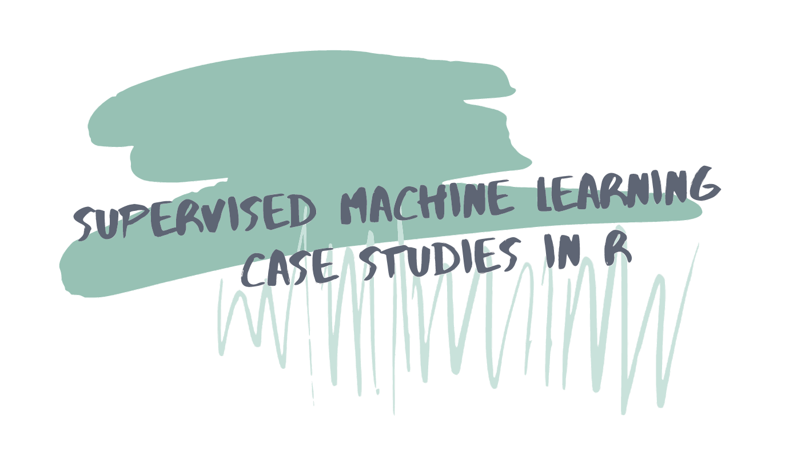

```{r startup, include = FALSE, message = FALSE, warning = FALSE}
knitr::opts_chunk$set(echo=T, eval=T, message=F, warning=F, error=F, comment=NA)
```


# I dati delle automobili

* Tratto dal libro AS, Capitolo 2.1

* I dati delle automobili si riferiscono alle caratteristiche di 203 modelli di automobili importati negli USA nel 1985

* I dati originali sono disponibili qui: [ftp://ftp.ics.uci.edu/pub/machine-learning-databases/autos](ftp://ftp.ics.uci.edu/pub/machine-learning-databases/autos)
Questi dati sono stati elaborati convertendo le unità di misura, eliminado alcune variabili originarie, correggendo alcuni nomi di marche, etc.

* Obiettivo: prevedere il consumo di carburante (o, equivalentemente, la distanza percorsa per unità di carburante) in funzione di determinate caratteristiche di un'automobile

---


* brand   :             manufacturer (factor, 22 levels), casa produttrice (fattore, 22 livelli) 
* fuel    :       type of engine fuel (factor, 2 levels: diesel, gasoline), tipo di alimentazione del motore (fattore, 2 livelli) 
* aspiration :          type of engine aspiration (factor, 2 levels: standard, turbo), tipo di aspirazione del motore (fattore, 2 livelli)   
* bodystyle :         type of body style (factor, 5 levels: hardtop, wagon, sedan, hatchback, convertible),  tipo di carrozzeria (fattore, 5 livelli)  
* drive.wheels :       type of drive wheels (factor,  3 levels: 4wd, fwd, rwd), tipo di trazione (fattore,  3 livelli)    
* engine.location :    location of engine (factor, 2 levels: front, rear), posizione del motore (fattore, 2 livelli)  
* wheel.base :         distance between axes (cm), distanza tra gli assi (cm) 
* length :             length (cm), lunghezza (cm)      
* width :              width (cm), larghezza (cm)    
* height :             height (cm), altezza (cm)    
* curb.weight :        weight (kg), peso (kg)   
* engine size :        engine size (l), cilindrata (l)   
* compression.ratio :   compression ratio, rapporto di compressione   
* HP :                  horsepower, cavalli motore   
* peak.rot     :       number of peak revolutions per minute, numero di giri massimi del motore al minuto    
* __city.distance__ :      city distance covered (km/l), percorrenza urbana (km/l)   
* highway.distance :    highway distance (km/l), percorrenza extra urbana (km/l)  
* n.cylinders  :       number of cylinders, numero di cilindri

---


```{r}
rm(list=ls())
auto <- read.table("http://azzalini.stat.unipd.it/Book-DM/auto.dat", header=TRUE, quote="\"")
dim(auto)
# ci sono dati mancanti?
sum(is.na(auto))
```


---

```{r}
# tipologia di variabili
str(auto)
auto$fuel <- factor(auto$fuel)
```

---


```{r}
# dataset ridotto
names(auto)[which(names(auto)=="city.distance")] <- "y"
vars <- c("y", "engine.size","n.cylinders","curb.weight","fuel")
train <- auto[,vars]
pairs(train[,-5], col=train$fuel)
```

---


.pull-left[
```{r}
# y: istogramma
hist(train$y)
```
]


.pull-right[
```{r}
# y: density plot
plot(density(train$y))
```
]

---

.pull-left[
```{r}
# diagramma di dispersione
plot(y~engine.size, train, col=fuel) 
```
]

.pull-right[
```{r}
# jitter
plot(jitter(y)~jitter(engine.size), train, col=fuel) 
```
]

---

$$Y = \beta_1 + \beta_2 \mathrm{engine.size} + \beta_3 \mathrm{engine.size}^2 + \beta_4 \mathrm{engine.size}^3 + \beta_5 I\{\mathrm{fuel} = \mathrm{gas}\} + \varepsilon$$

```{r}
fit1 <- lm(y ~ poly(engine.size, degree=3, raw=T) + fuel, train)
```

```{r, echo=FALSE}
x <- seq(1,5.5,  length=200)
beta<- coef(fit1)
plot(y ~ engine.size, col=fuel, train)
lines(x, beta[1]+ beta[2]*x+beta[3]*x^2+beta[4]*x^3)
lines(x,  beta[1]+ beta[2]*x+beta[3]*x^2+beta[4]*x^3+beta[5],col="red")
```

---

$$1/y = \beta_1 + \beta_2 \mathrm{engine.size} +  \beta_3 I\{\mathrm{fuel} = \mathrm{gas}\}+ \varepsilon$$

```{r}
fit2<-lm(1/y ~ engine.size + fuel, train)
```

.pull-left[
```{r, echo=FALSE}
plot(1/y ~ engine.size, col=fuel, train)
beta<- coef(fit2)
abline(beta[1:2])
abline(beta[1]+beta[3], sum(beta[2]) , col=2)
```
]

.pull-right[
```{r, echo=FALSE}
plot(y ~ engine.size, col=fuel, train)
lines(x, 1/(beta[1]+ beta[2]*x))
lines(x, 1/(beta[1]+beta[3]+ beta[2]*x),  col=2)
```
]


---

$$\log(y) = \beta_1 + \beta_2 \log(\mathrm{engine.size}) +  \beta_3 I\{\mathrm{fuel} = \mathrm{gas}\} + \varepsilon$$
```{r}
fit3 <- lm(log(y) ~ log(engine.size) + fuel, train)
```

.pull-left[
```{r, echo=FALSE}
plot(log(y) ~ log(engine.size), col=fuel, train)
beta<- coef(fit3)
abline(beta[1:2])
abline(beta[1]+beta[3], sum(beta[2]) , col=2)
```
]

.pull-right[
```{r, echo=FALSE}
plot(y ~ engine.size, col=fuel, train)
x <- log(seq(1,5.5,  length=200))
lines(exp(x), exp(beta[1]+ beta[2]*x))
lines(exp(x), exp(beta[1]+beta[3]+ beta[2]*x),  col=2)
```
]

---

.pull-left[
```{r}
plot(fit3, which=1)
```
]

.pull-right[
```{r}
plot(fit3, which=4)
```
]

---

```{r}
train[which(cooks.distance(fit3) > .07), ]
table(train$n.cylinders)
```


---

$$
\begin{aligned}
\log(y) = & \beta_1 + \beta_2 \log(\mathrm{engine.size}) +  \beta_3 I\{\mathrm{fuel} = \mathrm{gas}\}  +\\ 
& +\beta_4 \log(\mathrm{curb.weight})+ \beta_5I\{\mathrm{n.cylinders} = 2\} + \varepsilon
\end{aligned}
$$

```{r}
# MSE.tr
fit1 = update(fit1, . ~ . +  log(curb.weight) + I(n.cylinders==2), train)
mean(resid(fit1)^2) 
fit2 = update(fit2, . ~ . +  log(curb.weight) + I(n.cylinders==2), train)
mean((train$y - 1/fitted(fit2))^2) 
fit3 = update(fit3, . ~ . +  log(curb.weight) + I(n.cylinders==2), train)
mean((train$y - exp(fitted(fit3)))^2) 
```


---
layout: false
class: inverse, middle, center

# Not mtcars AGAIN

---

Esercizio tratto da https://supervised-ml-course.netlify.app/



---

```{r}
rm(list=ls())
library(readr)
cars2018 <- read_csv("https://raw.githubusercontent.com/topepo/supervised-ML-case-studies-course/master/data/cars2018.csv")
library(tidyverse)
glimpse(cars2018)
```

---

```{r}
ggplot(cars2018, aes(x = MPG)) +
    geom_histogram(bins = 25) +
    labs(x = "Fuel efficiency (mpg)",
         y = "Number of cars")
```

---

# Train e test set

```{r}
car_vars <- cars2018 %>%
    select(-Model, -`Model Index`)

library(caret)
library(tidymodels)

car_split <- car_vars %>%
    initial_split(prop = 0.8,
                  strata = Aspiration)

car_train <- training(car_split)
car_test <- testing(car_split)
```

---

# lm e knn

```{r}
## specificazione di un modello lineare
mod_lm <- linear_reg() %>%
    set_engine("lm")

fit_lm <- mod_lm %>%
    fit(log(MPG) ~ ., 
        data = car_train)

## specificazione di un knn
mod_knn <- nearest_neighbor() %>%
    set_mode("regression") %>%
    set_engine("kknn")

fit_knn <- mod_knn %>%
    fit(log(MPG) ~ ., 
        data = car_train)  
```

---

```{r}
results <- car_test %>%
    mutate(MPG = log(MPG)) %>%
    bind_cols(predict(fit_lm, car_test) %>%
                  rename(.pred_lm = .pred)) %>%
    bind_cols(predict(fit_knn, car_test) %>%
                  rename(.pred_knn = .pred))

# Valutazione sul test set
metrics(results, truth = MPG, estimate = .pred_lm)
metrics(results, truth = MPG, estimate = .pred_knn)
```

---

```{r}
car_folds <- vfold_cv(car_train, v = 10)

# Valutazione dei modelli con 10-fold CV
res_lm <- mod_lm %>%
    fit_resamples(
        log(MPG) ~ .,
        resamples = car_folds,
        control = control_resamples(save_pred = TRUE)
    )

res_knn <- mod_knn %>%
    fit_resamples(
        log(MPG) ~ .,
        resamples = car_folds,
        control = control_resamples(save_pred = TRUE)
    )
```

---

```{r}
results <-  bind_rows(res_lm %>%
                          collect_predictions() %>%
                          mutate(model = "lm"),
                      res_knn %>%
                          collect_predictions() %>%
                          mutate(model = "knn"))

head(results)
```

---

```{r}
results %>%
    ggplot(aes(`log(MPG)`, .pred)) +
    geom_abline(lty = 2, color = "gray50") +
    geom_point(size = 1.5, alpha = 0.3)+
    geom_smooth(method = "lm") +
    facet_wrap(~ model)
```

