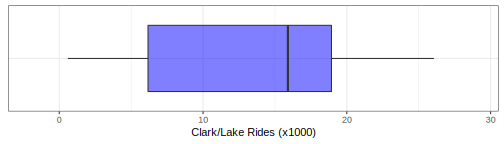

```{r startup, include = FALSE, message = FALSE, warning = FALSE}
knitr::opts_chunk$set(echo=T, eval=T, message=F, warning=F, error=F, comment=NA)
```


# 4.1 Introduction to the Chicago Train Ridership Data

* To illustrate how exploratory visualizations are a critical part of understanding a data set and how visualizations can be used to identify and uncover representations of the predictors that aid in improving the predictive ability of a model, we will be using data collected on ridership on the Chicago Transit Authority (CTA) “L” train system

* The next Figure (Figure 4.1) is the Chicago Transit Authority ‘L’ map. For this illustration, we are interesting in predicting the ridership at the **Clark/Lake station** in the Chicago Loop.

---

<center>

</center>

---

Code requires these packages:

```{r}
library(tidymodels)
library(gridExtra)
library(lubridate)
library(ggiraph)
library(heatmaply)
library(RColorBrewer)
library(scales)

l10_breaks <- scales::trans_breaks("log10", function(x) 10^x)
l10_labels <- scales::trans_format("log10", scales::math_format(10^.x))
```

---

```{r}
load("chicago.RData")
load("stations.RData")

train_plot_data <- 
  training %>% 
  mutate(date = train_days)
```

---

* These data are from Kuhn and Johnson (2020) and contain a training set for modeling the number of people (in thousands) who enter the Clark and Lake L station.

* The date column corresponds to the current date. 

* There are columns with station names (Austin through California)

* These are 14 day lag variables (i.e.  date - 14 days)

* There are columns related to weather and sports team schedules.

---

# 4.2 Visualizations

Examining the distribution of the response

<center>

</center>
.center[Figure 4.2: A box-and-whisker plot of the daily ridership at the Clark/Lake station from 2001 through 2016]

---

```{r}
y_hist <- 
  ggplot(train_plot_data, aes(s_40380)) +   
  geom_histogram(binwidth = .7, col = "#D53E4F", fill = "#D53E4F", alpha = .5) +  
  xlab("Clark/Lake Rides (x1000)") +
  ylab("Frequency") +
  ggtitle("(a)") +
  xlim(-2,29) +
  theme(
    axis.title.x = element_blank(),
    axis.text.x = element_blank(),
    axis.ticks.x = element_blank(),
    axis.title.y = element_blank(),
    axis.text.y = element_blank(),
    axis.ticks.y = element_blank()
  )
```

---

```{r}
y_hist
```


---

```{r}
y_violin <-
  ggplot(train_plot_data, aes(x = "", y = s_40380)) +
  geom_violin(alpha = 0.2) +
  ylab("Clark/Lake Rides (x1000)") +
  ggtitle("(c)") +
  theme(
    axis.title.y = element_blank(),
    axis.text.y = element_blank(),
    axis.ticks.y = element_blank()
  ) +
  coord_flip() +
  ylim(-2,29)
```

---

```{r}
y_violin
```

---

Examining the distribution of the predictors

```{r}
train_plot_data <- 
  train_plot_data %>% 
  mutate(
    pow = ifelse(dow %in% c("Sat", "Sun"), "Weekend", "Weekday"),
    pow = factor(pow)
  )

station_names <- 
  stations %>%
  mutate(lag_14_name = gsub("s_", "l14_", station_id))


```


