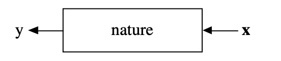
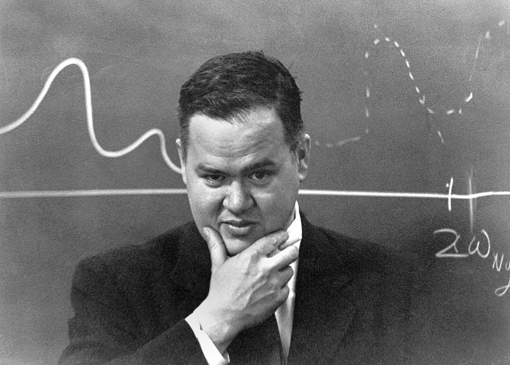
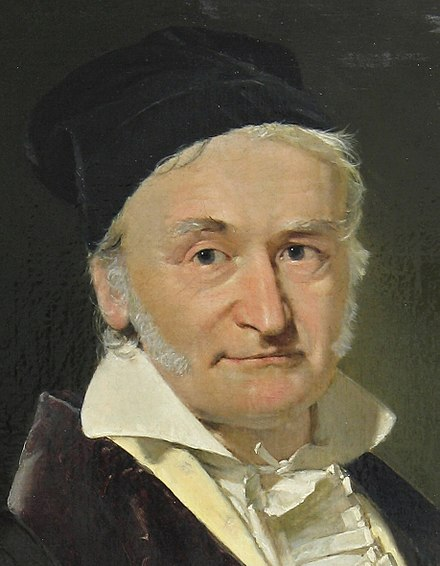

```{r startup, include = FALSE, message = FALSE, warning = FALSE}
knitr::opts_chunk$set(echo = T)
```

<style type="text/css">
.remark-slide-content {
    font-size: 25px;
    padding: 1em 4em 1em 4em;
}
</style>

# Docente

Aldo Solari

* E-mail: aldo.solari@unimib.it

* Ricevimento: su appuntamento concordato via email

* Pagina personale: https://aldosolari.github.io/

---

# Data Science e Data Mining

* Insegnamento **DATA MINING M** (6 CFU) 

* Insegnamento DATA SCIENCE M (12 CFU) 
    * Modulo **DATA MINING** (6 CFU) 
    * Modulo STATISTICAL LEARNING (6 CFU) 

---

# Data Mining: APM e IDL

  * I parte:  **APPLIED PREDICTIVE MODELLING** [APM] (3 CFU, Prof. Solari) 
  
  * II parte: **INTRODUCTION TO DEEP LEARNING** [IDL] (3 CFU, Prof. Borrotti) 

---

# Prerequisiti

Si consiglia la conoscenza degli argomenti trattati nei corsi 

* Probabilità e Statistica Computazionale M  
* Statistica Avanzata M

* (Machine Learning M)

---

# Pagine del corso 

* Pagina MOODLE: https://elearning.unimib.it/course/view.php?id=38065 

* Pagina WEB: https://aldosolari.github.io/DM/

Queste due pagine contengono tutte le informazioni relative al corso e il materiale didattico.

---

# Calendario delle lezioni 

L01 (1 Dicembre 2021 14:30 - 17:30 LAB716)

L02 (3 Dicembre 2021 10:30 - 12:30 LAB908)

L03 (10 Dicembre 2021 10:30 - 12:30 LAB908)

L04 (13 Dicembre 2021 12:30 - 14:30 LAB907)

L05 (15 Dicembre 2021 14:30 - 17:30 LAB716)

L06 (16 Dicembre 2021 16:30 - 18:30 LAB718)

L07 (17 Dicembre 2021 10:30 - 12:30 LAB908)

L08 (20 Dicembre 2021 12:30 - 14:30 LAB907)

Le lezioni si svolgeranno in **modalità duale** (streaming da piattaforma WebEx: https://unimib.webex.com/meet/aldo.solari ). Le lezioni **non saranno registrate**.

---

# Calendario degli esami

|| Sessione || Data || Luogo || Orario ||
|-|-|-|-|-|-|-|-|-|-|
||  || ||  ||  || ||
|| Invernale || 4 Febbraio 2022 || U7-12 || 09:30  ||
|| Invernale || 23 Febbraio 2022 || -  || 09:30 ||
|| Primaverile || - || -  || - ||
|| Estiva || - || -  || - ||
|| Estiva || - || -  || - ||
|| Estiva || - || -  || - ||

---

# Esame APM

* La modalità di verifica consiste nell’analisi di un dataset per il quale bisogna fornire delle **previsioni**, allegando il **codice R** utilizzato per produrle. 

* Oltre alle previsioni, bisognerà produrre una **relazione** contenete la descrizione dell'analisi.

* Verrà valutata sia l'accuratezza delle previsioni (50%) sia la qualità della relazione (40%) e del codice R utilizzato (10%).

* E' richiesto di consegnare le previsioni, il codice R e la relazione sullo spazio dedicato che trovate nella pagina MOODLE **almeno una settimana prima dell’appello d’esame**.

* Sarà possibile consegnare le previsioni e la relazione **una volta sola** per A.A.

* Lo studente oppure il docente può richiedere la prova orale.

---

# Il dataset: Home sales prices 

* Variabile risposta: *price* (in scala log10)

* Numero di covariate: 18

* [Info file](https://aldosolari.github.io/DM/docs/HomePrices/HomePrices_info.txt)

* Training set: $n = 17293$ osservazioni

* Test set: $m = 4320$ osservazioni

* Metrica di valutazione: *Mean Absolute Error* (MAE)

---

# Consegna 

Nominare i file con il proprio numero di matricola (il mio è 2575)

* [2575_previsione.TXT](https://aldosolari.github.io/DM/docs/HomePrices/2575_previsione.txt)

* [2575_codice.R](https://aldosolari.github.io/DM/docs/HomePrices/2575_codice.R)

Includere **solo** il codice indispensabile per ottenere la previsione finale. Il codice **deve** essere riproducibile.

* [2575_relazione.PDF](https://aldosolari.github.io/DM/docs/HomePrices/2575_relazione.pdf)

Il file contiene le linee guida per la relazione.

---

# Libri di testo

[AS] Azzalini, Scarpa (2004). *Analisi dei dati e data mining*, Springer-Verlag Italia

[KJ] Kuhn, Johnson (2019). [Feature Engineering and Selection](http://www.feat.engineering/). Chapman and Hall/CRC

[KS] Kuhn, Silge (2021+). [Tidy Modeling with R](https://www.tmwr.org/). In progress.

---

layout: false
class: inverse, middle, center

# Statistica e Machine Learning

---

| Machine Learning       |             | Statistical models | 
|------------------------|--------------------|-------------|
| target variable | $Y$ | response variable |
| attribute, feature | $X$ | covariate, explanatory variable |
| supervised learning | model $Y$ as a function of $X$ | regression |
| hypothesis | $Y= f(X) + \varepsilon$ | model, regression function |
| instances, examples | $(Y_1,X_1),\ldots,(Y_n,X_n)$ | samples, observations |
| learning | $\displaystyle \hat{f} = \underset{f \in \mathcal{F}}{\arg\min} \sum_{i=1}^{n} \mathrm{loss}(Y_i,f(X_i))$ | estimation, fitting |
| classification | $\hat{Y} = \hat{f}(X)$ | prediction |
| generalization error | $\mathbb{E} [\, \mathrm{loss}(Y,\hat{f}(X))\,]$ | risk |

---

| Machine Learning       |             | Statistical Models | 
|------------------------|--------------------|-------------|
| | FOCUS | |
|prediction |  | inference |
| | CULTURE | |
|algorithmic/optimization |  | modeling |
| | METHODS |  |
|decision trees |  | linear/logistic regression |
|k-nearest-neighbors | | discriminant analysis |
|neural networks | | mixed model |
|support vector machines || ridge/lasso regression |
|adaboost | | GAM |
|...||...|
|random forests | | random forests |

---

# Uno statistico "moderno"

* Il lavoro di Leo Breiman ha contribuito a colmare il divario tra i modelli statistici e il machine learning

* I maggiori contributi di Breiman:
    - Bagging
    - Random Forests
    - Boosting

* __Statistical Learning__ = __Statistical__ Modeling + Machine __Learning__

---

# I due obiettivi

Nel suo articolo del 2001, Leo Breiman sostiene che

> La statistica inizia con i dati. Pensate ai dati come se fossero generati da una scatola nera dove da un lato entra $X$ e 
dall'altro lato esce $Y$ [...]
Ci sono due obiettivi nell'analisi dei dati:




1. **Previsione**
Essere in grado di prevedere i valori futuri di $Y$ avendo a disposizione $X$ (tramite algoritmi di machine learning)
  
2. **Inferenza** 
Spiegare come la natura mette in relazione $X$ con $Y$ (tramite modelli probabilistici) 

---

# Spiegare o prevedere?

Supponiamo che il "corretto" modello sia il seguente:

$$Y = \beta_0 + \beta_1 X_1 + \beta_2 X_2 + \varepsilon$$
Consideriamo ora il seguente modello "sbagliato" (sottospecificato)

$$Y \approx \gamma_0+ \gamma_1 X_1 + \epsilon$$

Per ottenere una buona spiegazione dobbiamo stimare i coefficienti del modello "corretto", tuttavia a volte un modello "sbagliato" può prevedere meglio $Y$:
  - quando le variabili $X_1$ e $X_2$ sono fortemente correlate
  - quando i dati sono molto "rumorosi"
  - quando $\beta_2$ è un valore molto piccolo
  
**Lettura consigliata**: 

To explain or to predict? - [Shmueli (2010)](https://www.stat.berkeley.edu/~aldous/157/Papers/shmueli.pdf)

---

```{r}
simulation <- function(n){
x1 <- rnorm(n)
x2 <- rnorm(n, x1, 0.01)
y <- x1 + x2 + rnorm(n)
fit_oracle <- x1 + x2
fit_correct <- lm(y ~ x1 + x2)
fit_wrong <- lm(y ~ x1)
y_new <- x1 + x2 + rnorm(n)
MSE_oracle <- mean( (fit_oracle - y_new)^2 )
MSE_correct <- mean( (predict(fit_correct) - y_new)^2 )
MSE_wrong <- mean( (predict(fit_wrong) - y_new)^2 )
return(c(MSE_oracle, MSE_correct, MSE_wrong))
}

B = 1000
set.seed(123)
res = replicate(B, simulation(n=10))
row.names(res) <- c("MSE_oracle", "MSE_correct", "MSE_wrong")
rowMeans(res)
```

---
layout: false
class: inverse, middle, center

# Dalla statistica multivariata alla scienza dei dati

---


1. **Statistica Classica**
    - **Analisi multivariata** <br>
      I libri di Anderson (1958) e di Mardia, Kent & Bibby (1979)

    - **Modelli statistici** <br>
      L'articolo di Nelder & Wedderburn (1972) che introduce i GLM

2. **Statistica Computer-Age**
    - **Data Mining**
    
    - **Machine Learning**

3. **Statistica Moderna**
    - **Statistical Learning** <br>
      Il libro di Hastie, Tibshirani & Friedman  (2001) 
      
    - **Data Science**
    
---

# Letture consigliate

```{r, echo=FALSE, fig.align = 'center', out.width = '30%', out.height = '15%'}

```
.center[John Tukey (1915-2000)]

1. The Future of Data Analysis - [Tukey (1962)](https://projecteuclid.org/download/pdf_1/euclid.aoms/1177704711)

2. Data Mining and Statistics: What's the connection? -  [Friedman (1998)](http://docs.salford-systems.com/dm-stat.pdf)

3. Statistical Modeling: The Two Cultures - [Breiman (2001)](http://www2.math.uu.se/~thulin/mm/breiman.pdf)

4. 50 years of Data Science - [Donoho (2015)](https://courses.csail.mit.edu/18.337/2015/docs/50YearsDataScience.pdf)

5. Data Science vs. Statistics: Two Cultures? - [Carmichael and Marron (2018)](https://arxiv.org/pdf/1801.00371.pdf)

---

# Statistical learning

* **Unsupervised learning**
    - i dati sono $p$ variabili $X_1,\ldots,X_p$; nessuna variabile ha uno status "speciale"
    - L'obiettivo è 
          - riduzione della dimensionalità
          - clustering
          - etc.

* **Supervised learning**
    - i dati sono una variabile risposta $Y$ e $p$ predittori $X_1,\ldots,X_p$
    - l'obiettivo è la previsione di $Y$
        - $Y$ continua : problema di __regressione__
        - $Y$ binaria/categoriale : problema di  __classificazione__ 

---

# Gauss è un data scientist?


```{r, echo=FALSE, fig.align = 'center', out.width = '25%', out.height = '30%'}

```
.center[Carl Friedrich Gauss (1777 - 1855)]

---

# I problemi di Gauss

__Problema astronomico__ 

Prevedere in anticipo la posizione dell'asteroide Ceres in data 31 dicembre 1801 sulla base dei dati forniti dall'astronomo italiano Giuseppe Piazzi

__Problema statistico__

Determinare $\boldsymbol{\beta}$ tale che minimizzi $(\mathbf{y} - \mathbf{X}\boldsymbol{\beta})^\mathsf{T}(\mathbf{y} - \mathbf{X}\boldsymbol{\beta})$

La soluzione di Gauss: metodo dei minimi quadrati $\hat{\boldsymbol{\beta}}=(\mathbf{X}^\mathsf{T}\mathbf{X})^{-1}\mathbf{X}^\mathsf{T} \mathbf{y}$


__Problema computazionale__

Risolvere (a mano!) il sistema di equazioni $\mathbf{X}^\mathsf{T}\mathbf{X}\boldsymbol{\beta} = \mathbf{X}^\mathsf{T} \mathbf{y}$

La soluzione di Gauss: algoritmo di ottimizzazione (metodo di eliminazione di Gauss)


