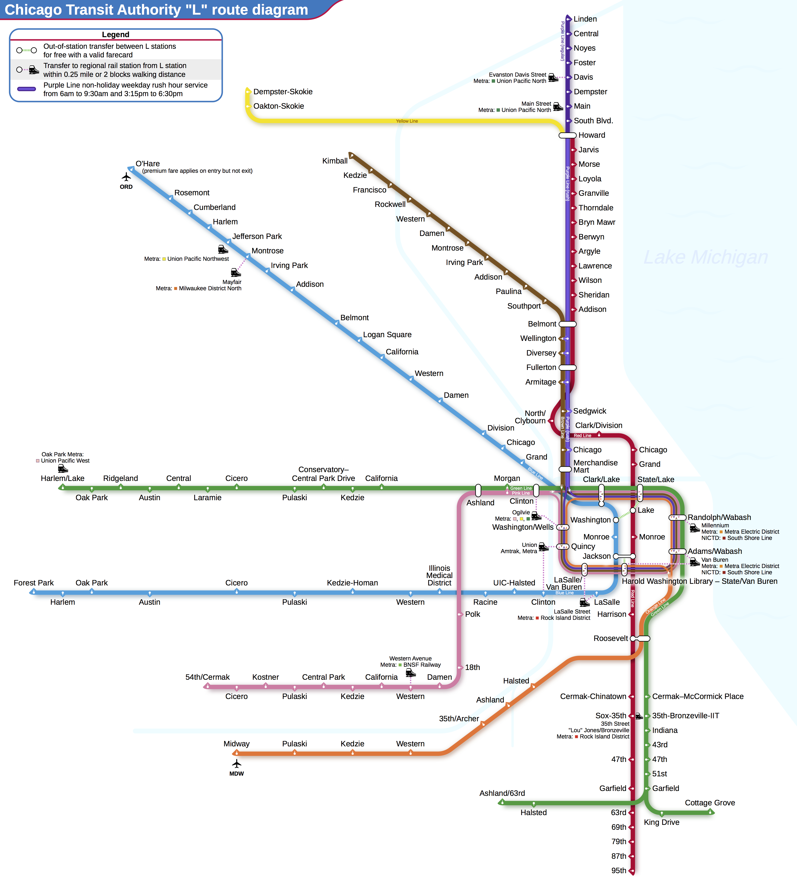
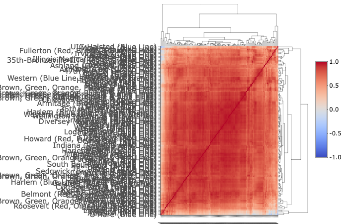
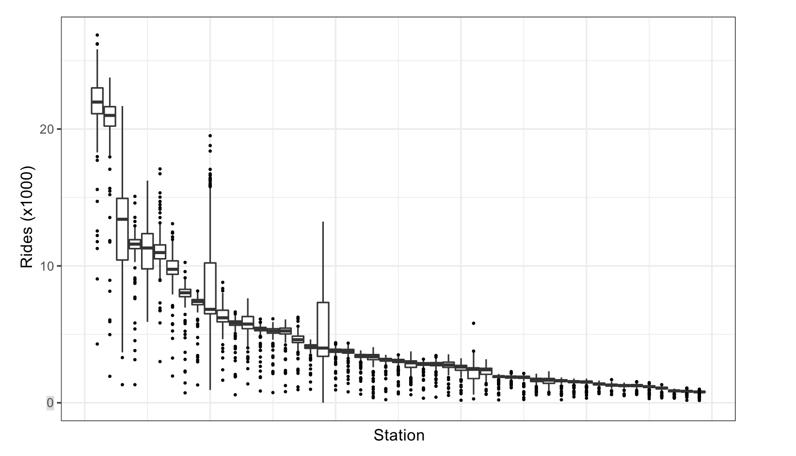
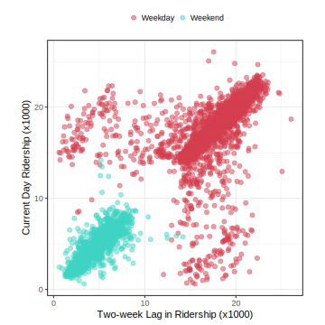
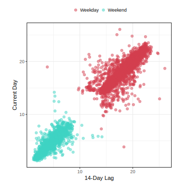
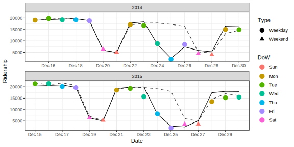
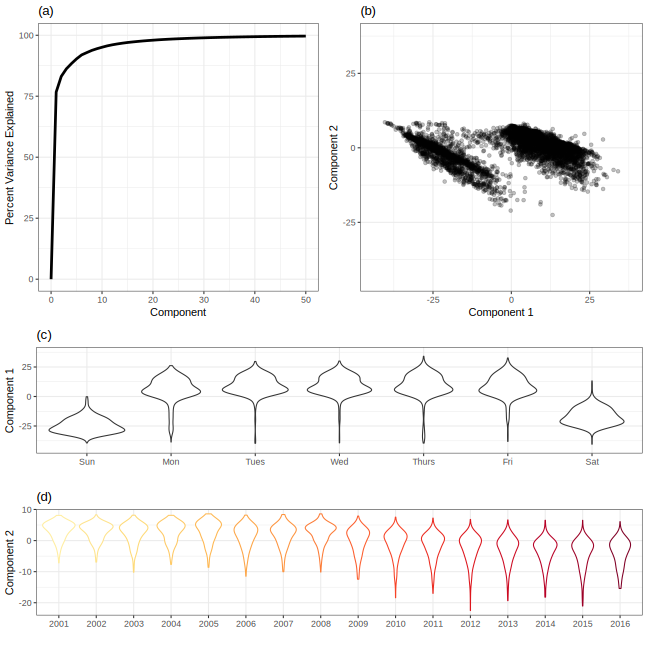
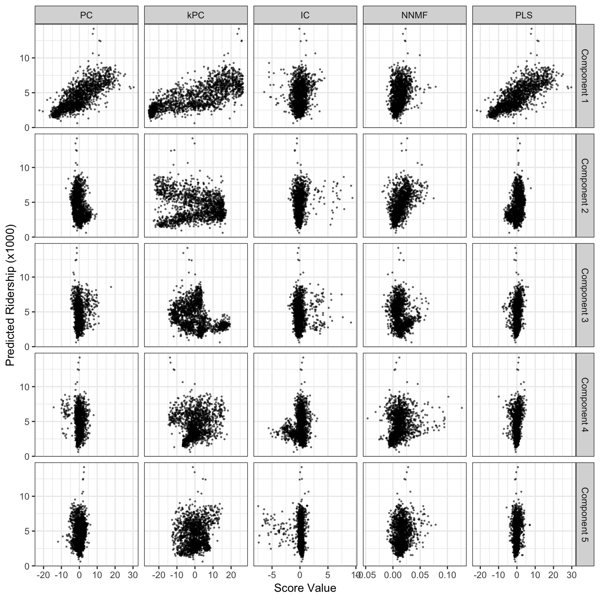

```{r startup, include = FALSE, message = FALSE, warning = FALSE}
knitr::opts_chunk$set(echo=T, eval=T, message=F, warning=F, error=F, comment=NA)
```


# Il processo di analisi dei dati


<center>

</center>
.center[Figure 1.2 del libro KS]


* Prima di tutto, bisogna considerare il processo (spesso sottovalutato) di **pulizia dei dati**

* Successivamente bisogna **capire i dati**. Questa fase viene chiamata *analisi esplorativa dei dati*. 

---

# Analisi esplorativa dei dati

<center>

</center>
.center[Figure 1.2 del libro KS]


* *Exploratory Data Analysis* (termine coniato da J. Tukey, abbreviato in EDA) comprende le operazioni di 

  * **visualizzazione**
  * **trasformazione** 
  * **modellizzazione**

* Tuttavia non ci sono regole ben definite. EDA è fondamentalmente un processo **creativo**.

---

# Visualizzazione, trasformazione e modellizzazione dei dati

Il libro di [Wickham e Grolemund (2016)](https://r4ds.had.co.nz/) [WG] illustra queste operazioni

* __La visualizzazione dei dati__ è un ottimo punto di partenza: ci consente di costruire grafici informativi che aiutano a comprendere i dati (WG, sezione 3)

* __La trasformazione dei dati__ ci consente di creare nuove variabili (*feature engineering*), di escludere le osservazioni anomale, etc. (WG, sezione 5)

* __La modellizzazione dei dati__ rende (matematicamente) precisa la relazione tra le variabili (WG, sezioni 22-25)

* EDA (WG, section 7) è un processo **iterativo**
    * Poniti delle domande sui tuoi dati.
    * Cerca le risposte visualizzando, trasformando e modellando i tuoi dati.
    * Usa ciò che impari per perfezionare le tue domande e/o generare nuove domande.

---

# Il processo di modellizzazione 

* Il processo di modellizzazione è anch'esso un processo **iterativo**.

* Il **modello** *per sé* rappresenta una minima parte del processo di modellizzazione.

* Le fasi principali comprendono

    * *Exploratory data analysis* 
    * *Feature engineering* 
    * *Model fitting / tuning*
    * *Model evaluation*

---

<center>

</center>
.center[Figure 1.3 del libro KS]


---

# Esempio

* In KJ, capitolo 4, viene discussa la modellizzazione dei dati sull'utenza giornaliera del sistema ferroviario pubblico di Chicago 

* I predittori utilizzati sono le date del calendario, la serie storica dell'utenza, il tempo atmosferico e altri fattori

* Il processo di modellizzazione può essere esemplificato con il seguente "monologo interiore" 

---

Figure 4.1: Chicago Transit Authority ‘L’ map. For this illustration, we are interesting in predicting the ridership at the Clark/Lake station in the Chicago Loop.

```{r, echo=FALSE,  out.width = '50%'}

```


---

| Riflessione   | Attività      |
|----------|:-------------:|
| I valori di utenza giornalieri tra le stazioni sono estremamente correlati.|  EDA |
| I valori nei giorni feriali e nel fine settimana sono molto diversi. |  EDA |
| 11 Giugno 2010 ha un numero estremamente elevato di utenze. |  EDA |
| Quali stazioni hanno i valori più bassi? |  EDA |
| Le date dovrebbero essere codificate come giorno della settimana e anno.  |  Feature engineering |
| Forse i predittori correlati potrebbero essere riassunti con una PCA.  |  Feature engineering |
| Le registrazioni meteorologiche orarie potrebbero essere riassunte in misurazioni giornaliere.  |  Feature engineering |
| Iniziamo con una regressione lineare, K-vicini più vicini e un *boosting* di alberi decisionali.  |  Model fitting |
| Quanti vicini K usare?  |  Model tuning |
| Quante iterazioni di *boosting*? Poche o tante?  |  Model tuning |
| Quali modelli hanno il MSE più basso? | Model evaluation |
| Quali giorni sono stati previsti male?  |  EDA |

---

| Riflessione   | Attività      |
|----------|:-------------:|
| I punteggi di importanza delle variabili indicano che le informazioni meteorologiche non sono predittive. Li scarteremo dalla prossima serie di modelli.  |  Model evaluation |
| Sembra che dovremmo concentrarci su molte iterazioni di *boosting*.|  Model evaluation |
| Abbiamo bisogno di codificare le festività per migliorare le previsioni su (e intorno a) quelle date |  Feature engineering |
| Eliminiamo K-NN dall'elenco dei modelli |  Model evaluation |


---

Figure 4.9: Visualization of the correlation matrix of the 14-day lag ridership station predictors for non-holiday, weekdays in 2016. Stations are organized using hierarchical cluster analysis, and the organizational structure is visualized using a dendrogram (top and right).

```{r, echo=FALSE,  out.width = '70%'}

```

---

Figure 4.5: Distribution of daily ridership at the Clark/Lake stop from 2001 to 2016 colored and faceted by weekday and weekend. Note that the y-axis counts for each panel are on different scales and the long left tail in the weekday data.

```{r, echo=FALSE,  out.width = '60%'}
knitr::include_graphics("images/eda-s-40380-distribution-POW-1.svg")
```

---


Figure 4.4: Distribution of weekday ridership at all stations other than Clark/Lake during 2016.


```{r, echo=FALSE,  out.width = '100%'}

```

---

Figure 4.6: A scatter plot of the 14-day lag ridership at the Clark/Lake station and the current-day ridership at the same station.

```{r, echo=FALSE,  out.width = '50%'}

```

---

Figure 4.7: Heat map of ridership from 2001 through 2016 for weekdays that have less than 10,000 rides at the Clark/Lake station. This visualization indicates that the distinct patterns of low ridership on weekdays occur on and around major US holidays.


```{r, echo=FALSE,  out.width = '50%'}
knitr::include_graphics("images/eda-s-40380-low-weekday-1.svg")
```

---

Figure 4.8: Two-week lag in daily ridership versus daily ridership for the Clark/Lake station with common US holidays excluded and colored by part of the week.

```{r, echo=FALSE,  out.width = '50%'}

```

---

Figure 3.12: The effect of adding holiday predictors to an SVM model created for the Chicago train data. The dashed line corresponds to the model of the original predictors. The solid line corresponds to the model when an indicator of holiday was included as a predictor.

```{r, echo=FALSE,  out.width = '100%'}

```

---

Figure 4.13: Principal component analysis of the 14-day station lag ridership. (a) The cumulative variability summarized across the first 10 components. (b) A scatter plot of the first two principal components. The first component focuses on variation due to part of the week while the second component focuses on variation due to time (year). (c) The relationship between the first principal component and ridership for each day of the week at the Clark/Lake station. (d) The relationship between second principal component and ridership for each year at the Clark/Lake station.

```{r, echo=FALSE,  out.width = '40%'}

```

---

Figure 6.9: Score values from several linear projection methods for the weekend ridership at Clark and Lake. The x-axis values are the scores for each method and the y-axis is ridership (in thousands).

```{r, echo=FALSE,  out.width = '50%'}

```

---

<!-- # Concetti importanti -->

<!-- 1. __Evitare il sovra-adattamento__ (*overfitting*) -->

<!-- 2. __Il compromesso distorsione-varianza__  -->

<!-- 3.  __Modellizzazione guidata dall'esperienza vs modellizzazione guidata dai dati__ -->
<!--     - Una persona esperta del contesto applicativo potrebbe avere un'idea precisa di quali dovrebbero essere i predittori da utilizzare nel modello - prima di esaminare i dati -->
<!--     - Tuttavia, a volte risulta preferibile farsi "guidare dai dati" piuttosto che dall'esperienza. Di solito la combinazione di questi due approcci funziona meglio -->

<!-- 4. __Selezione delle variabili__ La presenza di predittori irrilevanti aumentano la variabilità del modello, danneggiandone le prestazioni -->

<!-- 5. __Feature engineering__  Ci sono diversi modi per rappresentare i predittori in un modello, e alcune di queste rappresentazioni sono più efficaci di altre  -->

<!-- --- -->

---

# Pre-processamento dei dati

* **dummy** : i predittori qualitativi richiedono una codifica numerica?

* **zv** : le colonne a varianza (quasi) zero devono essere rimosse?

* **impute** : se mancano alcuni valori, dovrebbero essere imputati?

* **decorrelate** : se ci sono predittori correlati, questa correlazione dovrebbe essere mitigata? Ciò potrebbe significare filtrare i predittori, utilizzare l'analisi delle componenti principali o una tecnica basata su modelli (ad esempio la regolarizzazione)

* **normalize** : i predittori devono essere centrati e riscalati?

* **trasform** : è utile trasformare i predittori in modo che siano più simmetrici?

Si veda l'Appendice del libro KS

---


---

# Pre-processamento dei dati e feature engineering


Si veda https://topepo.github.io/2021_11_HDSI_RUG/#1


