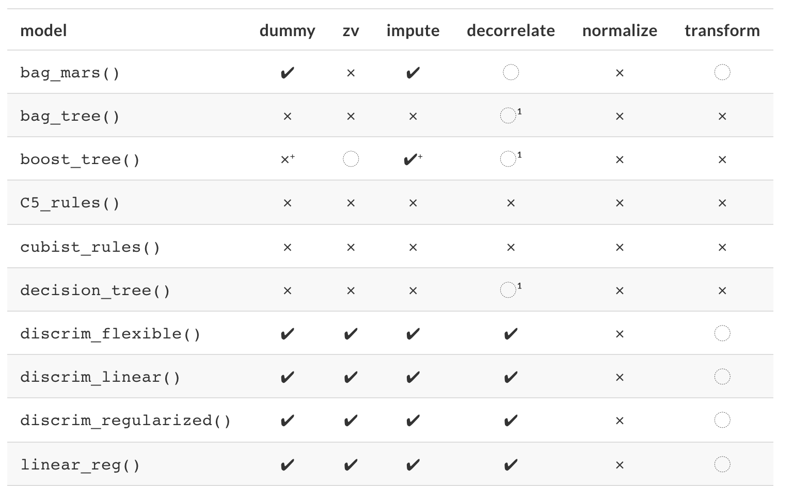

```{r startup, include = FALSE, message = FALSE, warning = FALSE}
knitr::opts_chunk$set(echo=T, eval=T, message=F, warning=F, error=F, comment=NA)
```


# Il processo di analisi dei dati


<center>

</center>
.center[Figure 1.2 del libro KS]


* Prima di tutto, bisogna considerare il processo (spesso sottovalutato) di **pulizia dei dati**

* Successivamente bisogna **capire i dati**. Questa fase viene chiamata *analisi esplorativa dei dati*. 

---

# Analisi esplorativa dei dati

<center>

</center>
.center[Figure 1.2 del libro KS]


* *Exploratory Data Analysis* (termine coniato da J. Tukey, abbreviato in EDA) comprende le operazioni di 

  * **visualizzazione**
  * **trasformazione** 
  * **modellizzazione**

* Tuttavia non ci sono regole ben definite. EDA è fondamentalmente un processo **creativo**.

---

# Visualizzazione, trasformazione e modellizzazione dei dati

Il libro di [Wickham e Grolemund (2016)](https://r4ds.had.co.nz/) [WG] illustra queste operazioni

* __La visualizzazione dei dati__ è un ottimo punto di partenza: ci consente di costruire grafici informativi che aiutano a comprendere i dati (WG, sezione 3)

* __La trasformazione dei dati__ ci consente di creare nuove variabili (*feature engineering*), di escludere le osservazioni anomale, etc. (WG, sezione 5)

* __La modellizzazione dei dati__ rende (matematicamente) precisa la relazione tra le variabili (WG, sezioni 22-25)

* EDA (WG, section 7) è un processo **iterativo**
    * Poniti delle domande sui tuoi dati.
    * Cerca le risposte visualizzando, trasformando e modellando i tuoi dati.
    * Usa ciò che impari per perfezionare le tue domande e/o generare nuove domande.

---

# Il processo di modellizzazione 

* Il processo di modellizzazione è anch'esso un processo **iterativo**.

* Il **modello** *per sé* rappresenta una minima parte del processo di modellizzazione.

* Le sue fasi comprendono

    * *Exploratory data analysis* 
    * *Feature engineering* (KS, capitolo 8)
    * *Model tuning and selection* (KS, capitolo 10)
    * *Model evaluation* (KS, capitolo 11)

---

<center>

</center>
.center[Figure 1.3 del libro KS]


---

# Esempio

* In KJ, capitolo 4, viene discussa la modellizzazione dei dati sull'utenza giornaliera del sistema ferroviario pubblico di Chicago 

* I predittori utilizzati sono le date del calendario, la serie storica dell'utenza, il tempo atmosferico e altri fattori

* Il processo di modellizzazione può essere esemplificato con il seguente "monologo interiore" 

---

| Riflessione   | Attività      |
|----------|:-------------:|
| I valori di utenza giornalieri tra le stazioni sono estremamente correlati.|  EDA |
| I valori nei giorni feriali e nel fine settimana sono molto diversi. |  EDA |
| Un giorno dell'estate del 2010 ha un numero anormalmente elevato di corse. |  EDA |
| Quali stazioni avevano i valori di utenza giornalieri più bassi? |  EDA |
| Le date dovrebbero essere codificate come giorno della settimana e anno.  |  Feature engineering |
| Forse la PCA potrebbe essere utilizzata sui predittori correlati per rendere più semplice l'utilizzo da parte dei modelli.  |  Feature engineering |
| Le registrazioni meteorologiche orarie dovrebbero probabilmente essere riassunte in misurazioni giornaliere.  |  Feature engineering |
| Iniziamo con una regressione lineare, K-vicini più vicini e un *boosting* di alberi decisionali.  |  Model fitting |
| Quanti vicini K usare?  |  Model tuning |
| Quante iterazioni di *boosting*? Poche o tante?  |  Model tuning |
| Quali modelli hanno il MSE più basso? | Model evaluation |
| Quali giorni sono stati previsti male?  |  EDA |


---

| Riflessione   | Attività      |
|----------|:-------------:|
| I punteggi di importanza delle variabili indicano che le informazioni meteorologiche non sono predittive. Li scarteremo dalla prossima serie di modelli.  |  Model evaluation |
| Sembra che dovremmo concentrarci su molte iterazioni di *boosting*.|  Model evaluation |
| Abbiamo bisogno di codificare le funzioni delle festività per migliorare le previsioni su (e intorno a) quelle date |  Feature engineering |
| Eliminiamo K-NN dall'elenco dei modelli |  Model evaluation |


---

# Concetti importanti

1. __Evitare il sovra-adattamento__ (*overfitting*)

2. __Il compromesso distorsione-varianza__ 
    
3.  __Modellizzazione guidata dall'esperienza vs modellizzazione guidata dai dati__
    - Una persona esperta del contesto applicativo potrebbe avere un'idea precisa di quali dovrebbero essere i predittori da utilizzare nel modello - prima di esaminare i dati
    - Tuttavia, a volte risulta preferibile farsi "guidare dai dati" piuttosto che dall'esperienza. Di solito la combinazione di questi due approcci funziona meglio

4. __Selezione delle variabili__ La presenza di predittori irrilevanti aumentano la variabilità del modello, danneggiandone le prestazioni
    
5. __Feature engineering__  Ci sono diversi modi per rappresentare i predittori in un modello, e alcune di queste rappresentazioni sono più efficaci di altre 

---

# Pre-processamento dei dati

* **dummy** : i predittori qualitativi richiedono una codifica numerica?

* **zv** : le colonne a varianza (quasi) zero devono essere rimosse?

* **impute** : se mancano alcuni valori, dovrebbero essere imputati?

* **decorrelate** : se ci sono predittori correlati, questa correlazione dovrebbe essere mitigata? Ciò potrebbe significare filtrare i predittori, utilizzare l'analisi delle componenti principali o una tecnica basata su modelli (ad esempio la regolarizzazione)

* **normalize** : i predittori devono essere centrati e riscalati?

* **trasform** : è utile trasformare i predittori in modo che siano più simmetrici?

Si veda l'Appendice del libro KS

---




