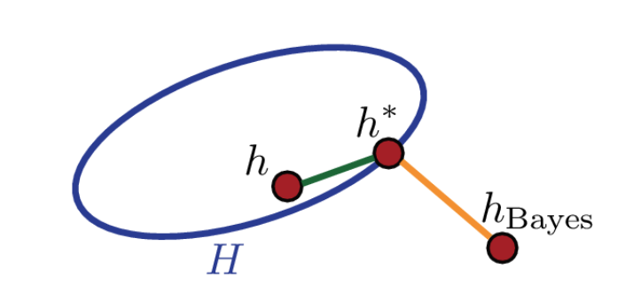
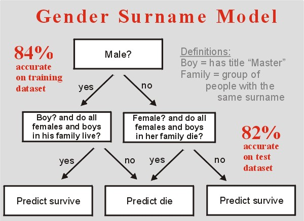

```{r startup, include = FALSE, message = FALSE, warning = FALSE}
knitr::opts_chunk$set(echo = T, eval=T, message=F, warning=F, error=F, comment=NA, cache=F)
```


# Il contesto della classificazione

Siano  $(X,Y) \in \mathcal{X} \times \mathcal{Y}$ variabili casuali con distribuzione congiunta (ignota), dove
* $Y \in \{0,1\}$ è una variabile risposta binaria
* $X=(X_1,\ldots,X_p)^\mathsf{T}$ sono $p$ predittori

Un classificatore è una funzione
$\hat{h}: \mathcal{X} \mapsto \{0,1\}$.
L'errore di classificazione di $\hat{h}$ è definito da
$$\mathrm{Err}(\hat{h}) = \mathbb{P}(Y \neq \hat{h}(X))$$
E' possibile mostrare che l'errore di classificazione è minimizzato dal classificatore di Bayes
$$h_{\mathrm{Bayes}}(x) = \left\{\begin{array}{ll}
1 & \mathrm{se\,\,} \mathbb{P}(Y=1|X=x) >1/2 \\
0 & \mathrm{altrimenti}\\
\end{array}\right.$$


---

# Errore stocastico e di approssimazione

Sia $$h^* = \arg\min_{h \in \mathcal{H}} \mathrm{Err}(h)$$
dove $\mathcal{H}$ è la classe di classificatori considerata. L'errore di previsione si può scomporre in **errore stocastico** $\hat{h} - h^*$ ed **errore di approssimazione** $h^* - h_{\mathrm{Bayes}}$




---

# Errore di training e di test

* Training set: $(x_1, y_1), (x_2,y_2),\ldots, (x_n,y_n)$
* Test set: $(x^*_1, y^*_1), (x^*_2,y^*_2),\ldots, (x^*_m,y^*_m)$


* __Errore di classificazione (training set)__

$$\mathrm{Err}_{\mathrm{Tr}} = \frac{1}{n} \sum_{i=1}^{n} \mathbb{I}\{y_i \neq \hat{h}(x_i) \}$$

* __Errore di classificazione (test set)__
$$\mathrm{Err}_{\mathrm{Te}} = \frac{1}{m} \sum_{i=1}^{m} \mathbb{I}\{y^*_i \neq \hat{h}(x^*_i) \}$$

* __Accuratezza (test set)__
$$\mathrm{Acc}_{\mathrm{Te}} = 1- \mathrm{Err}_{\mathrm{Te}}$$

---

layout: false
class: inverse, middle, center

# I dati Titanic


---

# Il disastro

Il 15 aprile 1912, durante il suo viaggio inaugurale, il Titanic affondò dopo essersi scontrato con un iceberg, causando la morte di 1502 persone (su 2224 tra passeggeri ed equipaggio)


* Training set di $n = 891$ passeggeri, sui quali sono state misurate $10$ variabili (predittori)

* L'obiettivo è prevedere la sorte (1 = sopravissuto, 0 = deceduto) di $m = 418$ passeggeri del test set


---

# Letture consigliate

Si consiglia la lettura di [Varian (2014) Big Data: New Tricks for Econometrics](https://www.aeaweb.org/articles?id=10.1257/jep.28.2.3). In particolare

* l'esempio Titanic (sezione *Classification and Regression Trees*)

* il codice R utilizzato (potete scaricare il [data set](https://www.aeaweb.org/jep/data/2802/2802-0003_data.zip) nella sezione *Additional Materials*)

La competizione Kaggle 
[Titanic: Machine Learning from Disaster](https://www.kaggle.com/c/titanic). In particolare

* [Exploring Survival on the Titanic](https://www.kaggle.com/mrisdal/exploring-survival-on-the-titanic) è un buon tutorial da cui partire

* [Tidy TitaRnic
](https://www.kaggle.com/headsortails/tidy-titarnic) fornisce un buon esempio di EDA

* [Titanic using Name only](https://www.kaggle.com/cdeotte/titanic-using-name-only-0-81818) fornisce un buon esempio di *feature engineering*

---

```{r}
# importazione dei dati
PATH <- "https://raw.githubusercontent.com/aldosolari/DM/master/docs/Titanic/"
train <- read.csv(paste0(PATH,"titanic_tr.csv"), 
                  header = TRUE, stringsAsFactors = FALSE)
n <- nrow(train)
test <- read.csv(paste0(PATH,"titanic_te.csv"), 
                 header = TRUE, stringsAsFactors = FALSE)
m <- nrow(test)
# unisco il training set con il test set
combi <- rbind(train, test)
# controllo la tipologia delle variabili
str(combi)
```

---

# Tipologia di variabili

| Name | Description |
|---|----|
| pclass   |       Passenger Class (1 = 1st; 2 = 2nd; 3 = 3rd) |
| survived    |   Survival (0 = No; 1 = Yes) |
| name      |      Name |
| sex      |       Sex |
| age      |       Age |
| sibsp     |      Number of Siblings/Spouses Aboard |
| parch     |      Number of Parents/Children Aboard |
| ticket    |      Ticket Number |
| fare      |      Passenger Fare |
| cabin     |      Cabin |
| embarked   |     Port of Embarkation  (C = Cherbourg; Q = Queenstown; S = Southampton) |

Si veda il file [http://biostat.mc.vanderbilt.edu/twiki/pub/Main/DataSets/titanic3info.txt](http://biostat.mc.vanderbilt.edu/twiki/pub/Main/DataSets/titanic3info.txt)

---

# Ricodifica di variabili

```{r}
# copia della risposta codificata come factor 
combi$survived01 <- combi$survived
combi$survived <- as.factor(combi$survived01)
levels(combi$survived) = c("Death","Alive")

# test survived NA
testsurvived <- combi$survived[(n+1):(n+m)]
combi$survived[(n+1):(n+m)] <- NA
combi$survived01[(n+1):(n+m)] <- NA

# ricodifica di pclass, sex, embarked in factor
combi$pclass <- as.factor(combi$pclass)
combi$sex <- as.factor(combi$sex)
combi$embarked <- as.factor(combi$embarked)

# cabin contiene valori mancanti codificati con "" invece di NA
combi$cabin[combi$cabin==""] <- NA
```

---

layout: false
class: inverse, middle, center

# Valori mancanti

---

```{r}
library(VIM)
aggr(combi[,-c(2,12)], prop = FALSE, combined = TRUE, numbers = TRUE, sortVars = TRUE, sortCombs = TRUE)
```


---

```{r, echo=F}
aggr(combi[,-c(2,12)], prop = FALSE, combined = TRUE, numbers = TRUE, sortVars = TRUE, sortCombs = TRUE, plot=F)
```

---

# Tariffa (*fare*)

```{r}
# 1 valore mancante in fare
combi[which(is.na(combi$fare)), ]
```

---

# Sostituzione del valore mancante

```{r}
aggregate(fare ~ pclass + embarked, combi, FUN=median)
combi$fare[which(is.na(combi$fare))] <- 8.0500
```

---

# Porto di imbarcazione (*embarked*)

```{r}
# 2 valori mancanti in embarked
combi[which(is.na(combi$embarked)), ]
```

---

# Biglietto (*ticket*)


---

# Prezzo del biglietto per passeggero

```{r}
# distribuzione di frequenza del biglietto
combi$ticketFreq <- ave(1:nrow(combi), combi$ticket, FUN=length)

# prezzo del biglietto per passeggero
combi$price <- combi$fare / combi$ticketFreq
```

---

```{r}
boxplot(price ~ pclass + embarked + sex, data=combi, subset=pclass==1 & sex=="female"); abline(h=40)
combi$embarked[which(is.na(combi$embarked))] <- c("C","C")
```

---

# Età (*age*)

```{r}
# Età come funzione di pclass e sex
aggregate(age ~ pclass + sex, combi, FUN=mean)

# Modello lineare
fit.age <- lm(age ~ sex*pclass, data = combi[!is.na(combi$age),])

# Sostituzione dei valori mancanti
combi$age[is.na(combi$age)] <- predict(fit.age, newdata=combi[is.na(combi$age),])
```

---

layout: false
class: inverse, middle, center

# Analisi esplorativa

---

# Divisione in training and test 

```{r}
train <- combi[1:n,]
test <- combi[(n+1):(n+m),]
```

---

# Modello nullo 

* Training set: il 38.38% dei passeggeri è sopravvissuto
* Il modello nullo utilizza solo $y$ e prevede 'nessun sopravvissuto'

```{r}
round(mean(train$survived01),2)
yhat <- rep("Death",m)
# matrice di confusione
table(Predicted=yhat, True=testsurvived)
# accuratezza
mean(yhat == testsurvived)
```

---

# Sesso (*sex*)

.pull-left[

Prima le donne?

```{r, eval=F}
plot(survived ~ sex, train)
```
]

.pull-right[

```{r, echo=F}
plot(survived ~ sex, train)
```
]

---

```{r}
# modello logistico con solo il sesso
fit <- glm(survived ~ sex, train, family="binomial")
phat <- predict(fit, newdata=test, type = "response")
yhat <- ifelse(phat > 0.5, "Alive","Death")

# matrice di confusione 
table(Predicted=yhat, True=testsurvived)

# accuratezza
mean(yhat == testsurvived)
```

Questo modello classifica i passeggeri del test set in funzione del sesso: se donna, sopravvissuta, se uomo, deceduto.

---

# Classe

.pull-left[

I passeggeri che viaggiavano in prima classe hanno avuto maggiore probabilità di sopravvivenza?

```{r, eval=F}
plot(survived~pclass, train)
```
]

.pull-right[
```{r, echo=F}
plot(survived~pclass, train)
```
]

---

```{r}
# modello logistico con solo pclass
fit <- glm(survived ~ pclass, train, family="binomial")
phat <- predict(fit, newdata=test, type = "response")
yhat <- ifelse(phat > 0.5, "Alive","Death")

# matrice di confusione
table(Predicted=yhat, True=testsurvived)

# accuratezza
mean(yhat == testsurvived)
```

Questo modello classifica i passeggeri del test set in funzione della classe: se prima, sopravvissuto, se seconda o terza, deceduto.


---

# Età

Prima i bambini? Qual è la relazione tra età e sopravvivenza?

```{r}
summary(glm(survived ~ age, train, family="binomial"))$coefficients 
```

---


.pull-left[
```{r, echo=FALSE}
ageclass = cut(train$age, breaks = c(0,10,20,30,40,50,60,70,80))
barplot(prop.table(table(train$survived01==0,ageclass),2), xlab="Age class")
```
]


.pull-right[
```{r, echo=F}
plot(survived ~ age, train)
```
]

---

# Età e classe

```{r, echo=F}
set.seed(123)
class.jitter <- as.numeric(train$pclass)+.7*runif(n)
plot(age ~ class.jitter,xlim=c(.95,3.8),cex=1, xlab="Passenger class",xaxt="n", train)
axis(side=1,at=c(1.4,2.4,3.4),label=c("1st","2nd","3rd"))
points(age[survived01==0] ~ class.jitter[survived01==0],pch=19, train)
```

---

# Albero di classificazione

```{r, echo=F}
set.seed(123)
class.jitter <- as.numeric(train$pclass)+.7*runif(n)
plot(age ~ class.jitter,xlim=c(.95,3.8),cex=1, xlab="Passenger class",xaxt="n", train)
axis(side=1,at=c(1.4,2.4,3.4),label=c("1st","2nd","3rd"))
points(age[survived01==0] ~ class.jitter[survived01==0],pch=19, train)
abline(v=2.85)
rect(1.85,18,4.0,89,col=rgb(0.5,0.5,0.5,1/4))
rect(2.85,-5,4.0,89,col=rgb(0.5,0.5,0.5,1/4))
```


---

# Regola decisionale

.pull-left[
```{r}
library(rpart)
library(rpart.plot)
fit <- rpart(survived ~ pclass + age, train, control=rpart.control(maxdepth =  3))
rpart.plot(fit, type=0, extra=2)
```
]

.pull-right[
| Status | Pr(Death) | Prediction |
|-----------|-----------|------|
| Class 3 |  76% | Death |
| Class 1-2, younger than 18 |  9% | Alive |
| Class 2, older than 18 |  56% | Death |
| Class 1, older than 18 |  39% | Alive | 
]

---


```{r}
yhat <- predict(fit, newdata=test, type="class")

# matrice di confusione
table(Predicted=yhat, True=testsurvived)

# accuratezza
mean(yhat == testsurvived)
```

---

# Modello logistico

| Predictors | Acc.Tr | Acc.Te |
|------------|-------|--------|
| -  |   61.6% |  62.2% |
| age | 61.6% | 62.2% |
| pclass | 67.9% | 67.2% |
| sex | 78.7% | 76.6% |
| age + pclass | 69.1% | 65.3% |
| age + sex | 78.7% | 76.6% |
| pclass + sex | 78.7% | 76.5% |
| age + pclass + sex | 79.5% | 75.6% |

---

# Come migliorare il modello sex-only?

Per migliorare il modello sex-only, dobbiamo capire 

1. quali maschi sopravvivono 

2. quali femmine muoiono

---

# Sesso e età

Molti maschi sopravvissuti sono tra i giovani 

.pull-left[
```{r ,echo=F}
plot(survived~age, train, subset=sex=="male", main="male")
```
]

.pull-right[
```{r, echo=F}
plot(survived~age, train, subset=sex=="female", main="female")
```
]

---

# Sesso e classe

La maggior parte delle femmine che muoiono viaggiano in terza classe

.pull-left[
```{r, echo=F}
plot(survived~pclass, train, subset=sex=="male", main="male")
```
]

.pull-right[
```{r, echo=F}
plot(survived~pclass, train, subset=sex=="female", main="female")
```
]

---

```{r}
# 21/40 maschi sotto i 16 anni sopravvivono
table(train$survived[train$sex=='male' & train$age<16])

# 72/144 femmine che viaggiano in terza classe non sopravvivono
table(train$survived[train$sex=='female' & train$pclass==3])
```


---

layout: false
class: inverse, middle, center

# Feature engineering

---

# Cabina

.pull-left[
```{r}
# the first character of cabin is the deck
table(substr(combi$cabin, 1, 1))
```
]

.pull-right[

]

---

# Titolo

```{r}
combi$name[1]
library(dplyr)
library(stringr)
combi <- combi %>% 
     mutate(title = str_extract(name, "[a-zA-Z]+\\."))
table(combi$title)
combi$title <- factor(combi$title)
```

---

```{r}
plot(survived ~ title, combi[1:n,])
```

---

# Uomo, ragazzo o donna?

.pull-left[
```{r, eval=F}
combi$wbm <- "man"
combi$wbm[grep('Master',combi$name)] <- "boy"
combi$wbm[combi$sex=="female"] <- "woman"
combi$wbm <- factor(combi$wbm)
plot(survived ~ wbm, combi[1:n,])
```
]

.pull-right[
```{r, echo=F}
combi$wbm <- "man"
combi$wbm[grep('Master',combi$name)] <- "boy"
combi$wbm[combi$sex=="female"] <- "woman"
combi$wbm <- factor(combi$wbm)
plot(survived ~ wbm, combi[1:n,])
```
]

---

# Distribuzione di frequenza dei cognomi

```{r}
combi$surname <- substring(combi$name,0,regexpr(",",combi$name)-1)
combi$surnameFreq <- ave(1:nrow(combi),combi$surname,FUN=length)
# famiglie con almeno 5 componenti
table(combi$surname[combi$surnameFreq>4])
```

---

```{r}
train = combi[1:n,]
test = combi[(n+1):(n+m),]
plot(survived ~ as.factor(surname), train[train$surnameFreq==5,])
```


---

# Sopravvivenza di donne e bambini nelle famiglie

```{r}
combi$surname[combi$wbm=='man'] <- 'noGroup'
combi$surname[combi$surnameFreq<=1] <- 'noGroup'
combi$surnamesurvival <- NA
combi$surnamesurvival[1:n] <- ave(combi$survived01[1:n],combi$surname[1:n])
for (i in (n+1):(n+m)) combi$surnamesurvival[i] <- combi$surnamesurvival[which(combi$surname==combi$surname[i])[1]]
```

---

```{r}
combi$predict <- "Death"
combi$predict[combi$wbm=='woman'] <- "Alive"
combi$predict[combi$wbm=='boy' & combi$surnamesurvival==1] <- "Alive"
combi$predict[combi$wbm=='woman' & combi$surnamesurvival==0] <- "Death"
combi$predict <- factor(combi$predict)
plot(predict ~ wbm, combi)
```


---
layout: false
class: inverse, middle, center

# Modello Gender Surname

---



<!-- | Rule | Prediction | -->
<!-- |---|----| -->
<!-- | Man | Death | -->
<!-- | Boy and all females and boys in his family live | Alive | -->
<!-- | Boy and not all females and boys in his family live | Death | -->
<!-- | Female and all females and boys in her family die | Death | -->
<!-- | Female and not all females and boys in her family die | Alive | -->

---

```{r}
yhat <- combi$predict[1:n]
table(Predicted=yhat, True=train$survived)
mean(yhat == train$survived)
yhat <- combi$predict[(n+1):(n+m)]
table(Predicted=yhat, True=testsurvived)
mean(yhat == testsurvived)
```


---

# Confronto tra modelli

| Model | Acc.Tr | Acc.Te |
|---|----|----|
| All-dead | 61.6% |  62.2% |
| Gender-only | 78.7% | 76.6% |
| Gender surname | 85.5% | 80.1% |


