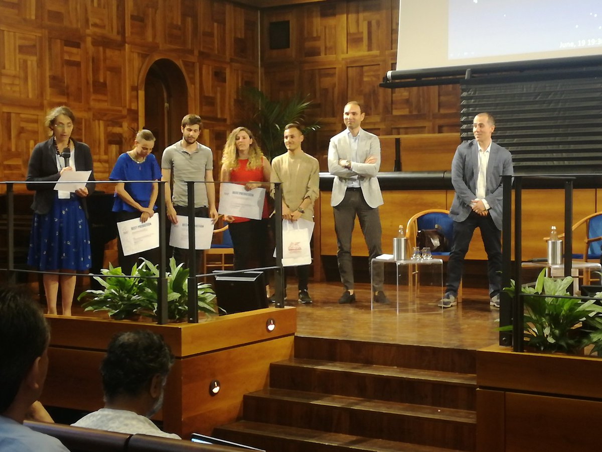

```{r startup, include = FALSE, message = FALSE, warning = FALSE}
knitr::opts_chunk$set(echo = T)
```

<style type="text/css">
.remark-slide-content {
    font-size: 25px;
    padding: 1em 4em 1em 4em;
}
</style>

# Docente

Aldo Solari

* E-mail: aldo.solari@unimib.it

* Ricevimento: su appuntamento concordato via e-mail

* Pagina personale: https://aldosolari.github.io/

---

# Data Mining

* Insegnamento **DATA MINING M** (6 CFU) 

* Insegnamento DATA SCIENCE M (12 CFU) 
    * Modulo **DATA MINING** (6 CFU) 
    * Modulo STATISTICAL LEARNING (6 CFU) 


---

# Pagine del corso 

* Pagina MOODLE: https://elearning.unimib.it/ (accesso con credenziali di Ateneo)

* Pagina WEB: https://aldosolari.github.io/DM/

Tutto il materiale didattico (slides, registrazione delle lezioni etc.) verrà caricato su queste pagine progressivamente con lo svolgimento del corso

---

# Calendario delle lezioni 

.pull-left[

* L01 (1 Ottobre 9:30 - 11:30) 
  
* L02 (5 Ottobre 14:30 - 16:30)
  
* L03 (6 Ottobre 12:30 - 15:30)
  
* L04 (8 Ottobre 9:30 - 12:30) 

* L05 (12 Ottobre 14:30 - 16:30) 

* L06 (13 Ottobre 12:30 - 15:30) 

* L07 (15 Ottobre 9:30 - 12:30) 

* L08 (19 Ottobre 14:30 - 16:30)  

]

.pull-right[

* L09 (20 Ottobre 12:30 - 15:30) 

* L10 (22 Ottobre 9:30 - 12:30) 

* L11 (26 Ottobre 14:30 - 16:30) 

* L12 (27 Ottobre 12:30 - 15:30) 

* L13 (29 Ottobre 9:30 - 12:30) 

* L14 (2 Novembre 14:30 - 16:30) 

* L15 (3 Novembre 12:30 - 15:30) 

* L16 (5 Novembre 9:30 - 12:30) 

]


Le lezioni si svolgeranno in modalità da remoto asincrono con eventi in videoconferenza sincrona


---

# Calendario degli esami

|| Sessione || Data || Luogo || Orario ||
|-|-|-|-|-|-|-|-|-|-|
||  || ||  ||  || ||
|| Autunnale || 18 Novembre 2020 || Telematica ||  14:30||
|| Invernale || 11 Febbraio 2020 || - || -  ||
|| Invernale || 25 Febbraio 2020 || -  || - ||

---

# Esame

L’esame è composto da due parti:

1. Prova scritta

2. Compiti per casa

Il voto finale è dato dalla media dei voti della Prova scritta (50%) e dei Compiti per casa (50%)

Lo studente (oppure il docente) può richiedere la prova orale

---

# 1. Prova scritta

* Domande di teoria ed esercizi

* Può prevedere l'utilizzo di un computer su cui è installato il software R o RStudio

* La prova si svolge in modalità "libro aperto"

---

#  2. Compiti per casa

* Problema 0: Un semplice problema-tipo (10%)

* Problema 1: Competizione Netflix (70%)

* Problema 2: Intervalli di previsione (20%)

Agli studenti che si iscrivono al seguente [form](https://docs.google.com/forms/d/e/1FAIpQLSdOOTc_IcCx8Nzv7JhxqIcs7C3nvTv9mdUS3PpMSMpF7thNxQ/viewform?usp=sf_link) entro il 2 Ottobre 2020 viene data la possibilità di svolgere i compiti per casa in gruppi di (al massimo) tre persone. Gli iscritti verranno suddivisi in gruppi in maniera casuale.  

Per tutti gli altri studenti, il lavoro (individuale) deve essere consegnato almeno una settimana prima della data di esame secondo le modalità previste

Il punteggio ottenuto scade alla fine dell'anno accademico (Ottobre 2021)

---

# Competizione

* Ispirata da [kaggle](https://www.kaggle.com/), la più grande comunità al mondo di data scientist e machine learning

* Dal 2015, questo corso utilizza [BeeViva](http://www.bee-viva.com/competitions), una piattaforma italiana per ospitare le competizioni (grazie al prezioso supporto di Livio Finos, Dario Solari e Tomaso “Minni” Minelli)

* Beeviva è anche utilizzata per l'evento [Stats Under the Stars](http://sus.stat.unipd.it/)

---

# Stats Under the Stars 

.pull-left[


.center[Caffè Pedrocchi, Padova 2015]

]

.pull-left[
* [SUS](http://sus.stat.unipd.it/) Padova 8.9.2015
* [SUS^2](http://www.labeconomia.unisa.it/sus2/) Salerno 7.6.2016
* [SUS^3](http://local.disia.unifi.it/sus3/) Firenze 27.6.2017
* [SUS^4](https://www.unipa.it/dipartimenti/seas/sus4/) Palermo 19.6.2018
* [SUS^5](http://www.sus5.unibocconi.eu/wps/wcm/connect/Site/SUS5/Home) Milano 18.6.2019
* Cancellato l'evento nel 2020
* SUS^6 Pisa ?
]


---

# SUS5

```{r, echo=FALSE, fig.align = 'center', out.width = '50%', out.height = '50%'}

```
.center[Team **GoldFisher** (da sinistra): Beatrice Somaschini, Federico Melograna, Alice Giampino, Nicholas Missineo  - **Best Predictive Performance**]


---

# Libri di testo

* Azzalini, Scarpa (2004). **Analisi dei dati e data mining**, Springer-Verlag Italia

* Gareth, Witten, Hastie, Tibshirani (2013). **Introduction to Statistical Learning with applications in R**. Springer

* Hastie, Tibshirani, Friedman (2009). **The Elements of Statistical Learning**. Springer

* Kuhn, Johnson (2019). **Feature Engineering and Selection**. Chapman and Hall/CRC

* Lewis, Kane, Arnold (2019) **A Computational Approach to Statistical Learning**. Chapman And Hall/Crc

* Wickham, Grolemund (2015) **R for Data Science**. O'Reilly Cookbooks

Tutti i libri di testo (tranne il primo) sono disponibili in formato elettronico presso la [biblioteca](https://www.biblio.unimib.it/it/risorse/accesso-alle-risorse-remoto)


