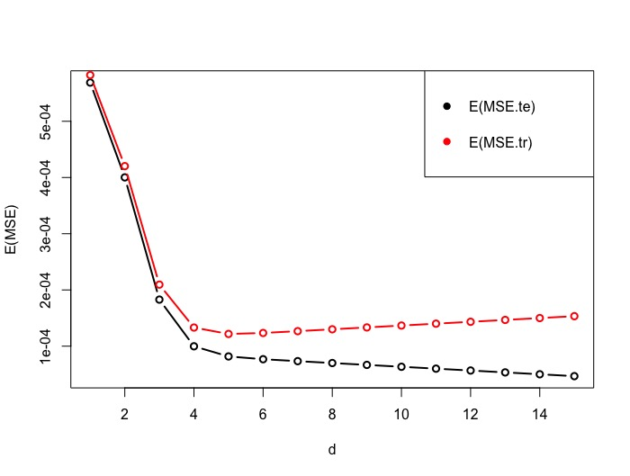

```{r startup, include = FALSE, message = FALSE, warning = FALSE}
knitr::opts_chunk$set(echo = T, eval=T, message=F, warning=F, error=F, comment=NA, cache=F)
```

# Visto che non conosciamo $f(x)...$

* La conclusione della lezione precedente è stata
che dobbiamo operare un compromesso tra le componenti di 
distorsione e di varianza. Operativamente però non possiamo utilizzare la conoscenza di $f(x)$, ovviamente ignota in pratica

* Presenteremo due approcci per stimare l'errore di previsione e scegliere il modello:  
  - Il concetto di ottimismo e i criteri basati sull'informazione
  - Il metodo della convalida incrociata

---

# Stima dell'errore di previsione

* Calcolare l'errore quadratico medio sugli stessi dati con i quali abbiamo stimato il modello non è sembrato molto utile

* Si ricordi l'esempio della regressione polinomiale: $\mathrm{MSE}_{\mathrm{Tr}}$ decresce al crescere di $d$, fino ad arrivare a 0 per $d=n-1$

* Tuttavia se risultasse
$$\mathbb{E}(\mathrm{MSE}_{\mathrm{Te}}) = \mathbb{E}(\mathrm{MSE}_{\mathrm{Tr}}) + \mathrm{costante}$$
allora si potrebbe stimare l'errore (atteso) di previsione come
\begin{aligned}
\widehat{\mathbb{E}(\mathrm{MSE}_{\mathrm{Te}})} &= \widehat{\mathbb{E}(\mathrm{MSE}_{\mathrm{Tr}})} + \mathrm{costante}\\
 &= \mathrm{MSE}_{\mathrm{Tr}} + \mathrm{costante}\\
\end{aligned}
a patto di conoscere il valore della costante

---

# Ottimismo

Si consideri il setting Fixed-X. 

Chiameremo **ottimismo** la differenza 
$$\mathbb{E}(\mathrm{MSE}_{\mathrm{Te}}) - \mathbb{E}(\mathrm{MSE}_{\mathrm{Tr}}) = \frac{2}{n}\sum_{i=1}^{n}\mathbb{C}\mathrm{ov}(Y_i,\hat{f}(x_i)) = \mathrm{OptF}$$
Maggiore è la correlazione tra $Y_i$ e $\hat{f}(x_i)$, maggiore è l'ottimismo

---

* Abbiamo
\begin{aligned}
 \mathbb{E}[(Y_i - \hat{f}(x_i))^2]& = \mathbb{V}\mathrm{ar}( Y_i - \hat{f}(x_i)) + (\mathbb{E}[Y_i - \hat{f}(x_i)])^2\\
 &= \mathbb{V}\mathrm{ar}( Y_i) + \mathbb{V}\mathrm{ar}( \hat{f}(x_i) ) - 2\mathbb{C}\mathrm{ov}(Y_i,\hat{f}(x_i) ) + (\mathbb{E}[Y_i] - \mathbb{E}[\hat{f}(x_i)])^2\\
\end{aligned}
e
\begin{aligned}
 \mathbb{E}[(Y^*_i - \hat{f}(x_i))^2]& = \mathbb{V}\mathrm{ar}( Y^*_i - \hat{f}(x_i)) + (\mathbb{E}[Y^*_i - \hat{f}(x_i)])^2\\
 &= \mathbb{V}\mathrm{ar}( Y_i^*) + \mathbb{V}\mathrm{ar}( \hat{f}(x_i) ) - 2\mathbb{C}\mathrm{ov}(Y_i^*,\hat{f}(x_i) ) + (\mathbb{E}[Y_i^*] - \mathbb{E}[\hat{f}(x_i)])^2\\
\end{aligned}

* Si noti che $Y^*_i$ è indipendente da $Y_i$, ma hanno la stessa distribuzione, quindi $\mathbb{E}(Y^*_i)=\mathbb{E}(Y_i)$, $\mathbb{V}\mathrm{ar}( Y_i^*) = \mathbb{V}\mathrm{ar}( Y_i)$ e $\mathbb{C}\mathrm{ov}(Y_i^*,\hat{f}(x_i))=0$. Allora
\begin{aligned}
 \mathbb{E}[(Y^*_i - \hat{f}(x_i))^2] &= \mathbb{V}\mathrm{ar}( Y_i) + \mathbb{V}\mathrm{ar}(\hat{f}(x_i))  + (\mathbb{E}[Y_i] - \mathbb{E}[\hat{f}(x_i)])^2\\
 &= \mathbb{E}[ (Y_i - \hat{f}(x_i))^2] + 2\mathbb{C}\mathrm{ov}(Y_i,\hat{f}(x_i) )
\end{aligned}

* Se facciamo la media su tutte le $n$ osservazioni
\begin{aligned}
\mathbb{E}\left[\frac{1}{n}\sum_{i=1}^{n}( Y^*_i - \hat{f}(x_i))^2 \right] &= \left[ \frac{1}{n}\sum_{i=1}^{n}( Y_i - \hat{f}(x_i))^2 \right] + \frac{2}{n}\sum_{i=1}^{n}\mathbb{C}\mathrm{ov}(Y_i,\hat{f}(x_i) )\\
\mathbb{E}(\mathrm{MSE}_{\mathrm{Te}}) & = \mathbb{E}(\mathrm{MSE}_{\mathrm{Tr}})+\frac{2}{n}\sum_{i=1}^{n}\mathbb{C}\mathrm{ov}(Y_i,\hat{f}(x_i))\\
\end{aligned}

---

# Ottimismo per il modello lineare

* Si noti che 
$$\frac{2}{n}\sum_{i=1}^{n}\mathbb{C}\mathrm{ov}(Y_i,\hat{f}(x_i)) = \frac{2}{n}\mathrm{tr}( \mathbb{C}\mathrm{ov}(  \mathbf{Y}, \hat{\mathbf{f}}))$$
dove $\mathbf{Y}=(Y_1,\ldots,Y_n)^\mathsf{T}$ e $\hat{\mathbf{f}}=(\hat{f}(x_1),\ldots,\hat{f}(x_n))^\mathsf{T}$

* I valori previsti dal modello lineare si possono esprimere come
$$\hat{\mathbf{f}}=\mathbf{H}\mathbf{Y}$$
dove $\mathbf{H} = \mathbf{X}(\mathbf{X}^\mathsf{T} \mathbf{X})^{-1}\mathbf{X}^\mathsf{T}$ è la matrice di proiezione ("*hat matrix*"), simmetrica e idempotente

* Abbiamo
$$\mathrm{tr}\{\mathbb{C}\mathrm{ov}(  \mathbf{Y}, \mathbf{H}\mathbf{Y})\}=\mathrm{tr}\{\mathbb{C}\mathrm{ov}(  \mathbf{Y},\mathbf{Y})\mathbf{H}^\mathsf{T}\} = \mathrm{tr}\{\sigma^2 \mathbf{I}_n\mathbf{H}\} = \sigma^2\mathrm{tr}\{\mathbf{X}(\mathbf{X}^\mathsf{T} \mathbf{X})^{-1}\mathbf{X}^\mathsf{T}\} =\sigma^2\mathrm{tr}\{\mathbf{X}^\mathsf{T}\mathbf{X}(\mathbf{X}^\mathsf{T} \mathbf{X})^{-1}\}$$
e quindi
$$\mathrm{OptF} = \frac{2\sigma^2 p}{n}$$

---



---

```{r}
rm(list=ls())
library(readr)
df <- read_table2("http://azzalini.stat.unipd.it/Book-DM/yesterday.dat")[-31,]
train <- data.frame(x=df$x, y=df$y.yesterday)
sigmatrue = 0.01
# MSE.tr
n <- nrow(train)
ds = 1:15
ps = ds + 1
fun <- function(d) if (d==0) lm(y~1, train) else lm(y~poly(x,degree=d), train)
fits <- lapply(ds, fun)
MSEs.tr <- unlist( lapply(fits, deviance) )/n
hatMSEs.te = MSEs.tr + (2*sigmatrue^2*ps)/n
```

---

```{r}
plot(ds, MSEs.tr, type="b", xlab="d", ylab="ErrF")
lines(ds, hatMSEs.te, type="b", col=2)
legend("topright",c("MSE.tr","MSE.tr + Opt"), col=c(1,2), pch=19)
```


---

# Cp di Mallows

* $\displaystyle \mathrm{OptF}=\frac{2\sigma^2p}{n}$ richiede la conoscenza di $\sigma^2$, che però è un valore incognito

* Possiamo però sostituirlo con la sua stima
$$\hat{\sigma}^2= \frac{\mathrm{RSS}}{n-p}= \frac{\sum_{i=1}^{n}( y_i - \hat{f}(x_i))^2}{n-p}$$
dove $\mathrm{RSS} = n \mathrm{MSE}_{\mathrm{Tr}}$ è la somma dei quadrati dei residui (*Residual Sum of Squares*)

* Quindi una stima per l'errore di previsione è data da
\begin{aligned}
\widehat{\mathbb{E}(\mathrm{MSE}_{\mathrm{Te}})} &= \mathrm{MSE}_{\mathrm{Tr}} + \widehat{\mathrm{OptF}}\\
\end{aligned}

* Questo stimatore è noto come __Cp di Mallows__ : 

$$\mathrm{Cp} = \mathrm{MSE}_{\mathrm{Tr}}  + \frac{2 \hat{\sigma}^2 p}{n}$$

---


```{r}
hatsigma2 = (n*MSEs.tr)/(n-ps)
Cps = MSEs.tr + (2*hatsigma2*ps)/n 
plot(ds, MSEs.tr, type="b", xlab="d", ylab="ErrF")
lines(ds, Cps, type="b", col=2)
legend("topright",c("MSE.tr","MSE.tr + hatOpt"), col=c(1,2), pch=19)
```

---

```{r}
plot(ds, hatsigma2, type="b", xlab="d", ylab="Sigma2")
abline(h=sigmatrue^2, col=4)
```

---

layout: false
class: inverse, middle, center

# Criteri basati sull'informazione

---

# AIC e BIC

* __AIC__ è definito come
$$\mathrm{AIC} =  -2 \cdot \mathrm{loglikelihood}(\hat{\beta},\hat{\sigma}^2) + 2p$$
dove per il modello lineare $-2 \cdot \mathrm{loglikelihood}(\hat{\beta},\hat{\sigma}^2) = n \log(\mathrm{MSE}_{\mathrm{Tr}})$

* Per i modelli lineari, Cp e AIC sono proporzionali, e quindi il valore più piccolo per Cp corrisponde al valore più piccolo per AIC

* __BIC__ è definito come
$$\mathrm{BIC} =  -2 \cdot \mathrm{loglikelihood}(\hat{\beta},\hat{\sigma}^2) + \log(n)p$$

* Dal momento che $\log(n) > 2$ per $n > 7$,
BIC generalmente seleziona modelli meno complessi rispetto a quelli selezionati da AIC

---

```{r}
AICs <- unlist( lapply(fits, AIC) )
BICs <- unlist( lapply(fits, BIC) )
plot(ds, AICs, type="b", col=5, ylab="Criteri basati sull'informazione", xlab="d")
lines(ds, BICs, type="b", col=6)
legend("topright",c("AIC","BIC"), col=c(5,6), lty=1)
```

---
layout: false
class: inverse, middle, center

# Random-X setting

---

# Random-X setting

Finora abbiamo considerato il setting Fixed-X, dove i valori dei predittori erano fissati. Tuttavia risulta più realistico adottare un setting Random-X, in cui i valori dei predittori (sia del training che del test set) sono realizzazioni di v.c. Si consideri quindi

* La variabile risposta $Y$ e i predittori $X=(X_1,\ldots,X_p)^\mathsf{T}$ hanno una certa distribuzione congiunta (che non è nota)

* Condizionatamente a $X=x$, abbiamo
$$(Y|X=x) = f(x) + \varepsilon$$
dove 
    - $f(x) = \mathbb{E}(Y|X=x)$ è la funzione di regressione 
    - $\varepsilon$ è il termine di errore, che assumiamo indipendente da $X$ e con $\mathbb{E}(\varepsilon)=0$ e $\mathbb{V}\mathrm{ar}(\varepsilon)=\sigma^2$
* Si noti che la varizanza condizionata 
$\mathbb{V}\mathrm{ar}(Y|X=x) = \sigma^2$ è costante (assunzione di omoschedasticità)

* Training set: $n$ coppie $(X_1,Y_1),\ldots,(X_n,Y_n)$ di v.c. i.i.d. come $(X,Y)$
* Test set: $m$ coppie $(X^*_1,Y^*_1),\ldots,(X^*_m,Y^*_m)$ di v.c. i.i.d. come $(X,Y)$

---


# Il valore atteso condizionato

Supponiamo che $(X,Y)$ ha una certa distribuzione congiunta. Qual è la migliore funzione $f(X)$ per prevedere $Y$ se consideriamo la funzione di perdita quadratica $(Y-f(X))^2$? Il problema di minimo
$$f =  \underset{g}{\arg\min} \,\, \mathbb{E}_{X,Y}[(Y - g(X))^2]$$
ha soluzione
$$f(X) =  \mathbb{E}(Y|X)$$

Per dimostrare questo risultato, possiamo scrivere
 $$\mathbb{E}_{X,Y}\{[Y - g(X)]^2\} = \mathbb{E}_X \mathbb{E}_{Y|X=x} \{[Y - g(x)]^2 | X=x\}$$
e poichè 
$$\mathbb{E}_{Y|X=x} \{[Y - \mathbb{E}(Y|X=x) + \mathbb{E}(Y|X=x) - c ]^2 | X=x\} = \mathbb{Var}(Y|X=x) + [\mathbb{E}(Y|X=x) - c]^2$$
la soluzione è data da
$$f(x) =  \mathbb{E}(Y|X=x)$$
Quindi la previsione ottimale per $Y$ in un qualunque punto $X = x$ è il valore atteso condizionato $\mathbb{E}(Y|X=x)$

---

# Esempio

$$\left(\begin{array}{c} 
Y \\
X \\
\end{array}\right) \sim N\left(\left(\begin{array}{c} 
\mu_y \\
\mu_x \\
\end{array}\right), \left(\begin{array}{cc} 
\sigma^2_y & \rho \sigma_x \sigma_y \\
\rho \sigma_x \sigma_y  & \sigma^2_x \\
\end{array}\right)\right)$$
quindi la distribuzione condizionata di $Y$ dato $X=x$ è

$$(Y|X=x) \sim N\Big(\mu_y + \rho \frac{\sigma_y}{\sigma_x}(x-\mu_x), \sigma^2_y (1-\rho^2)\Big)$$

dove $f(x)= \mathbb{E}(Y|X=x) = \left(\mu_y - \rho\frac{\sigma_y}{\sigma_x}\mu_x\right) + \left(\rho\frac{\sigma_y}{\sigma_x}\right)x = \alpha + \beta x$.

Se vogliamo generare dei dati: per $i=1,\ldots,n$:

1. $x_i$ è la realizzazione di $X_i \sim N(\mu_x,\sigma^2_x)$, la distribuzione marginale di $X$

2. $y_i$ è la realizzazione di $(Y_i|X_i=x_i) = f(x_i) + \varepsilon_i$, la distribuzione condizionata di $Y$ dato $X=x$, dove 
    - $f(x_i)=\alpha + \beta x_i$ con $\alpha=\left(\mu_y - \rho\frac{\sigma_y}{\sigma_x}\mu_x\right)$ e $\beta= \left(\rho\frac{\sigma_y}{\sigma_x}\right)$
    - $\varepsilon_i \sim N(0,\sigma^2)$ con $\sigma^2=\sigma^2_y (1-\rho^2)$

e analogamente per il test set

---

# Errore di previsione nel setting Random-X

$$\mathrm{ErrR}= \mathbb{E}(\mathrm{MSE_{\mathrm{Te}}}) = \mathbb{E}\left[\frac{1}{m}\sum_{i=1}^{m}(Y^*_i - \hat{f}(X^*_i))^2\right] = \mathbb{E}[(Y^*_1 - \hat{f}(X^*_1))^2]$$
dove l'ultima uguaglianza segue dalla scambiabilità delle v.c. e il valore atteso dell'ultimo termine è con rispetto al training set $(X_1,Y_1),\ldots,(X_n,Y_n)$ e al test $(X^*_1,Y^*_1)$


---

# Ottimismo per il modello lineare nel setting Random-X

* Si assuma che $X = (X_1,\ldots,X_p)^\mathsf{T} \sim N(0,\Sigma)$ dove $\Sigma$ è invertibile e $p<n-1$

* Si assuma inoltre che $f(x)= x^\mathsf{T}\beta$ è una funzione lineare di $x$ 

* Si noti che le assunzioni precedenti sono soddisfatte se assumiamo che $(X,Y)$ ha distribuzione congiunta Gaussiana

* Allora, nel modello lineare
$$\mathrm{OptR}= \mathrm{OptF} + \frac{\sigma^2p}{n}\left( \frac{p+1}{n-p-1}\right)$$

---

# Cp di Mallows nel setting Random-X

* Abbiamo $$\mathrm{ErrR} = \mathbb{E}(\mathrm{MSE}_{\mathrm{Tr}}) +  \mathrm{OptR}$$

*  Possiamo stimare l'errore di previsione ErrR con
$$\widehat{\mathrm{ErrR}} = \mathrm{MSE}_{\mathrm{Tr}} + \frac{\sigma^2p}{n}\left(2 + \frac{p+1}{n-p-1}\right)$$

* Se utilizziamo $\hat{\sigma}^2 = \mathrm{RSS}/(n-p)$ al posto di $\sigma^2$, otteniamo la versione Random-X del Cp di Mallows
$$\mathrm{RCp} = \mathrm{Cp} + \frac{\hat{\sigma}^2p}{n}\left( \frac{p+1}{n-p-1}\right) = \frac{\mathrm{RSS}(n-1)}{(n-p)(n-p-1)}$$

