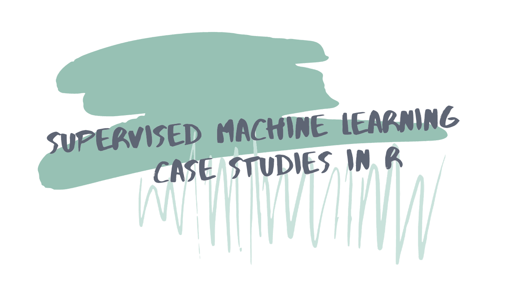

```{r startup, include = FALSE, message = FALSE, warning = FALSE}
knitr::opts_chunk$set(echo=T, eval=T, message=F, warning=F, error=F, comment=NA)
```


# L'analisi esplorativa dei dati

* La **visualizzazione**, **trasformazione** e **modellizzazione** dei dati 
sono operazioni che rientrano in quella che gli statistici chiamano 
**analisi esplorativa dei dati** (*Exploratory Data Analysis*, abbreviato EDA, 
termine coniato da J. Tukey)

* L'obiettivo di EDA è di comprendere la natura dei dati

* EDA è processo iterativo
<center>

</center>
.center[Figura del libro r4ds di WG, sezione 1.1]

* Tuttavia non ci sono regole ben definite. EDA è fondamentalmente un processo creativo

---

# Visualizzazione, trasformazione e modellizzazione dei dati

* __La visualizzazione dei dati__ è un ottimo punto di partenza: ci consente di costruire grafici informativi che aiutano a comprendere i dati (si veda WG, sezione 3)

* La sola visualizzazione in genere non è sufficiente. __La trasformazione dei dati__ ci consente di selezionare solo le variabili rilevanti, di escludere le osservazioni anomale, di creare nuove variabili, etc. (si veda WG, sezione 5)

* Infine con __la modellizzazione dei dati__ si rendono (matematicamente) precise le relazioni tra le variabili (si veda WG, sezioni 22-25, per un'introduzione)

* EDA (see WG, section 7) serve a comprendere le principali caratteristiche dei predittori e della variabile risposta in modo che eventuali difficoltà associate ai dati possano essere scoperte prima della modellazione. Ciò può includere analisi della struttura di correlazione delle variabili, analisi dei dati mancanti e / o delle osservazioni anomale, etc.

---

# I primi passi di EDA

* Uno dei primi passaggi è creare visualizzazioni (si veda KJ, sezione 4)

* Si inizia con la variabile risposta, cercando di comprendere le caratteristiche della sua distribuzione

* Poi si esplorano le relazioni tra i predittori e la risposta 

    - diagramma di dispersione di ciascun predittore e la risposta,
    - una matrice di diagrammi di dispersione per capire la dipendenza tra coppie di predittori,
    - proiettare i predittori in un sottospazio a bassa dimensionalità (e.g. tramite l'analisi delle componenti principali),
    - esaminare i primi livelli di un albero decisionale (di regressione o di classificazione),
    - grafici a mosaico (*mosaic plot*) per esaminare le associazioni tra variabili categoriali;
    - Etc.

* Dopo la costruzione del modello, la visualizzazione dei dati può essere utilizzata per valutare la mancanza di adattamento del modello e per valutare l'efficacia di nuovi predittori che non erano presenti nel modello originale


---

# Il modello vs il processo di modellizzazione 

* Il modello *per sé* rappresenta una minima parte del processo di modellizzazione

* Il processo di costruzione di un modello efficace è un processo **iterativo** ed **euristico**

* È difficile anticipare le caratteristiche di un dataset prima di averci lavorato 

* Di solito vengono valutati diversi approcci ed effettuate modifiche prima di finalizzare il modello 


---

# Operazioni tipiche

**Pre-processamento dei dati ed EDA**

* Gestione i dati mancanti
* Esplorazione delle relazioni tra i predittori e la risposta
* Rappresentazione delle variabili (*feature engineering*)
* Etc. 

**Costruzione dei modelli**

* Valutazione della bontà delle previsioni
* Regolazione dei parametri del modello (*parameter tuning*)
* Selezione delle variabili (*feature selection*)
* Etc.


---

# Il processo di modellizzazione


.center[Figura del libro KJ, sezione 1.2.4]

---


* __(a)__ *EDA (preliminare)*. Si inizia con l'esplorazione preliminare dei dati

* __(b)__ *Analisi quantitative (preliminari)*. includono il calcolo di semplici misure di sintesi e l'identificazione di predittori con fortemente correlati con la variabile risposta. Il processo alterna visualizzazioni e analisi quantitative fino a quando non ci si sente sicuri di aver ben compreso i dati

* __(c)__ *Rappresentazione delle variabili (preliminare)*. Una prima proposta di come verranno rappresentati i predittori e la risposta nei modelli sulla base di quanto scoperto nel punto precedente.

---


* __(d)__ *Regolazione dei parametri (preliminare)*. A questo punto, è possibile stimare diversi modelli utilizzando il training set. Prima di procedere, bisogna regolare i parametri (o iperparametri) dei modelli.

* __(e)__ *Valutazione delle performance (preliminare)*. Una volta regolati i parametri, i modelli vengono valutati numericamente sui dati per comprenderne la bontà delle previsioni, utilizzando indici di sintesi come MSE, Accuratezza, etc.

* __(f)__ *Analisi dei residui*. EDA sui risultati dei modelli, ad esempio l'analisi dei residui.

* __(g)__ *Problemi sistematici*. In caso di problemi sistematici con il modello, si può rimediare ad esempio con la *feature engineeding*

---


* __(h)__ *Regolazione dei parametri*. A questo punto, dovrebbe essere evidente quali modelli tendono a funzionare meglio, e si può procedere con un altro round di *tuning* più intenso sui modelli selezionati

* __(i)__ *Valutazione delle performance*. I modelli candidati (#2 e #4) vengono confrontati su un test set esterno  

* __(h)__ *Il modello finale*. Viene quindi scelto il modello finale (o una combinazione di più modelli) che viene utilizzato per prevedere le nuove osservazioni

---

# Il teorema "No Free Lunch"

> Il teorema "No Free Lunch" (Wolpert 1996) è l'idea che, senza alcuna conoscenza specifica del problema o dei dati in questione, nessun modello predittivo può essere considerato il migliore

* Ci sono stati studi per giudicare quali modelli tendono a fare meglio di altri (in media)

* Tuttavia, il tasso di "successo" non è abbastanza elevato per mettere in atto una strategia di "utilizzare sempre il modello X"

---

# Concetti importanti

1. __Sovra-adattamento__ L'overfitting è la situazione in cui un modello si adatta molto bene al training set ma non riesce a prevedere bene le osservazioni del test set 

2. __Il compromesso distorsione-varianza__ 
    
3.  __Modellizzazione guidata dall'esperienza vs modellizzazione guidata dai dati__
    - Una persona esperta del contesto applicativo potrebbe avere un'idea precisa di quali dovrebbero essere i predittori da utilizzare nel modello - prima di esaminare i dati
    - Tuttavia, a volte risulta preferibile farsi "guidare dai dati" piuttosto che dall'esperienza
    - Di solito la combinazione di questi due approcci funziona meglio

4. __Selezione delle variabili__
    - I modelli possono avere prestazioni ridotte a causa della presenza di predittori non rilevanti che causano eccessiva variabilità del modello
    - Quando si cerca di individuare un sottoinsieme di predittori da utilizzare, è importante rendersi conto che potrebbe non esserci un insieme unico di predittori in grado di produrre le migliori prestazioni
    
5. __Feature engineering__
    
---

# Feature engineering

* L'idea che ci siano diversi modi per rappresentare i predittori in un modello e che alcune di queste rappresentazioni siano migliori di altre ci porta alla *feature engineering*, il processo di creazione di rappresentazioni di dati che aumentano l'efficacia di un modello

* Ad esempio, potrebbe risultare utile:
     - la trasformazione di un predittore,
     - la costruzione di un termine di interazione tra due o più predittori come un prodotto o un rapporto,
     - etc.

---
layout: false
class: inverse, middle, center

# I dati della automobili

---

# I dati delle automobili

* Tratto dal libro AS, Capitolo 2

* I dati delle automobili si riferiscono alle caratteristiche di 203 modelli di automobili importati negli USA nel 1985

* I dati originali sono disponibili qui: [ftp://ftp.ics.uci.edu/pub/machine-learning-databases/autos](ftp://ftp.ics.uci.edu/pub/machine-learning-databases/autos)
Questi dati sono stati elaborati convertendo le unità di misura, eliminado alcune variabili originarie, correggendo alcuni nomi di marche, etc.

* Obiettivo: prevedere il consumo di carburante (o, equivalentemente, la distanza percorsa per unità di carburante) in funzione di determinate caratteristiche di un'automobile

---


* brand   :             manufacturer (factor, 22 levels), casa produttrice (fattore, 22 livelli) 
* fuel    :       type of engine fuel (factor, 2 levels: diesel, gasoline), tipo di alimentazione del motore (fattore, 2 livelli) 
* aspiration :          type of engine aspiration (factor, 2 levels: standard, turbo), tipo di aspirazione del motore (fattore, 2 livelli)   
* bodystyle :         type of body style (factor, 5 levels: hardtop, wagon, sedan, hatchback, convertible),  tipo di carrozzeria (fattore, 5 livelli)  
* drive.wheels :       type of drive wheels (factor,  3 levels: 4wd, fwd, rwd), tipo di trazione (fattore,  3 livelli)    
* engine.location :    location of engine (factor, 2 levels: front, rear), posizione del motore (fattore, 2 livelli)  
* wheel.base :         distance between axes (cm), distanza tra gli assi (cm) 
* length :             length (cm), lunghezza (cm)      
* width :              width (cm), larghezza (cm)    
* height :             height (cm), altezza (cm)    
* curb.weight :        weight (kg), peso (kg)   
* engine size :        engine size (l), cilindrata (l)   
* compression.ratio :   compression ratio, rapporto di compressione   
* HP :                  horsepower, cavalli motore   
* peak.rot     :       number of peak revolutions per minute, numero di giri massimi del motore al minuto    
* __city.distance__ :      city distance covered (km/l), percorrenza urbana (km/l)   
* highway.distance :    highway distance (km/l), percorrenza extra urbana (km/l)  
* n.cylinders  :       number of cylinders, numero di cilindri

---


```{r}
rm(list=ls())
auto <- read.table("http://azzalini.stat.unipd.it/Book-DM/auto.dat", header=TRUE, quote="\"")
dim(auto)
# ci sono dati mancanti?
sum(is.na(auto))
```


---

```{r}
# tipologia di variabili
str(auto)
auto$fuel <- factor(auto$fuel)
```

---


```{r}
# dataset ridotto
names(auto)[which(names(auto)=="city.distance")] <- "y"
vars <- c("y", "engine.size","n.cylinders","curb.weight","fuel")
train <- auto[,vars]
pairs(train[,-5], col=train$fuel)
```

---


.pull-left[
```{r}
# y: istogramma
hist(train$y)
```
]


.pull-right[
```{r}
# y: density plot
plot(density(train$y))
```
]

---

.pull-left[
```{r}
# diagramma di dispersione
plot(y~engine.size, train, col=fuel) 
```
]

.pull-right[
```{r}
# jitter
plot(jitter(y)~jitter(engine.size), train, col=fuel) 
```
]

---

$$Y = \beta_1 + \beta_2 \mathrm{engine.size} + \beta_3 \mathrm{engine.size}^2 + \beta_4 \mathrm{engine.size}^3 + \beta_5 I\{\mathrm{fuel} = \mathrm{gas}\} + \varepsilon$$

```{r}
fit1 <- lm(y ~ poly(engine.size, degree=3, raw=T) + fuel, train)
```

```{r, echo=FALSE}
x <- seq(1,5.5,  length=200)
beta<- coef(fit1)
plot(y ~ engine.size, col=fuel, train)
lines(x, beta[1]+ beta[2]*x+beta[3]*x^2+beta[4]*x^3)
lines(x,  beta[1]+ beta[2]*x+beta[3]*x^2+beta[4]*x^3+beta[5],col="red")
```

---

$$1/y = \beta_1 + \beta_2 \mathrm{engine.size} +  \beta_3 I\{\mathrm{fuel} = \mathrm{gas}\}+ \varepsilon$$

```{r}
fit2<-lm(1/y ~ engine.size + fuel, train)
```

.pull-left[
```{r, echo=FALSE}
plot(1/y ~ engine.size, col=fuel, train)
beta<- coef(fit2)
abline(beta[1:2])
abline(beta[1]+beta[3], sum(beta[2]) , col=2)
```
]

.pull-right[
```{r, echo=FALSE}
plot(y ~ engine.size, col=fuel, train)
lines(x, 1/(beta[1]+ beta[2]*x))
lines(x, 1/(beta[1]+beta[3]+ beta[2]*x),  col=2)
```
]


---

$$\log(y) = \beta_1 + \beta_2 \log(\mathrm{engine.size}) +  \beta_3 I\{\mathrm{fuel} = \mathrm{gas}\} + \varepsilon$$
```{r}
fit3 <- lm(log(y) ~ log(engine.size) + fuel, train)
```

.pull-left[
```{r, echo=FALSE}
plot(log(y) ~ log(engine.size), col=fuel, train)
beta<- coef(fit3)
abline(beta[1:2])
abline(beta[1]+beta[3], sum(beta[2]) , col=2)
```
]

.pull-right[
```{r, echo=FALSE}
plot(y ~ engine.size, col=fuel, train)
x <- log(seq(1,5.5,  length=200))
lines(exp(x), exp(beta[1]+ beta[2]*x))
lines(exp(x), exp(beta[1]+beta[3]+ beta[2]*x),  col=2)
```
]

---

.pull-left[
```{r}
plot(fit3, which=1)
```
]

.pull-right[
```{r}
plot(fit3, which=4)
```
]

---

```{r}
train[which(cooks.distance(fit3) > .07), ]
table(train$n.cylinders)
```


---

$$
\begin{aligned}
\log(y) = & \beta_1 + \beta_2 \log(\mathrm{engine.size}) +  \beta_3 I\{\mathrm{fuel} = \mathrm{gas}\}  +\\ 
& +\beta_4 \log(\mathrm{curb.weight})+ \beta_5I\{\mathrm{n.cylinders} = 2\} + \varepsilon
\end{aligned}
$$

```{r}
# MSE.tr
fit1 = update(fit1, . ~ . +  log(curb.weight) + I(n.cylinders==2), train)
mean(resid(fit1)^2) 
fit2 = update(fit2, . ~ . +  log(curb.weight) + I(n.cylinders==2), train)
mean((train$y - 1/fitted(fit2))^2) 
fit3 = update(fit3, . ~ . +  log(curb.weight) + I(n.cylinders==2), train)
mean((train$y - exp(fitted(fit3)))^2) 
```


---
layout: false
class: inverse, middle, center

# Not mtcars AGAIN

---

Esercizio tratto da https://supervised-ml-course.netlify.app/



---

```{r}
rm(list=ls())
library(readr)
cars2018 <- read_csv("https://raw.githubusercontent.com/topepo/supervised-ML-case-studies-course/master/data/cars2018.csv")
library(tidyverse)
glimpse(cars2018)
```

---

```{r}
ggplot(cars2018, aes(x = MPG)) +
    geom_histogram(bins = 25) +
    labs(x = "Fuel efficiency (mpg)",
         y = "Number of cars")
```

---

# Train e test set

```{r}
car_vars <- cars2018 %>%
    select(-Model, -`Model Index`)

library(caret)
library(tidymodels)

car_split <- car_vars %>%
    initial_split(prop = 0.8,
                  strata = Aspiration)

car_train <- training(car_split)
car_test <- testing(car_split)
```

---

# lm e knn

```{r}
## specificazione di un modello lineare
mod_lm <- linear_reg() %>%
    set_engine("lm")

fit_lm <- mod_lm %>%
    fit(log(MPG) ~ ., 
        data = car_train)

## specificazione di un knn
mod_knn <- nearest_neighbor() %>%
    set_mode("regression") %>%
    set_engine("kknn")

fit_knn <- mod_knn %>%
    fit(log(MPG) ~ ., 
        data = car_train)  
```

---

```{r}
results <- car_test %>%
    mutate(MPG = log(MPG)) %>%
    bind_cols(predict(fit_lm, car_test) %>%
                  rename(.pred_lm = .pred)) %>%
    bind_cols(predict(fit_knn, car_test) %>%
                  rename(.pred_knn = .pred))

# Valutazione sul test set
metrics(results, truth = MPG, estimate = .pred_lm)
metrics(results, truth = MPG, estimate = .pred_knn)
```

---

```{r}
car_folds <- vfold_cv(car_train, v = 10)

# Valutazione dei modelli con 10-fold CV
res_lm <- mod_lm %>%
    fit_resamples(
        log(MPG) ~ .,
        resamples = car_folds,
        control = control_resamples(save_pred = TRUE)
    )

res_knn <- mod_knn %>%
    fit_resamples(
        log(MPG) ~ .,
        resamples = car_folds,
        control = control_resamples(save_pred = TRUE)
    )
```

---

```{r}
results <-  bind_rows(res_lm %>%
                          collect_predictions() %>%
                          mutate(model = "lm"),
                      res_knn %>%
                          collect_predictions() %>%
                          mutate(model = "knn"))

head(results)
```

---

```{r}
results %>%
    ggplot(aes(`log(MPG)`, .pred)) +
    geom_abline(lty = 2, color = "gray50") +
    geom_point(size = 1.5, alpha = 0.3)+
    geom_smooth(method = "lm") +
    facet_wrap(~ model)
```

