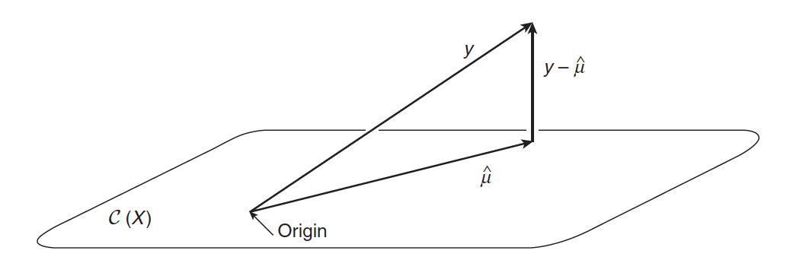

```{r startup, include = FALSE, message = FALSE, warning = FALSE}
knitr::opts_chunk$set(echo = T, eval=T, message=F, warning=F, error=F, comment=NA, cache=F, R.options=list(width=220))
```


# Il teorema di Gauss-Markov 

Si consideri il setting Fixed-X con $\mathbf{X}$ a rango pieno, i.e. $\mathrm{rank}(\mathbf{X}) = p$, e si assuma che i dati siano generati secondo il modello 
$$\mathbf{y} = \mathbf{X}\boldsymbol{\beta}^0 + \boldsymbol{\varepsilon}$$
con $\mathbb{E} \boldsymbol{\varepsilon} = \mathbf{0}$ e $\mathbb{V}\mathrm{ar}(\boldsymbol{\varepsilon}) = \sigma^2 \mathbf{I}$

Il teorema di Gauss-Markov dimostra che lo stimatore OLS
$$\hat{\boldsymbol{\beta}}^{\mathrm{OLS}} = \underset{\boldsymbol{\beta} \in \mathbb{R}^p}{\arg\min} \| \mathbf{y} - \mathbf{X}\boldsymbol{\beta} \|^2_2 = (\mathbf{X}^\mathsf{T}\mathbf{X})^{-1}\mathbf{X}^\mathsf{T} \mathbf{y}$$
è il migliore stimatore lineare tra i non distorti: per qualsiasi altro stimatore non distorto  $\tilde{\boldsymbol{\beta}}$ lineare in $\mathbf{y}$ (ovvero della forma $\tilde{\boldsymbol{\beta}} = \mathbf{A} \mathbf{y}$ per una qualche matrice $\mathbf{A}$), abbiamo che
$$\mathbb{V}\mathrm{ar}(\tilde{\boldsymbol{\beta}}) - \mathbb{V}\mathrm{ar}(\hat{\boldsymbol{\beta}}^{\mathrm{OLS}})$$
è positiva semidefinita. 


---

# La geometria dei minimi quadrati




* $\hat{\boldsymbol{\mu}}$ indica $\hat{\mathbf{y}} =  \mathbf{X}\hat{\boldsymbol{\beta}} = \mathbf{H} \mathbf{y}$, la proiezione di $\mathbf{y}$ su $\mathcal{C}(\mathbf{X})$, lo spazio generato dalle colonne di $\mathbf{X}$ 

* $\mathbf{H} = \mathbf{X} (\mathbf{X}^\mathsf{T}\mathbf{X})^{-1}\mathbf{X}^\mathsf{T}$ indica la matrice  di proiezione ("hat") su $\mathcal{C}(\mathbf{X})$

* $\mathbf{y} - \hat{\boldsymbol{\mu}}$ indicano i residui $(\mathbf{I}_n - \mathbf{H})\mathbf{y}$ 

---

# Perchè considerare stimatori alternativi a OLS?

Se consideriamo la funzione di perdita quadratica, gli stimatori non distorti di $\boldsymbol{\beta}_0$ vengono valutati sulla base della loro varianza.

Per uno stimatore distorto $\tilde{\boldsymbol{\beta}}$, la quantità rilevante è 
$$
\begin{aligned}
\mathbb{E}\{(\tilde{\boldsymbol{\beta}}- \boldsymbol{\beta}^0)(\tilde{\boldsymbol{\beta}}- \boldsymbol{\beta}^0)\}^\mathsf{T} & = \mathbb{V}\mathrm{ar}(\tilde{\boldsymbol{\beta}}) + \{ \mathbb{E}(\tilde{\boldsymbol{\beta}}- \boldsymbol{\beta}^0) \} \{ \mathbb{E}(\tilde{\boldsymbol{\beta}}- \boldsymbol{\beta}^0) \}^\mathsf{T}
\end{aligned}
$$
che somma distorsione al quadrato e varianza. 

Un punto cruciale per l'ottimalità per gli stimatori OLS (e MLE) è la loro non distorsione.

Esistono stimatori distorti per cui la loro varianza è ridotta rispetto a OLS in modo tale che l'errore di previsione complessivo sia inferiore? Sì! 

In effetti, l'uso di stimatori distorti è essenziale per trattare contesti in cui il numero di parametri $p$ da stimare è elevato rispetto al numero di osservazioni $n$

---

# Setting ad elevata dimensionalità


Se $n>p$ ma $n \approx p$, allora lo stimatore OLS è molto variabile, con conseguente sovra-adattamento e previsioni scadenti

Se $n=p$, allora lo stimatore OLS si sovra-adatta completamente ai dati, i.e. $\hat{y}_i = y_i$, e le previsioni saranno inaccettabili 

Se $n<p$ (*high-dimensional setting*), non esiste più una stimatore OLS unico, quindi il metodo non può essere utilizzato

---

# $n \approx p$

* $n=10$ e $p=9$

* Si consideri il modello $Y = \beta_1 X_1 + \beta_2 X_2 + \ldots + \beta_9X_9 +  \varepsilon$

* Il vero $\boldsymbol{\beta}$ è $(1,0,0,\ldots,0)^\mathsf{T}$

```{r}
n = 10
p = 9
set.seed(1793)
X = matrix(rnorm(n*p), nrow=n, ncol=p)
y = X[,1] + rnorm(n,0,0.5)
fit = lm(y~ 0 + X)
coef(fit)
```

Stime elevate dei coefficienti di regressione (in valore assoluto) sono spesso un'indicazione di sovra-adattamento

---


```{r}
yhat = predict(fit)
plot(X[,1],y, xlab="x1")
ix = sort(X[,1], index.return=T)$ix
lines(X[ix,1], yhat[ix])
abline(a=0,b=1, col=4)
```

---

# OLS in setting ad elevata dimensionalità

Quando $\mathrm{rank}(\mathbf{X}) < p$, ci sono infinite soluzioni nel problema dei minimi quadrati

Supponiamo $p > n = \mathrm{rank}(\mathbf{X})$. Sia $\mathcal{C}(\mathbf{X})$ lo spazio $n$-dimensionale formato dalle colonne di $\mathbf{X}$ e $\mathcal{V}=\mathcal{C}(\mathbf{X})^\bot$ lo spazio $p-n$ dimensionale ortogonale a $\mathcal{C}(\mathbf{X})$, i.e. lo spazio nullo di $\mathbf{X}$

Allora $\mathbf{X}\mathbf{v} = \mathbf{0}_p$ per qualunque $\mathbf{v} \in \mathcal{V}$, e $\mathbf{X}^\mathsf{T}\mathbf{X}\mathbf{v} = \mathbf{X}^\mathsf{T}\mathbf{0}_p = \mathbf{0}_n$, la soluzione delle equazioni normali $\mathbf{X}^\mathsf{T}\mathbf{X}\boldsymbol{\beta} = \mathbf{X}^\mathsf{T}\mathbf{y}$ è
$$\underset{p\times 1}{\hat{\boldsymbol{\beta}}} = (\mathbf{X}^\mathsf{T}\mathbf{X})^{-}\mathbf{X}^\mathsf{T} \mathbf{y} + \mathbf{v} \quad \forall\,\, \mathbf{v} \in \mathcal{V}$$
dove $\mathbf{A}^-$ indica l'inversa di Moore-Penrose della matrice $\mathbf{A}$


---

# La regressione Ridge 

Un modo per ridurre la varianza di 
 $\hat{\boldsymbol{\beta}}^{\mathrm{OLS}}$ è di contrarre (*shrink*) le stime dei coefficienti verso il valore zero.

La regressione Ridge (Hoerl and Kennard, 1970) fa proprio questi risolvendo il seguente problema di ottimizzazione
$$(\hat{\mu}_\lambda^R, \hat{\boldsymbol{\beta}}^R_\lambda) = \arg\min_{(\mu,\boldsymbol{\beta}) \in \mathbb{R} \times \mathbb{R}^p} \left\{ \| \mathbf{y} - \mu\mathbf{1}_n - \mathbf{X}\boldsymbol{\beta}\|_2^2 + \lambda \|\boldsymbol{\beta}\|^2_2 \right\}$$
Vediamo che la funzione obiettivo OLS è penalizzata da un termine aggiuntivo che è proporzionale a  $\|\boldsymbol{\beta}\|^2_2$

Il parametro $\lambda \geq 0$, che controlla l'ammontare della penalità e quindi il grado di contrazione verso lo zero, è detto parametro di regolarizzazione (*regularisation parameter* o *tuning parameter*). 


---

# L'intercetta

Si noti che nella formulazione precedente l'intercetta non viene penalizzata. La ragione di ciò è che se cambiamo l'origine dei predittori (ad es. il predittore temperatura è misurato in unità Kelvin anziché Celsius), i valori stimati dal modello non cambiano.

Tuttavia, $\mathbf{X}\boldsymbol{\beta}$ non è invariante a trasformazioni di scala dei predittori, quindi è pratica comune centrare le colonne di $\mathbf{X}$ (rendendole ortogonali all'intercetta) e ri-scalare i predittori (di solito in modo tale che la loro norma Euclidea risulti pari $\sqrt{n}$ o 1). 

E' possibile dimostrare (si veda l'esercizio seguente) che se le colonne di 
$\mathbf{X}$ sono centrate, si ottiene $\hat{\mu}_\lambda^R = \bar{y} = n^{-1}\sum_{i=1}^{n}y_i$, quindi possiamo assumere $\sum_{i=1}^{n}y_i=0$ sostituendo $y_i$ con $y_i - \bar{y}$ e quindi omettere $\mu$ dalla nostra funzione obiettivo. 

Da qui in poi, ogni qualvolta ci riferiamo alla regressione *ridge*, assumeremo che 

* la risposta $\mathbf{y}$ è centrata (o standardizzata)
* la matrice del disegno $\mathbf{X}$ è centrata (o standardizzata)


---

# Esercizio

Si consideri la minimizzazione del seguente funzione obiettivo che coinvolge la risposta $\mathbf{y}$ e la matrice del disegno $\mathbf{X}$ su $(\mu,\boldsymbol{\beta}) \in \mathbb{R}\times \mathbb{R}^p$:
$$\min_{(\mu,\boldsymbol{\beta}) \in \mathbb{R} \times \mathbb{R}^p} \left\{ \| \mathbf{y} - \mu\mathbf{1}_n - \mathbf{X}\boldsymbol{\beta}\|_2^2 + J(\boldsymbol{\beta}) \right\}$$
Qui $J:\mathbb{R}^p \rightarrow \mathbb{R}$ è una funzione di penalità arbitraria. Si supponga che $\sum_{i=1}^{n}x_{ij}=0$ per $j=1,\ldots,p$. Assumendo che una soluzione  $(\hat{\mu},\hat{\boldsymbol{\beta}})$ esista, si dimostri che $\hat{\mu} = \bar{y}$. 

Ora si consideri $\sum_{i=1}^{n}y_i = 0$ e sia $J(\boldsymbol{\beta})= \lambda \|\boldsymbol{\beta}\|^2_2$ in modo da ottenere la funzione obiettivo della regressione *ridge*: 

$$\min_{\boldsymbol{\beta} \in  \mathbb{R}^p} \left\{ \| \mathbf{y} -  \mathbf{X}\boldsymbol{\beta}\|_2^2 + \|\boldsymbol{\beta}\|^2_2 \right\}$$

Si dimostri che
$$\hat{\boldsymbol{\beta}}^{\mathrm{R}}_\lambda = (\mathbf{X}^\mathsf{T}\mathbf{X} + \lambda \mathbf{I}_p )^{-1}\mathbf{X}^\mathsf{T} \mathbf{y}$$

Per la dimostrazione, si vedano le note scritte a mano. 

---

# I dati Hitters

Un dataset con $n=322$ giocatori di baseball su cui sono state misurate $p=20$ variabili

.pull-left[
AtBat
Number of times at bat in 1986

Hits
Number of hits in 1986

HmRun
Number of home runs in 1986

Runs
Number of runs in 1986

RBI
Number of runs batted in in 1986

Walks
Number of walks in 1986

Years
Number of years in the major leagues

CAtBat
Number of times at bat during his career

CHits
Number of hits during his career

CHmRun
Number of home runs during his career

CRuns
Number of runs during his career
]

.pull-right[
CRBI
Number of runs batted in during his career

CWalks
Number of walks during his career

League
A factor with levels A and N indicating player's league at the end of 1986

Division
A factor with levels E and W indicating player's division at the end of 1986

PutOuts
Number of put outs in 1986

Assists
Number of assists in 1986

Errors
Number of errors in 1986

**Salary**
1987 annual salary on opening day in thousands of dollars

NewLeague
A factor with levels A and N indicating player's league at the beginning of 1987
]

---

# lm.ridge

```{r}
rm(list=ls())
library(ISLR)
data(Hitters)
# togliamo le righe con valori mancanti
Hitters =na.omit(Hitters )
# least squares
fit.lm = lm(Salary ~ ., Hitters)
# lm.ridge
library(MASS)
fit.ridge = lm.ridge(Salary ~ ., Hitters, lambda=1) 
```

---

```{r}
# coefficienti
round(data.frame(lm=coef(fit.lm), ridge=coef(fit.ridge)),4)
```

---

# Il percorso della stima *ridge*


Il percorso della stima *ridge* è dato da
$$\{\hat{\boldsymbol{\beta}}^{\mathrm{R}}_\lambda: \lambda \in [0,\infty) \}$$

Se $\lambda \rightarrow 0$, allora $\hat{\boldsymbol{\beta}}^{\mathrm{R}}_\lambda\rightarrow \hat{\boldsymbol{\beta}}^{\mathrm{OLS}}$

Se $\lambda \rightarrow \infty$, allora  $\hat{\boldsymbol{\beta}}^{\mathrm{R}}_\lambda\rightarrow \mathbf{0}_p$

Si noti che questo comportamento non è strettamente monotono rispetto a $\lambda$, ovvero  $\lambda_a > \lambda_b$ non implica necessariamente che $|\hat{\beta}^{\mathrm{R}}_j(\lambda_a)| < |\hat{\beta}^{\mathrm{R}}_j(\lambda_b)|$

---

# glmnet

```{r, eval=F}
glmnet(X, y,
family="gaussian",
alpha = 0, # default = 1 (LASSO), 0 = ridgde
nlambda = 100, # default
standardize = TRUE, # default
intercept=TRUE # default
)
```

Si veda la guida a [glmnet](https://web.stanford.edu/~hastie/glmnet/glmnet_alpha.html)

---

```{r}
X = model.matrix(fit.lm)
y = Hitters$Salary
n = nrow(X)

# standardizzazione
Xstd = scale(X[,-1])[,]*sqrt((n-1)/n)
ystd = scale(y)[,]*sqrt((n-1)/n)
```

---

```{r}
library(glmnet)
fit.std = glmnet(Xstd, ystd, alpha = 0, family="gaussian")
plot(fit.std, xvar="lambda")
```

---

```{r}
# In scala originale
fit = glmnet(X, y, alpha = 0, family="gaussian")
plot(fit, xvar="lambda")
```

---

# Teorema 

Per $\lambda$ sufficientemente piccolo (che dipende da $\boldsymbol{\beta}^0$ e $\sigma^2$), 

$$\mathbb{E}(\hat{\boldsymbol{\beta}}^{\mathrm{OLS}}- \boldsymbol{\beta}^0)(\hat{\boldsymbol{\beta}}^{\mathrm{OLS}}- \boldsymbol{\beta}^0)^\mathsf{T} - \mathbb{E}(\hat{\boldsymbol{\beta}}_\lambda^{\mathrm{R}} - \boldsymbol{\beta}^0)(\hat{\boldsymbol{\beta}}_\lambda^{\mathrm{R}}- \boldsymbol{\beta}^0)^\mathsf{T}$$
è positiva definita. 

Per la dimostrazione, si vedano le note scritte a mano. 

---

```{r, echo=FALSE}
f <- function(rho, lam, n) {
  XtX <- matrix(c(1, rho, rho,1), 2, 2)
  beta0 <- matrix(c(1,1), 2, 1)
  sigma <- 1
    
  ## OLS
  bias.ols <- rep(0, 2)
  var.ols <- (sigma^2)*solve(XtX)/n
  mse.ols <- sum(diag(var.ols)) + crossprod(bias.ols)

  ## ridge
  W <- solve(XtX + lam/n*diag(2))
  var.ridge <- (sigma^2) * W %*% XtX %*% W / n
  bias.ridge <- lam/n * W %*% beta0
  mse.ridge <- sum(diag(var.ridge)) + crossprod(bias.ridge)
  val <- c(mse.ols, mse.ridge, crossprod(bias.ridge), sum(diag(var.ridge)))
  names(val) <- c("mse.ols", "mse.ridge", "bias.ridge", "var.ridge")
  val
}
lam <- c(0, exp(seq(log(0.001), log(10), length=99)))
MSE <- matrix(NA, 100, 4)
for (i in 1:100) {
  MSE[i,] <- f(0.5, lam[i], 20)
}
matplot(lam, MSE, type="l", col=c("gray50", 1:3), lwd=3, lty=1, xlab=expression(lambda), las=1, ylab="", bty="n")
text(5.5, 0.10, "MSE", xpd=T)
text(9, 0.03, "Var", xpd=T)
text(9, 0.085, expression(Bias^2), xpd=T)
```

---

# Il caso di una variabile gaussiana

$Y = \mu + \varepsilon$ con $\varepsilon \sim N(0,\sigma^2)$

Dato il training set $Y_1,\ldots,Y_n$, vogliamo prevedere una futura osservazione $Y$

Stimatore media campionaria: $\bar{Y} = \frac{1}{n}\sum_{i=1}^{n} Y_i$

La scomposizione Distorsione-Varianza risulta
$$
\begin{aligned}
\mathbb{E}\{[Y - \bar{Y} ]^2 \} & = \sigma^2 + [\mathbb{B}\mathrm{ias}( \bar{Y} ) ]^2 + \mathbb{V}\mathrm{ar}( \bar{Y} )\\
& = \sigma^2 + 0 + \sigma^2/n
\end{aligned}
$$

Il teorema di Rao-Blackwell ci dice che $\bar{Y}$ è lo stimatore a varianza minima tra i non distorti. Possiamo fare meglio?

---

# Contrazione della media campionaria

Stimatore che "contrae" la media campionaria  $\hat{Y}_{\lambda} = \lambda \bar{Y}$ con $\lambda \in [0,1]$ 

Scomposizione distorsione-varianza 
$$
\begin{aligned}
\mathbb{E}\{[Y - \hat{Y}_\lambda ]^2 \} & = \sigma^2 + [\mathbb{B}\mathrm{ias}( \hat{Y}_\lambda ) ]^2 + \mathbb{V}\mathrm{ar}( \hat{Y}_\lambda )\\
& = \sigma^2 + [\mu - \lambda \mu]^2 + \lambda^2\frac{\sigma^2}{n}
\end{aligned}
$$

Proviamo a minimizzare questa quantità. 
Risolvendo $\displaystyle \frac{d}{d \lambda} \mathbb{E}\{[Y - \hat{Y}_\lambda ]^2 \}  = 0$ otteniamo  il valore ottimale
$$\lambda^*=\frac{\mu^2}{\mu^2 + \sigma^2/n}$$ 
che minimizza $\mathbb{E}\{[Y - \hat{Y}_{\lambda} ]^2 \}$. Tuttavia, $\lambda^*$ dipende da parametri ignoti

---

# La scelta del parametro di *shrinkage*

Finora abbiamo discusso le proprietà della regressione *ridge* considerando $\lambda$ noto. 

Nella pratica, questo parametro è ignoto e bisogna scegliere un valore. Per fare ciò, di solito si utilizza il metodo della convalida incrociata 

---

```{r}
# K-fold CV
K <- 5
fit.cv <-cv.glmnet(X[,-1],y, alpha=0, nfolds = K, grouped=FALSE)
plot(fit.cv)
```

---

```{r}
# lambda selezionato da K-fold CV
hatlambda <-fit.cv$lambda.min
hatlambda
```

---

# Scorciatoia per calcolare il LOOCV

La matrice "hat" della regressione *ridge* è 
$$\mathbf{H}_\lambda = \mathbf{X}(\mathbf{X}^\mathsf{T}\mathbf{X} + \lambda \mathbf{I}_p )^{-1}\mathbf{X}^\mathsf{T}$$

Si può dimostrare che
$$\frac{1}{n}\sum_{i=1}^{n}\Big[ y_i - x_i^\mathsf{T} \hat{\boldsymbol{\beta}}^{-i}_\lambda \Big]^2 = \frac{1}{n}\sum_{i=1}^{n} \left[ \frac{y_i - x_i^\mathsf{T} \hat{\boldsymbol{\beta}}_\lambda}{1-\{\mathbf{H}_\lambda\}_{ii}} \right]^2$$
dove $\hat{\boldsymbol{\beta}}^{-i}_\lambda$ è la stima *ridge* escludento l'osservazione $i$-sima e  $\{\mathbf{H}_\lambda\}_{ii}$ è l' $i$-simo elemento diagonale di $\mathbf{H}_\lambda$


Quindi l'errore di previsione stimato con LOOCV per un dato  $\lambda$ può essere calcolato direttamente utilizzando 
$\mathbf{H}(\lambda)$ e il vettore risposta senza dover ricalcolare le stime $n$ volte. Computazionalmente, questo è un grande vantaggio

---

# La matrice di Gram

I valori stimati dalla regressione *ridge* sono
$$\mathbf{X}(\mathbf{X}^\mathsf{T}\mathbf{X} + \lambda \mathbf{I} )^{-1}\mathbf{X}^\mathsf{T} \mathbf{y}$$
Questa quantità si può riscrivere come
$$\begin{aligned}
\mathbf{X}\mathbf{X}^\mathsf{T}(\mathbf{X}\mathbf{X}^\mathsf{T} + \lambda \mathbf{I} )^{-1} \mathbf{y} = \mathbf{K}(\mathbf{K}+ \lambda \mathbf{I})^{-1}\mathbf{y}
\end{aligned}$$

Si noti che
* $\mathbf{X}^\mathsf{T}\mathbf{X}$ è $p\times p$, mentre la matrice di Gram $\mathbf{K}=\mathbf{X}\mathbf{X}^\mathsf{T}$ è $n\times n$ dove $K_{ij}=\{\mathbf{K}\}_{ij} = x_i^\mathsf{T} x_j = \sum_{k}x_{ik}x_{jk}$

* Calcolare i valori stimati utilizzando la prima espressione richiede un numero di operazioni dell'ordine $O(np^2+p^3)$. Se $p\ll n$ può risultare computazionalmente impegnativo. La seconda espressione invece richiede un numero di operazioni dell'ordine $O(n^2p+n^3)$


---

Supponiamo di voler aggiungere interazioni e termini al quadrato

$$\begin{aligned}
x_{i1},x_{i2},\ldots, x_{ip}\\
x_{i1}x_{i1},x_{i1}x_{i2},\ldots, x_{i1}x_{ip}\\
x_{i2}x_{i1},x_{i2}x_{i2},\ldots, x_{i2}x_{ip}\\
\vdots\\
x_{ip}x_{i1},x_{ip}x_{i2},\ldots, x_{ip}x_{ip}\\
\end{aligned}$$

per un totale di $O(p^2)$ predittori,  il costo computazionale è dell'ordine $O(n^2p^2 + n^3)$ che può essere proibitivo se $p \gg n$. 

Però si può calcolare $\mathbf{K}$ direttamente. Se definiamo
$$K_{ij} = (\frac{1}{2} + x_i^\mathsf{T} x_j)^2 -\frac{1}{4}= \sum_{k} x_{ik}x_{jk} + \sum_{k,l} x_{ik}x_{il}x_{jk}x_{jl}$$

possiamo calcolare i valori stimati dal modello come
$$\mathbf{K}(\mathbf{K}+ \lambda \mathbf{I})^{-1}\mathbf{y}$$
e il costo computazionale si riduce a un numero di operazioni dell'ordine $O(n^2p)$


---

# Decomposizione ai valori singolari

la decomposizione ai valori singolari, detta anche SVD (dall'acronimo inglese *Singular Value Decomposition*) è una generalizzazione della decomposizione spettrale (*eigendecomposition*) di una matrice quadrata. Possiamo fattorizzare $\mathbf{X} \in \mathbb{R}^{n\times p}$ in
$$\mathbf{X} = \tilde{\mathbf{U}} \tilde{\mathbf{D}} \mathbf{V}^\mathsf{T}$$
dove $\tilde{\mathbf{U}} \in \mathbb{R}^{n\times n}$ e $\mathbf{V} \in \mathbb{R}^{p\times p}$ sono matrici ortogonali e $\tilde{\mathbf{D}} \in \mathbb{R}^{n\times p}$ ha $D_{11}\geq D_{22} \geq \ldots \geq D_{mm}\geq 0$ dove $m=\min(n,p)$ e tutti gli altri elementi pari a 0. Le colonna $r$-sima di $\tilde{\mathbf{U}}$ ( $\mathbf{V}$ ) è denominata $r$-simo vettore singolare sinistro (destro), e $D_{rr}$ è l' $r$-simo valore singolare. 

Tale fattorizzazione è indicata come fattorizzazione SVD **completa**. Nella versione normalmente utilizzata, denominata forma SVD **ridotta**, se $n>p$, la matrice $\tilde{\mathbf{U}}$ è sostituita con le sue prime $p$ colonne, mentre $\tilde{\mathbf{D}}$ con le sue prime $p$ righe. Allora $\mathbf{X} = \mathbf{U} \mathbf{D} \mathbf{V}^\mathsf{T}$ dove 
* $\mathbf{U} \in \mathbb{R}^{n\times p}$  non è più quadrata ma ha colonne ortonormali, i.e. $\tilde{\mathbf{U}}^\mathsf{T}\tilde{\mathbf{U}} = \mathbf{I}$ 
* $\mathbf{D}$ è quadrata e diagonale
* $\mathbf{V}$ è una matrice ortogonale, i.e. $\mathbf{V}^\mathsf{T}\mathbf{V}=\mathbf{V}\mathbf{V}^\mathsf{T} = \mathbf{I}$, quindi $\mathbf{V}^\mathsf{T} = \mathbf{V}^{-1}$ 

C'è una versione equivalente per $p>n$.

---

Sia $\mathbf{X} \in \mathbb{R}^{n\times p}$ la nostra matrice del disegno, e supponiamo $n\geq p$. Utilizzando la SVD ridotta, possiamo scrivere i valori stimati dalla regressione *ridge* come

$$\begin{aligned}
\mathbf{X}\hat{\boldsymbol{\beta}}_\lambda^{\mathrm{R}} &= \mathbf{X}(\mathbf{X}^\mathsf{T}\mathbf{X} + \lambda \mathbf{I} )^{-1}\mathbf{X}^\mathsf{T} \mathbf{y}\\
&= \mathbf{U}\mathbf{D}\mathbf{V}^\mathsf{T}(\mathbf{V}\mathbf{D}^2\mathbf{V}^\mathsf{T} + \lambda \mathbf{I})^{-1} \mathbf{V}\mathbf{D}\mathbf{U}^\mathsf{T} \mathbf{y}\\
& = \mathbf{U} \mathbf{D} (\mathbf{D}^2 + \lambda \mathbf{I})^{-1} \mathbf{D}\mathbf{U}^\mathsf{T}\mathbf{y} \\
&= \sum_{j=1}^{p} \mathbf{U}_j \left(\frac{D^2_{jj}}{D^2_{jj} +\lambda}\right) \mathbf{U}_j^\mathsf{T}\mathbf{y}
\end{aligned}$$
dove nel passaggio dalla seconda alla terza riga abbiamo utilizzato 
$$\begin{aligned}
\mathbf{V}\mathbf{D}^2\mathbf{V}^\mathsf{T} + \lambda \mathbf{I} &= \mathbf{V}(\mathbf{D}^2 + \lambda \mathbf{I})\mathbf{V}^\mathsf{T}\\
(\mathbf{V}(\mathbf{D}^2 + \lambda \mathbf{I})\mathbf{V}^\mathsf{T})^{-1} &= \mathbf{V}(\mathbf{D}^2 + \lambda \mathbf{I})^{-1}\mathbf{V}^\mathsf{T} \\
\end{aligned}$$

Per confronto, i valori stimati con OLS (quando $\mathbf{X}$ ha rango pieno) sono
$$\begin{aligned}
\mathbf{X}\hat{\boldsymbol{\beta}}^{\mathrm{OLS}} = \mathbf{X}(\mathbf{X}^\mathsf{T}\mathbf{X}  )^{-1}\mathbf{X}^\mathsf{T} \mathbf{y} =  \sum_{j=1}^{p} \mathbf{U}_j  \mathbf{U}_j^\mathsf{T}\mathbf{y}
\end{aligned}$$

quindi la regressione *ridge* moltiplica la $j$-ma colonna $\mathbf{U}_j$ per $D^{2}_{jj}/(D^{2}_{jj} + \lambda)$; se $D_{jj}$ è un valore piccolo, la contrazione verso lo zero (*shrinkage*) sarà più forte.


---

# Analisi delle componenti principali

L'analisi delle componenti principali (in inglese *Principal Component Analysis* o abbreviata PCA) per una matrice (centrata) $\mathbf{X}$ comporta la trasformazione lineare
$$\mathbf{Z} = \mathbf{X}\mathbf{V} = \mathbf{U}\mathbf{D}$$
da cui si ottengono $p$ componenti principali:

* la prima componente principale $\mathbf{Z}_1 = \mathbf{X}\mathbf{V}_1 = D_{11}\mathbf{U}_1$ è la combinazione lineare (normalizzata) dei predittori che ha varianza massima: $\mathbb{V}\mathrm{ar}(\mathbf{Z}_1)=(D_{11})^2/n$

* la seconda componente principale $\mathbf{Z}_2 = \mathbf{X}\mathbf{V}_2= D_{22}\mathbf{U}_2$ ha varianza massima $\mathbb{V}\mathrm{ar}(\mathbf{Z}_2)=(D_{22})^2/n$ soddisfando il vincolo di essere ortogonale alla precedente, i.e. $\mathbf{Z}_2 \bot \mathbf{Z}_1$

* la terza componente principale $\mathbf{Z}_3 = \mathbf{X}\mathbf{V}_3= D_{33}\mathbf{U}_3$ ha varianza massima $\mathbb{V}\mathrm{ar}(\mathbf{Z}_3)=(D_{33})^2/n$ soddisfando il vincolo di essere ortogonale alla due precedenti, etc. 

La regressione basata sulle prime $q < p$ componenti principali è detta PCR (*Principal Component Regression*)


---

# OLS, *ridge* e PCR

Stimatore OLS

$$\hat{\boldsymbol{\beta}}^{\mathrm{OLS}}  = \mathbf{V}\mathrm{\,\,diag}\Big(\frac{1}{D_{11}},\ldots,\frac{1}{D_{pp}}\Big) \mathbf{U}^\mathsf{T}\mathbf{y}$$

Stimatore *ridge*

$$\hat{\boldsymbol{\beta}}^{\mathrm{R}}_\lambda  = \mathbf{V}\mathrm{\,\,diag}\Big(\frac{D_{11}}{D^2_{11} + \lambda},\ldots,\frac{D_{11}}{D^2_{pp} + \lambda}\Big) \mathbf{U}^\mathsf{T}\mathbf{y}$$

Stimatore PCR

$$\hat{\boldsymbol{\beta}}^{\mathrm{PCR}}_q  = \mathbf{V}\mathrm{\,\,diag}\Big(\frac{1}{D_{11}},\ldots,\frac{1}{D_{qq}},0,\ldots,0\Big) \mathbf{U}^\mathsf{T}\mathbf{y}$$

---

# Regressione *ridge* con SVD

```{r}
lm_ridge <- function(X,y,lambdas){
  svd_x <- svd(X)
  U <- svd_x$u
  V <- svd_x$v
  sval <- svd_x$d
  k <- length(lambdas)
  betahat <- matrix(NA_real_, nrow=k, ncol=ncol(X))
  for (j in seq_len(k)){
    D <- diag(sval/(sval^2 + lambdas[j]))
    betahat[j,] <- V %*% D %*% t(U) %*% y
  }
  betahat
}
```

---


```{r}
lambdas <- fit.std$lambda*n
betahat <- lm_ridge(Xstd,ystd,lambdas)
matplot(log(lambdas), betahat, type="l", lty=1)
```


# Simulazione

Sia $\mathbf{X} = \in \mathbb{R}^{n\times p}$ la matrice del disegno (standardizzata) con $n=100$ e $p=2$. Possiamo scrivere $\mathbf{X}= \mathbf{U} \mathbf{D} \mathbf{V}^\mathsf{T}$ e supponiamo che 
$$\boldsymbol{\beta}^0 = \mathbf{V}\mathbf{D}^{-1}\boldsymbol{\gamma}^0$$
quindi la risposta sarà generata dal modello
$$\begin{aligned}\mathbf{y} &= \mathbf{X}\boldsymbol{\beta}^0 + \boldsymbol{\varepsilon}\\
&= \mathbf{U}\boldsymbol{\gamma}^0 + \boldsymbol{\varepsilon}\end{aligned}$$

Considereremo una situazione "facile" per la regressione *ridge*, ovvero quando il segnale è presente solo sulla prima componente principale di $\mathbf{X}$:
$$\boldsymbol{\gamma}^0 = (\sqrt{n},0)^\mathsf{T}$$
e una "difficile", ovvero il segnale è presente solo sull' ultima componente principale di $\mathbf{X}$:
$$\boldsymbol{\gamma}^0 = (0,\sqrt{n})^\mathsf{T}$$


---

```{r}
## Generazione dei dati
set.seed(123)
n <- 100
x1 <- rnorm(n)
x2 <- x1 + 0.5*rnorm(n)
x1 <- (x1 - mean(x1))/sd(x1)
x2 <- (x2 - mean(x2))/sd(x2)
X <- cbind(x1, x2)

## SVD (ridotta) di x
svd_x <- svd(X)
str(svd_x)
(svd_x$v)
```

---

```{r}
## diagramma di dispersione e componenti principali
library(MASS)
eqscplot(x1, x2)
abline(0, 1)
abline(0, -1)
```

---

```{r}
## Generazione della risposta
sigma <- 5
errors <- sigma*rnorm(n)
errors <- errors - mean(errors)

sig_easy <- sqrt(n)*svd_x$u[, 1]
sig_hard <- sqrt(n)*svd_x$u[, 2]

y_easy <- sig_easy + errors
y_hard <- sig_hard + errors

## Regressione ridge
lambda_max <- 200
nlambda <- 101
lambda <- seq(from=0, to=lambda_max, length.out=nlambda)
lambda_mat <- rep(lambda, each = 2)
dim(lambda_mat) <- c(2, nlambda)

U <- svd_x$u
U_t <- t(U)
V <- svd_x$v
D_lambda_inv <- svd_x$d^2/(svd_x$d^2 + lambda_mat) # matrice 2 x nlambda

coef_easy <- V %*% (D_lambda_inv/svd_x$d * as.numeric((U_t %*% y_easy)))

fit_easy <- U %*% (D_lambda_inv * as.numeric(U_t %*% y_easy))
fit_hard <- U %*% (D_lambda_inv * as.numeric(U_t %*% y_hard))
```

---

```{r}
## Stima dei coefficienti
matplot(main="Coefficients", ylab=expression(hat(beta)), xlab=expression(lambda),
        x=lambda, y=t(coef_easy), type="l")
```

---

```{r}
## Errore di previsione

nreps <- 500
out_mat_easy <- out_mat_hard <- matrix(nrow=nlambda, ncol=nreps)

for (i in seq_len(nreps)) {
  errors <- sigma*rnorm(n)
  errors <- errors - mean(errors)
  sig_easy <- sqrt(n)*svd_x$u[, 1]
  sig_hard <- sqrt(n)*svd_x$u[, 2]
  y_easy <- sig_easy + errors
  y_hard <- sig_hard + errors
  
  fit_easy <- U %*% (D_lambda_inv * as.numeric(U_t %*% y_easy))
  fit_hard <- U %*% (D_lambda_inv * as.numeric(U_t %*% y_hard))
  
  out_mat_easy[, i] <- colMeans((fit_easy - sig_easy)^2)
  out_mat_hard[, i] <- colMeans((fit_hard - sig_hard)^2)
}
```


---

.pull-left[
```{r}
plot(main="easy", ylab="MSE", xlab=expression(lambda),
     x=lambda, y=rowMeans(out_mat_easy), type="l")
```
]

.pull-right[
```{r}
plot(main="hard", ylab="MSE", xlab=expression(lambda),
     x=lambda, y=rowMeans(out_mat_hard), type="l")
```
]
