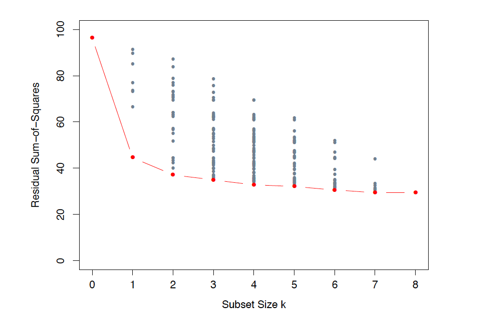

```{r startup, include = FALSE, message = FALSE, warning = FALSE}
knitr::opts_chunk$set(echo = T, eval=T, message=F, warning=F, error=F, comment=NA, cache=F, R.options=list(width=220))
```


# Variable selection

Let us revisit the linear model $\mathbf{y} = \mathbf{X} \boldsymbol{\beta}^0 + \boldsymbol{\varepsilon}$ where $\mathbb{E}(\boldsymbol{\varepsilon})=\mathbf{0}$ and $\mathbb{V}\mathrm{ar}(\boldsymbol{\varepsilon})= \sigma^2 \mathbf{I}$. In many modern dataset, there are reasons to believe there are many more variables present than are necessary to explain the response. Let $S$ be the set 
$$S = \{k \in \{1,\ldots,p\}: \beta_k^0 \neq 0\}$$
and suppose $s = |S| \ll p$. The mean square prediction error of OLS is
$$
\begin{aligned}
\frac{1}{n}\mathbb{E} \| \mathbf{X} \boldsymbol{\beta}^0 - \mathbf{X} \hat{\boldsymbol{\beta}}^{\mathrm{OLS}} \|^2_2 &= \frac{1}{n}\mathbb{E}\{(\boldsymbol{\beta}^0 - \hat{\boldsymbol{\beta}}^{\mathrm{OLS}})^{\mathsf{T}} \mathbf{X}^{\mathsf{T}}\mathbf{X} (\boldsymbol{\beta}^0 - \hat{\boldsymbol{\beta}}^{\mathrm{OLS}}) \}\\
&= \frac{1}{n}\mathbb{E}[\mathrm{tr}\{(\boldsymbol{\beta}^0 - \hat{\boldsymbol{\beta}}^{\mathrm{OLS}})  (\boldsymbol{\beta}^0 - \hat{\boldsymbol{\beta}}^{\mathrm{OLS}})^{\mathsf{T}} \mathbf{X}^{\mathsf{T}}\mathbf{X}\}]\\
&=\frac{1}{n} \mathrm{tr}[\mathbb{E}\{ (\boldsymbol{\beta}^0 - \hat{\boldsymbol{\beta}}^{\mathrm{OLS}})  (\boldsymbol{\beta}^0 - \hat{\boldsymbol{\beta}}^{\mathrm{OLS}})^{\mathsf{T}} \mathbf{X}^{\mathsf{T}}\mathbf{X}\}]\\
&=  \frac{1}{n} \mathrm{tr}[\mathbb{V}\mathrm{ar}(\hat{\boldsymbol{\beta}}^{\mathrm{OLS}})\mathbf{X}^{\mathsf{T}}\mathbf{X}] = \frac{p}{n}\sigma^2
\end{aligned}
$$
If we could identify $S$ and then fit a linear model using just these variables, we would obtain a mean square prediction error of $\sigma^2s/n$. Futhermore, it can be shown that parameter estimates from the reduced model are more accurate. The smaller model would also be easier to interpret. 

---

# Best subset selection

A natural approach to finding $S$ is to consider all $2^p$ possible regression models each involving regressing the response on a different sets of predictors $\mathbf{X}_M$ where $M$ is a subset of $\{1,\ldots,p\}$. 

We can then pick the "best" model using cross-validation (say).

For general design matrices, this involves an exhaustive search over all subsets, so this is not really feasible for $p>50$. 

**Algorithm**

Set $B_0$ as the null model (only intercept)

For $k=1,\ldots,p$:

1. Fit all ${ p \choose k }$ models that contain exactly $k$ predictors

2. Pick the "best" among these ${ p \choose k }$ models, and call it $B_k$, where "best" is defined having the smallest residual sum of squares RSS = $n \mathrm{MSE}_{\mathrm{Tr}}$

Select a single best model from among $B_0,B_1,\ldots,B_p$ using AIC, BIC, Cross-Validation, etc.


---




---

# Backward stepwise selection

This can be seen as a greedy way of performing best subset regression. It will be sub-optimal to best subset selection but computationally efficient.


It is applicable only when $n>p$.

__Algorithm__

Set $S_p$ as the full model (all $p$ predictors)

For $k=p,p-1,\ldots,1$:

1. Consider all $k$ models that contain all but one of the predictors in $S_k$, for a total of $k-1$ predictors

2. Choose the "best" among these $k$ models and call it $S_{k-1}$, where "best" is defined having the smallest RSS

Select a single best model from among $S_0,S_1,\ldots,S_p$ using AIC, BIC, cross-validation, etc.

---

# Forward stepwise selection

Greedy algorithm sub-optimal to best subset selection but computationally efficient.

Applicable also when $p>n$ to construct the sequence $S_0, S_1,\ldots,S_{n-1}$.

__Algorithm__

Set $S_0$ as the null model (only intercept)

For $k=0,\ldots,\min(n-1,p-1)$:


1. Consider all $p-k$ models that augment the predictors in $S_k$ with one additional predictor

2. Choose the "best" among these $p-k$ models and call it $S_{k+1}$, where "best" is defined having the smallest RSS

Select a single best model from among $S_0,S_1,S_2, \ldots$ using AIC, BIC, cross-validation, etc.


---

# Forward with AIC-based stopping rule

Set $S_0$ as the null model and $k=0$.

1. Consider all $p-k$ models that augment the predictors in $S_k$ with one additional predictor.

2. Choose the "best" among these $p-k$ models and call it $S_{k+1}$, where "best" is defined having the smallest AIC.

3. If AIC( $S_{k+1}$ ) $<$ AIC( $S_k$ ), set $k=k+1$ and go to 1., otherwise STOP

---


# Application to Hitters data

```{r}
rm(list=ls())
library(ISLR)
data(Hitters)
Hitters = Hitters[complete.cases(Hitters),]
Hitters[,"League"]=(Hitters[,"League"]=="A")*1
Hitters[,"Division"]=(Hitters[,"Division"]=="E")*1
Hitters[,"NewLeague"]=(Hitters[,"NewLeague"]=="A")*1
set.seed(123)
n = 163
train.id = sample(nrow(Hitters),n)
train = Hitters[train.id,]
names(train)[19] = "y" 
X = as.matrix(train[,-19])
y = train$y
p = ncol(X)
test = Hitters[-train.id,]
names(test)[19] = "y" 
X.star = as.matrix(test[,-19])
y.star = test$y
m = nrow(X.star)
```

---

```{r}
# Full model
fit.full = lm(y ~ ., train)
RMSE.full = sqrt(mean( (predict(fit.full, newdata=test) - y.star )^2 ))
RMSE.full
```

---


```{r}
# Best subset
library(leaps)
fit.bests <- regsubsets(y~.,train, nvmax=p)
summary.bests<-summary(fit.bests)
head(summary.bests$outmat, 10)
```

---

```{r}
# Best Cp
plot(summary.bests$cp, xlab="k", ylab="Cp", type="b")
```

---

```{r}
# best BIC
plot(fit.bests, scale="bic")
```

---

```{r}
# function predict for regsubsets
predict.regsubsets =function(object ,newdata ,id ,...){
 form=as.formula(object$call[[2]])
 mat=model.matrix(form, newdata)
 coefi =coef(object, id=id)
 xvars =names(coefi)
 mat[,xvars]%*%coefi
}

yhat.bestCp = predict.regsubsets(fit.bests, newdata=test, id=which.min(summary.bests$cp))
RMSE.Cp = sqrt(mean( (yhat.bestCp - y.star)^2 ))
RMSE.Cp

yhat.bestBIC = predict.regsubsets(fit.bests, newdata=test, id=which.min(summary.bests$bic))
RMSE.BIC = sqrt(mean( (yhat.bestBIC - y.star)^2 ))
RMSE.BIC
```

---

```{r}
# Forward with AIC stopping rule
fit.null = lm(y ~ 1, train)
fit.fwdAIC = step(fit.null, scope=list(upper=fit.full), direction="forward", k=2, trace=0)
summary(fit.fwdAIC)$coeff
yhat.fwdAIC = predict(fit.fwdAIC, newdata=test)
RMSE.fwdAIC = sqrt(mean( (yhat.fwdAIC - y.star)^2 ))
RMSE.fwdAIC
```

---

layout: false
class: inverse, middle, center

# Variable selection and cross-validation

---

# Variable selection and cross-validation

See ISLR, 6.5.3.

Since variable selection is part of the model building process,  cross-validation should account for the __variability of the selection__ when calculating estimates of the test error.

If the full data set is used to perform the best subset selection step, the cross-validation errors that we obtain will not be accurate estimates of the test error.

To choose among the models of different sizes using cross-validation, we perform best
subset selection within each iteration of the cross-validation.

Note that possibly different subsets of the "best" predictors are generated at each iteration of the cross-validation.

---

```{r}
# Validation set
set.seed(123)
is.va = sample(c(T,F), n, replace = TRUE)
err.va = vector()
fit = regsubsets(y ~.,data=train[!is.va,],nvmax=p)
for (j in 1:p){
  yhat=predict(fit, train[is.va,], id=j)
  err.va[j] = sqrt(mean( (train$y[is.va]-yhat)^2 ))
}
names(err.va) <- 1:p
err.va
yhat.bestVa = predict.regsubsets(fit.bests, newdata=test, id=which.min(err.va))
RMSE.bestVa = sqrt(mean( (yhat.bestVa - y.star)^2 ))
RMSE.bestVa
```

---

```{r}
# K-fold Cross-Validation
set.seed(123)
K = 10
folds = sample(1:K, n, replace =TRUE)
KCV = matrix(NA, K, p)
for (k in 1:K){
  fit_k = regsubsets(y ~.,data=train[folds!=k,],nvmax=p)
  for (j in 1:p){
    yhat_k=predict(fit_k, train[folds==k,], id=j)
    KCV[k,j]=mean( (train$y[folds==k]-yhat_k)^2 )
  }
}
```

---

```{r}
plot(1:p,apply(KCV,2,mean), type="b", ylab="CV error", xlab="k")
```

---

```{r}
yhat.bestCV = predict.regsubsets(fit.bests, newdata=test, id=which.min(apply(KCV,2,mean)))
RMSE.bestCV = sqrt(mean( (yhat.bestCV - y.star)^2 ))
RMSE.bestCV
```

---

```{r}
data.frame(
  fit = c("full", "best cp", "best bic", "best fwd aic", "best va", "best cv"),
  RMSE = c(RMSE.full, RMSE.Cp, RMSE.BIC, RMSE.fwdAIC, RMSE.bestVa, RMSE.bestCV)
)
```

---

# ESL Chapter 7.10.2

Consider a scenario with $n = 50$ samples in two equal-sized classes, and $p = 5000$ quantitative
predictors (standard Gaussian) that are independent of the class labels. The true (test) error rate of any classifier is 50%. Try the following approach:

1. choose the 100 predictors having highest correlation
with the class labels

2. use a 1-nearest neighbor classifier, based on just these 100 *selected* predictors. 

3. Use $K$-fold CV to estimate the test error of the final model


---

```{r}
set.seed(123)
n = 50
p = 5000
y = c(rep(0,n/2),rep(1,n/2))
X = matrix(rnorm(p*n), ncol=p)
# compute p correlations between each predictor and the response
cors = apply(X,2, function(x) cor(y,x))
# columns of the best 100 predictors
colbest100 = sort(-abs(cors), index.return=T)$ix[1:100]
# best 100 predictors
Xbest = X[,colbest100]
# CV
require(class)
K<-5
set.seed(123)
folds <- sample( rep(1:K,length=n) )
Err.CV = vector()
for (k in 1:K){
out = which(folds==k)
# predict the held-out samples using k nearest neighbors
pred <- knn(train = Xbest[ -out, ],test = Xbest[out, ], cl = y[-out], k = 1)
# % of misclassified samples
Err.CV[k] = mean( y[out] != pred)
}
mean(Err.CV)
```

---

Leaving observations out after the variables have been selected does not correctly mimic the application of the classifier to a completely independent
test set, since these predictors have already seen the left out observations. Here is the correct way to carry out cross-validation in this example:

1. Divide the observations into $K$ cross-validation folds at random
2. For each fold $k = 1,\ldots,K$

    a. Find the best 100 predictors that have the largest (in absolute value) correlation with the class labels, using all of the observations except those in fold $k$
    
    b. Using just this subset of predictors, fit a 1-nearest neighbor classifier, using all of the observations except those in fold $k$
    
    c. Use the classifier to predict the class labels for the observations in fold $k$
    
---

```{r}
set.seed(123)
n = 50
p = 5000
y = c(rep(0,n/2),rep(1,n/2))
X = matrix(rnorm(p*n), ncol=p)
require(class)
K<-5
set.seed(123)
folds <- sample( rep(1:K,length=n) )
Err.CV = vector()
for (k in 1:K){
out = which(folds==k)
cors = apply(X[-out, ],2, function(x) cor(y[-out],x))
colbest100 = sort(-abs(cors), index.return=T)$ix[1:100]
Xbest = X[,colbest100]
pred <- knn(train = Xbest[-out, ],
            test = Xbest[out, ],
            cl = y[-out], k = 1)
Err.CV[k] = mean( y[out] != pred)
}
mean(Err.CV)
```
