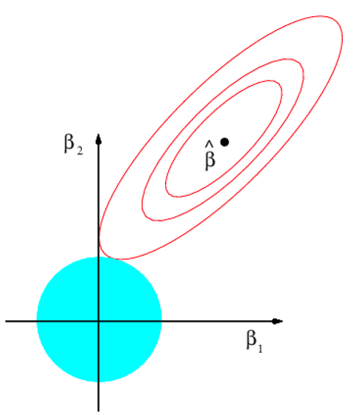
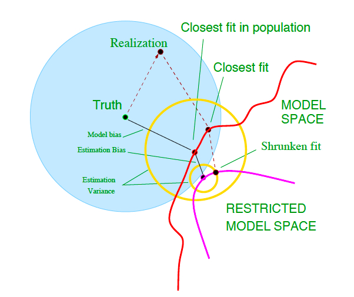

```{r startup, include = FALSE, message = FALSE, warning = FALSE}
knitr::opts_chunk$set(echo = T, eval=T, message=F, warning=F, error=F, comment=NA, cache=F, R.options=list(width=220))
```


# Outline

* Problems in linear regression
* Problem 1: collinearity 
* Problem 2: overfitting
* Problem 3: high-dimensional data
* Ridge regression
* Bias-variance trade-off
* Constrained estimation

---

# Matrix notation

* Vector of response: 
$$\underset{n\times 1}{\mathbf{y}} = 
\left[
\begin{array}{c}
y_1   \\
\cdots\\
y_i  \\
\cdots\\
y_n \\
\end{array}\right]$$

* Design matrix:
$$\underset{n\times p}{\mathbf{X}} = \left[
\begin{array}{cccccc}
x_{1}^\mathsf{T}   \\
x_{2}^\mathsf{T}  \\
\cdots   \\
x_{i}^\mathsf{T}    \\
\cdots\\
x_{n}^\mathsf{T}\\
\end{array}\right] = \left[
\begin{array}{cccccc}
x_{11}  & x_{12}  & \cdots   &  x_{1j}  & \cdots   &   x_{1p}  \\
x_{21}  & x_{22} & \cdots   &  x_{2j}  & \cdots   &   x_{2p}  \\
\cdots   & \cdots   &  \cdots & \cdots   &  \cdots  \\
x_{i1}  & x_{i2} & \cdots   &  x_{ij}& \cdots   & x_{ip}    \\
\cdots   & \cdots   &  \cdots  &  \cdots   &  \cdots\\
x_{n1}   & x_{n2} & \cdots   & x_{nj}    &  \cdots   &   x_{np}\\
\end{array}\right]$$

---

# Linear regression

* Suppose $\mathrm{rank}(\mathbf{X}) = p$

* Least squares problem: 
$$\min_{\boldsymbol{\beta} \in \mathbb{R}^p} \sum_{i=1}^{n}(y_i - x_i^\mathsf{T}\boldsymbol{\beta} )^2 = \min_{\boldsymbol{\beta} \in \mathbb{R}^p} \| \mathbf{y} - \mathbf{X}\boldsymbol{\beta} \|^2_2$$
where  $\| \underset{p \times 1}{ \mathbf{v}} \|_{2} = (\mathbf{v}^\mathsf{T}\mathbf{v})^{1/2} = \sqrt{\sum_{j=1}^{p} v_j^2}$ denotes the $L_2$ norm


* Normal equations: $\mathbf{X}^\mathsf{T}\mathbf{X}\boldsymbol{\beta} = \mathbf{X}^\mathsf{T}\mathbf{y}$

* OLS estimator: $$\underset{p\times 1}{\hat{\boldsymbol{\beta}}} = (\mathbf{X}^\mathsf{T}\mathbf{X})^{-1}\mathbf{X}^\mathsf{T} \mathbf{y}$$

* Fitted values: $\underset{n\times 1}{\hat{\mathbf{y}} } = \mathbf{X}\hat{\boldsymbol{\beta}}$

* Test data: $\underset{m\times 1}{\mathbf{y}^*}$, $\underset{m\times p}{\mathbf{X}^*}$, prediction on test data: $\underset{m\times 1}{\hat{\mathbf{y}}^*} = \mathbf{X}^*\hat{\boldsymbol{\beta}}$


---

# Problems in linear regression

1. Collinearity

2. Overfitting: when $p \approx n$, the linear regression fit often has low bias but high variance 

3. High-dimensional data: when $p>n$, we have super-collinearity 

---

layout: false
class: inverse, middle, center

# Problem 1: collinearity

---

# Credit data

* `Balance` : average credit card debt (response) 
* `Age`
* `Cards` : number of credit cards
* `Education` : years of education
* `Income` : in thousands of dollars
* `Limit` : credit limit
* `Rating` : credit rating
* `Gender`
* `Student` : student status
* `Status` : marital status
* `Ethnicity` : Caucasian, African American
or Asian

---

```{r}
library(readr)
Credit <- read_csv("http://www-bcf.usc.edu/~gareth/ISL/Credit.csv")[,-1]
plot(Credit[,c("Balance","Limit","Rating")])
```

---

# Collinearity

* `Limit` and `Rating` are very highly correlated with each other, i.e. they are __collinear__

* Collinearity is problematic for regression, since it can be difficult to separate out the individual effects of collinear variables on the response

```{r}
round( summary(lm(Balance ~ Limit + Rating, Credit))$coeff , 4)
```

* The importance of the `Limit` variable has been masked due to the presence of collinearity

* [ISL Figure 3.15](http://www-bcf.usc.edu/~gareth/ISL/Chapter3/3.15.pdf) 

---

# Simulated data

True model

$$Y = 3 + 1\cdot X_1 + 1\cdot X_2 + \varepsilon$$

```{r}
set.seed(473)
x1 <- rnorm(20)
x2 <- rnorm(20, mean=x1, sd=.01)
y <- 3 + x1 + x2 + rnorm(20)
round( summary(lm(y~x1+x2))$coef , 4)
```

* Here the strong correlation between $X_1$ and $X_2$ is problematic for the estimation of $\beta_1$ and $\beta_2$

---
layout: false
class: inverse, middle, center

# Problem 2: Overfitting

---

# Simulated data

* $n=10$ and $p=9$
* Model: $Y = \beta_1 X_1 + \beta_2 X_2 + \ldots + \beta_9X_9 +  \varepsilon$
* True $\boldsymbol{\beta} = (1,0,0,\ldots,0)^\mathsf{T}$

```{r}
n = 10
p = 9
set.seed(1793)
X = matrix(rnorm(n*p),nrow=n, ncol=p)
y = X[,1] + rnorm(n,0,0.5)
fit = lm(y~ 0 + X)
coef(fit)
```

* Overfitting refers to the phenomenon of modelling the noise
rather than the signal

* Large estimates of regression coefficients (in absolute value)
are often an indication of overfitting

---


```{r}
yhat = predict(fit)
plot(X[,1],y, xlab="x1")
ix = sort(X[,1], index.return=T)$ix
lines(X[ix,1], yhat[ix])
abline(a=0,b=1, col=4)
```

---

# Complete overfitting

```{r}
y = c(-1,0); x1 = c(.75,.5); x2 = c(1,.5)
summary(lm(y~0+x1+x2))
```

---

# Observations space


---

* In $p\geq n$ settings overfitting is a real threat: it
is possible to form a linear combination of the predictors
that perfectly explains the response, including the noise

* [ISL Figure 6.22](http://www-bcf.usc.edu/~gareth/ISL/Chapter6/6.22.pdf) Least squares regression in the low-dimensional setting with $n=20$, $p=2$ and in the $n=p=2$ setting

---
layout: false
class: inverse, middle, center

# Problem 3: High-dimensional data

---

# Riboflavin data

* The data has been kindly provided by [DSM](https://www.dsm.com/corporate/home.html) (Kaiseraugst, Switzerland)

* The response variable is the logarithm of the riboflavin (vitamin B2) production rate in [Bacillus subtilis](https://en.wikipedia.org/wiki/Bacillus_subtilis)

* $n=71$ observations

* $p=4088$ predictors measuring the logarithm of the expression level of 4088 genes

* Data sets containing more variables than observations, i.e. $p > n$ are referred to as __high-dimensional__

* An high-dimensional $\mathbf{X}$ suffers from __super-collinearity__ : $p>n$ implies that the columns of $\mathbf{X}$ are linearly dependent, i.e.  $\mathrm{rank}(\mathbf{X})<p$. Then $\mathbf{X}^\mathsf{T}\mathbf{X}$ is singular and it does not have an inverse

* How to perform __high-dimensional regression__?

---

```{r}
library(hdi)
data(riboflavin)
Riboflavin = as.data.frame( cbind(y=riboflavin$y, x=riboflavin$x) )
names(Riboflavin) = c("y",attr(riboflavin$x, "dimnames")[[2]])
dim(Riboflavin)
```


```{r}
coef( lm( y ~ ., Riboflavin) )[1:100]
```

---

# The failure of least squares in high dimensions

* When $\mathrm{rank}(\mathbf{X}) < p$, e.g. this happens when $p>n$, there are infinitely many solutions in the least square problem

* Suppose $p>n$ and $\mathrm{rank}(\mathbf{X}) = n$. Let $U=\mathrm{span}(\mathbf{X})$ be the $n$-dimensional space spanned by the columns of $\mathbf{X}$ and $V=U^\bot$ the $p-n$ dimensional space orthogonal complement of $U$, i.e. i.e. the non-trivial null space of $\mathbf{X}$

* Then $\mathbf{X}\mathbf{v} = \mathbf{0}_p$ for all $\mathbf{v} \in V$, and $\mathbf{X}^\mathsf{T}\mathbf{X}\mathbf{v} = \mathbf{X}^\mathsf{T}\mathbf{0}_p = \mathbf{0}_n$, the solution of the normal equations is
$$\underset{p\times 1}{\hat{\boldsymbol{\beta}}} = (\mathbf{X}^\mathsf{T}\mathbf{X})^{-}\mathbf{X}^\mathsf{T} \mathbf{y} + \mathbf{v} \quad \forall\,\, \mathbf{v} \in V$$
where $\mathbf{A}^-$ denotes the Moore-Penrose inverse of the matrix $\mathbf{A}$


---

# Regularization

* How we deal with problems 1, 2 and 3? The short answer is __regularization__

* Least squares: 
$$\min_{\boldsymbol{\beta} \in \mathbb{R}^p} \| \mathbf{y} - \mathbf{X}\boldsymbol{\beta} \|^2_2$$

* __Penalized form__
$$\min_{\boldsymbol{\beta} \in \mathbb{R}^p} \| \mathbf{y} - \mathbf{X}\boldsymbol{\beta} \|^2_2+ P(\boldsymbol{\beta})$$
where $P(\cdot)$ is some (typically convex) penalty function

* __Constrained form__
$$\min_{\boldsymbol{\beta} \in \mathbb{R}^p} \| \mathbf{y} - \mathbf{X}\boldsymbol{\beta} \|^2_2 \quad \mathrm{subject\,\,to\,\,} \boldsymbol{\beta}\in C$$
where $C$ is some (typically convex) set

* At its core, regularization provides us a way of navigating the bias-variance trade-off

---

layout: false
class: inverse, middle, center

# Ridge regression

---

# Ridge regression

* Penalized least squares:
$$\min_{\boldsymbol{\beta} \in \mathbb{R}^p} \sum_{i=1}^{n}(y_i - x_i^\mathsf{T}\boldsymbol{\beta} )^2 + \lambda\sum_{j=1}^{p}\beta_j^2 = \min_{\boldsymbol{\beta} \in \mathbb{R}^p} \underbrace{ \| \mathbf{y} - \mathbf{X}\boldsymbol{\beta} \|^2_2 }_{\mathrm{RSS} }+ \underbrace{\lambda\| \boldsymbol{\beta}\|^2_2}_{\mathrm{penalty}}$$
Here $\lambda \in [0,\infty)$ is the __tuning parameter__ which controls the strenght of the penalty term

* The minimum of the RSS is attained at $\boldsymbol{\beta}=\hat{\boldsymbol{\beta}}$ while the minimum of the ridge penalty is attained at $\boldsymbol{\beta}=\mathbf{0}_p$. The effect of the penalty in this balancing act is to __shrink__ the
coefficient estimates towards zero

* The solution of the minimization problem is the __ridge estimator__ :
$$\underset{p\times 1}{\hat{\boldsymbol{\beta}}^\lambda} = (\mathbf{X}^\mathsf{T}\mathbf{X} + \lambda \mathbf{I}_p )^{-1}\mathbf{X}^\mathsf{T} \mathbf{y}$$
where $\mathbf{I}_p$ is the $p\times p$ identity matrix

* For any design matrix $\mathbf{X}$, the quantity
$(\mathbf{X}^\mathsf{T}\mathbf{X} + \lambda \mathbf{I}_p )^{-1}$ is always invertible provided that $\lambda > 0$; thus,
there is always a unique solution $\hat{\boldsymbol{\beta}}^\lambda$

---


# Solution path

* As $\lambda \rightarrow 0$, $\hat{\boldsymbol{\beta}}^\lambda \rightarrow \hat{\boldsymbol{\beta}}$

* As $\lambda \rightarrow \infty$, $\hat{\boldsymbol{\beta}}^\lambda \rightarrow \mathbf{0}_p$

* __Solution path__ of the ridge estimator:
$$\{\hat{\boldsymbol{\beta}}^{\lambda}: \lambda \in [0,\infty) \}$$

* All regression coefficients are shrunken towards zero as the tuning parameter $\lambda$ increases

* This behaviour is not strictly monotone in $\lambda$: $\lambda_a > \lambda_b$ does not necessarily imply $|\hat{\beta}^{\lambda_a}_j| < |\hat{\beta}^{\lambda_b}_j|$

---

# Standardization

* Some care is needed in the application of ridge regression

* First of all, usually the intercept term is not included in the penalty

* Second, the size of the regression coefficient depends on the
scale with which the associated predictor is measured, and the penalty term $\sum_{j=1}^{p}\beta_j$ is unfair if the predictors are not on the same scale

* If predictors are not in the same units already, they are standardized to have mean zero and standard deviation 1 prior to model fitting

* If we center the columns of $\mathbf{X}$, then the intercept estimate ends up just being $\hat{\beta}_0=\bar{y}$. Usually the response is also standardized to have mean zero and standard deviation 1 and the intercept term is not included in the model

* This can be accomplished without any loss of generality because the coefficients can be returned on the original scale

---

```{r}
fit = lm(Balance ~ ., Credit)
X= model.matrix(fit)
y = Credit$Balance
n = nrow(X)
Xstd = scale(X[,-1])[,]*sqrt((n-1)/n)
ystd = scale(y)[,]*sqrt((n-1)/n)
```


---

```{r}
lambdas = exp(seq(-4,12,length.out = 100))
hatbetas =sapply(lambdas, function(lambda)
solve(t(Xstd)%*%Xstd + lambda*diag(ncol(Xstd))) %*% t(Xstd) %*% ystd
)
matplot(log(lambdas), t(hatbetas), type="l", lty=1, ylab="standardized coefficients")
```

---

# glmnet()

```{r, eval=F}
glmnet(X, y,
family="gaussian",
alpha = 0, # default = 1 (LASSO), 0 = ridgde
nlambda = 100, # default
standardize = TRUE, # default
intercept=TRUE # default
)
```

* See the [glmnet vignette](https://web.stanford.edu/~hastie/glmnet/glmnet_alpha.html)

---

```{r}
library(glmnet)
fit = glmnet(Xstd, ystd, alpha = 0, family="gaussian", lambda=lambdas/n)
# solution path
plot(fit, xvar="lambda", label = TRUE)
```

---

```{r}
# Original scale
fit = glmnet(X, y, alpha = 0, family="gaussian")
plot(fit, xvar="lambda")
```

---

# Choice of the penalty parameter

* Throughout the introduction of ridge regression and the
subsequent discussion of its properties the penalty parameter is considered known or given

* In practice, it is unknown and the user needs to make an informed decision on its value

* Usually by cross-validation or generalized cross-validation

---

```{r}
# K-fold cross validation
K <- 5
fit.cv <-cv.glmnet(X[,-1],y, alpha=0, nfolds = K, grouped=FALSE)
plot(fit.cv)
```

---

```{r}
# lambda selected by K fold cross validation
hatlambda <-fit.cv$lambda.min
hatlambda
predict(fit.cv, s=hatlambda, type ="coefficients")
```

---

# Collinearity

```{r}
set.seed(473)
x1 <- rnorm(20)
x2 <- rnorm(20, mean=x1, sd=.01)
y <- rnorm(20, mean=3+x1+x2)
# OLS estimate
coef(lm(y~x1+x2))
# Ridge estimate
require(MASS)
lm.ridge(y~x1+x2, lambda=1)
```

It can be shown that ridge regression improves estimates for the coefficients of strongly positively correlated predictors with similar values of true coefficients 

---

# High-dimensional data

```{r, echo=F}
X = model.matrix(lm(y ~ . ,Riboflavin))
fit = glmnet(X,riboflavin$y, alpha=0, family="gaussian", standardize = FALSE)
plot(fit, xvar="lambda")
```

---

layout: false
class: inverse, middle, center

# Bias-variance trade-off

---

# Assumptions

* Consider a fixed $X$ setting

* Assume that the true model is linear 
$$\mathbf{y} =  \mathbf{X} \boldsymbol{\beta} + \boldsymbol{\varepsilon}$$
where the the distribution of the errors is Gaussian, i.e. $\boldsymbol{\varepsilon} \sim N(\mathbf{0}_n,\sigma^2 \mathbf{I}_{n})$

* These are strong assumptions

---

# Ridge regression bias-variance trade-off

* The linear operator 
$$\mathbf{W}^{\lambda} = [\mathbf{I}_{p\times p} + \lambda(\mathbf{X}^\mathsf{T}\mathbf{X})^{-1}]^{-1}$$
transforms the OLS estimator into the ridge estimator 
$$\mathbf{W}^{\lambda} \hat{\boldsymbol{\beta}} = \hat{\boldsymbol{\beta}}^{\lambda}$$

* Bias $$\mathbb{E}(\hat{\boldsymbol{\beta}}^{\lambda}) =  \mathbf{X}^\mathsf{T}\mathbf{X}(\lambda\mathbf{I}_{p}  + \mathbf{X}^\mathsf{T}\mathbf{X})^{-1} \boldsymbol{\beta}$$


* Variance
$$\mathbb{V}\mathrm{ar}(\hat{\boldsymbol{\beta}}^{\lambda}) = \sigma^2 \mathbf{W}^{\lambda} (\mathbf{X}^\mathsf{T}\mathbf{X} )^{-1}(\mathbf{W}^{\lambda})^\mathsf{T}$$


---

# Shrinkage

* Estimates are shrunk towards zero

* Consequence
    - Introduces bias
    - Reduces variance

---

# Theorem 2 of Theobald, 1974

* There exists $\lambda > 0$ such that $(\mathbb{B}\mathrm{ias} )^2 +   \mathbb{V}\mathrm{ar}$ of the ridge regression estimator is lower than the OLS estimator 

* For a certain value of $\lambda$, the decrease in variance of the ridge
regression estimator exceeds the increase in its bias

* The optimal choice of $\lambda$ depends on the quantities $\boldsymbol{\beta}$ and $\sigma^2$. These are unknown in practice

---

```{r, echo=FALSE}
f <- function(rho, lam, n) {
  G <- matrix(c(1, rho, rho,1), 2, 2)

  ## OLS
  bias.ols <- rep(0, 2)
  var.ols <- solve(G)/n
  mse.ols <- sum(diag(var.ols)) + crossprod(bias.ols)

  ## ridge
  W <- solve(G + lam/n*diag(2))
  var.ridge <- W %*% G %*% W / n
  bias.ridge <- lam/n * W %*% matrix(c(1,1), 2, 1)
  mse.ridge <- sum(diag(var.ridge)) + crossprod(bias.ridge)
  val <- c(mse.ols, mse.ridge, crossprod(bias.ridge), sum(diag(var.ridge)))
  names(val) <- c("mse.ols", "mse.ridge", "bias.ridge", "var.ridge")
  val
}
lam <- c(0, exp(seq(log(0.001), log(10), length=99)))
Y <- matrix(NA, 100, 4)
for (i in 1:100) {
  Y[i,] <- f(0.5, lam[i], 20)
}
matplot(lam, Y, type="l", col=c("gray50", 1:3), lwd=3, lty=1, xlab=expression(lambda), las=1, ylab="", bty="n")
text(5.5, 0.10, "MSE", xpd=T)
text(9, 0.03, "Var", xpd=T)
text(9, 0.085, expression(Bias^2), xpd=T)
```

---

# Predicting a Gaussian random variable

* $Y = \mu + \varepsilon$ with $\varepsilon \sim N(0,\sigma^2)$

* Training data: $Y_1,\ldots,Y_n$

* Sample mean: $\bar{Y} = \frac{1}{n}\sum_{i=1}^{n} Y_i$

* Bias-Variance decomposition 
$$
\begin{aligned}
\mathbb{E}\{[Y - \bar{Y} ]^2 \} & = \sigma^2 + [\mathbb{B}\mathrm{ias}( \bar{Y} ) ]^2 + \mathbb{V}\mathrm{ar}( \bar{Y} )\\
& = \sigma^2 + 0 + \sigma^2/n
\end{aligned}
$$

* Rao-Blackwell theorem says that $\bar{Y}$ has lower variance than any other unbiased estimator

* Is $\bar{Y}$ the optimal prediction for $Y$ ?

---

# Shrunken sample mean

* Shrunken sample mean: $\hat{Y} = \lambda \bar{Y}$ with $\lambda \in [0,1]$ 

* Bias-Variance decomposition 
$$
\begin{aligned}
\mathbb{E}\{[Y - \hat{Y} ]^2 \} & = \sigma^2 + [\mathbb{B}\mathrm{ias}( \hat{Y} ) ]^2 + \mathbb{V}\mathrm{ar}( \hat{Y} )\\
& = \sigma^2 + [\mu - \lambda \mu]^2 + \lambda^2(\sigma^2/n)
\end{aligned}
$$

* Solving $\displaystyle \frac{\partial}{\partial \lambda} \mathbb{E}\{[Y - \hat{Y} ]^2 \}  = 0$ gives the value
$$\lambda=\frac{\mu^2}{\mu^2 + \sigma^2/n}$$ 
that minimizes $\mathbb{E}\{[Y - \hat{Y} ]^2 \}$

* However, the optimal $\lambda$ depends on unknown parameters


---

layout: false
class: inverse, middle, center

# Constrained estimation

---

# Constrained estimation

* Solving the penalized problem
$$\min_{\boldsymbol{\beta} \in \mathbb{R}^p} \| \mathbf{y} - \mathbf{X}\boldsymbol{\beta} \|^2_2 + \lambda\| \boldsymbol{\beta}\|^2_2$$
is equivalent to solving the constrained problem
$$\min_{\boldsymbol{\beta} \in \mathbb{R}^p} \| \mathbf{y} - \mathbf{X}\boldsymbol{\beta} \|^2_2 \mathrm{\,\,subject\,\,to\,\,}\|\boldsymbol{\beta}\|^2_2 \leq t$$

* The constrained problem can be solved by means of the Karuch-Kuhn-Tucker (KTT) multiplier method, which minimizes a function subject to inequality constraint

---



---




