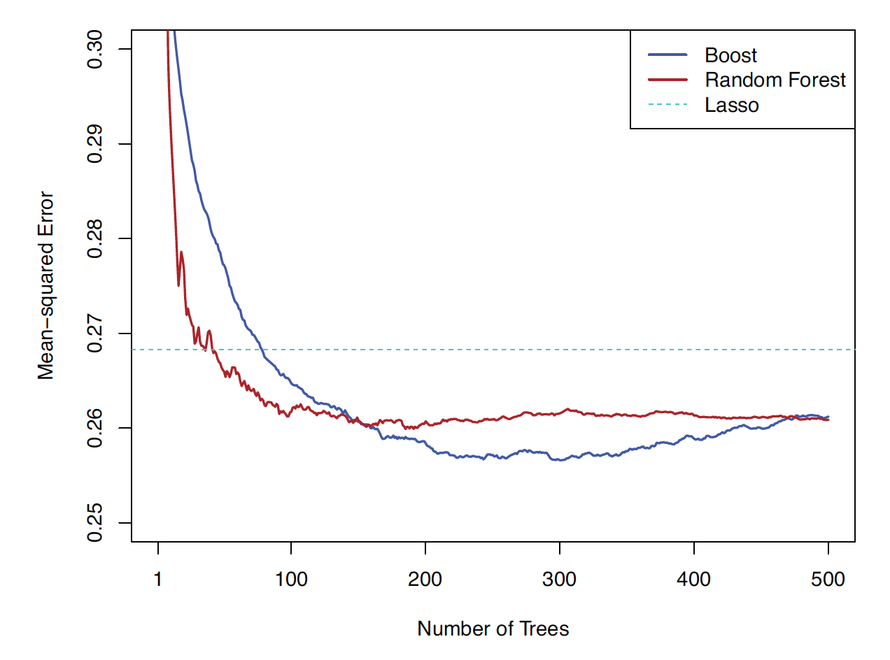
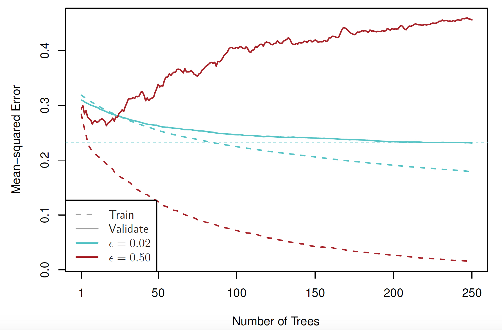
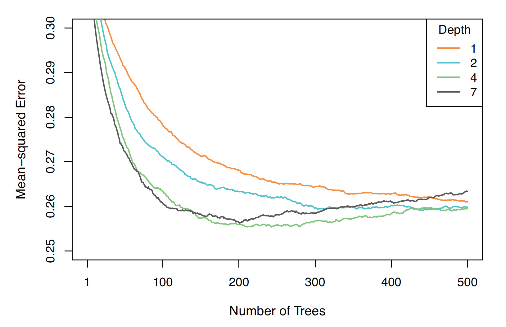
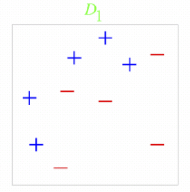
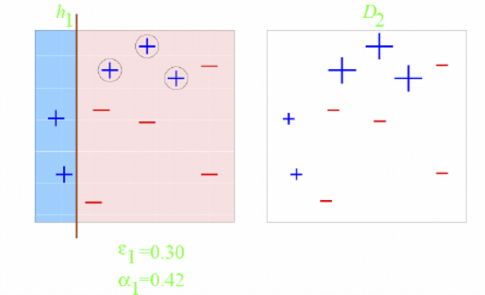
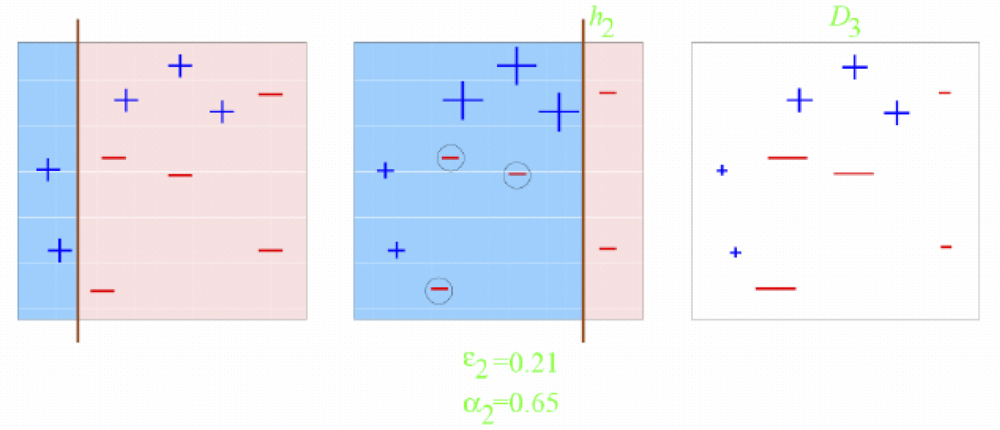
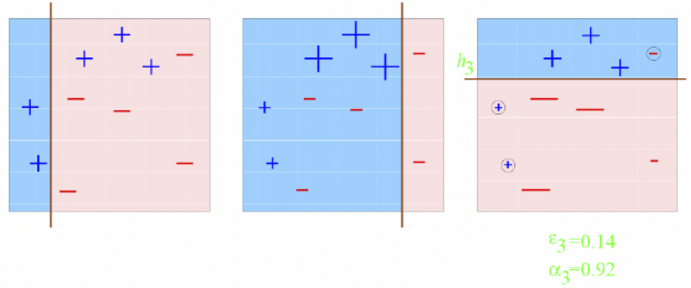
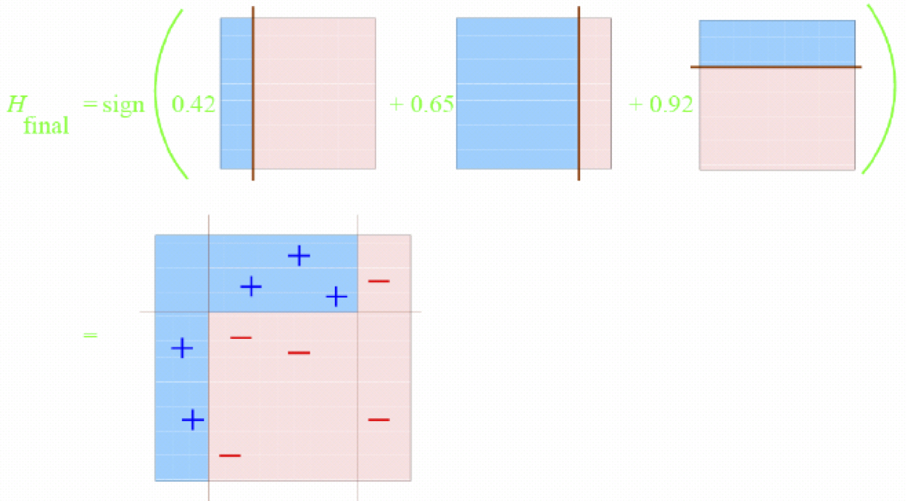

```{r startup, include = FALSE, message = FALSE, warning = FALSE}
knitr::opts_chunk$set(echo = T, eval=T, message=F, warning=F, error=F, comment=NA, cache=F, R.options=list(width=220))
```


# Outline


* L2-boosting

* AdaBoost

* Gradient boosting

---

# Boosting

* Boosting is a general method for building a complex
prediction model using simple building components (called __weak learners__)

* The original proposal for boosting is the algorithm __Adaboost__ (Freund and Shapire, 1997) as a means for improving the performance of decision trees in binary classification problems

* The general idea is the following

  - Boosting starts by fitting a weak learner to the training data

  - Next the weak learner is re-fitted, but with __more
weight__ given to badly fitted/misclassified observations

  - This process is repeated until some stopping rule is reached

---

# Boosting algorithms


1.  __boosting with squared error loss__ (L2-boosting) by using regression trees as weak learners

2.  __boosting with exponential loss__ (AdaBoost.M1) by using classification trees as weak learners

3.  __gradient boosting__ 

---

layout: false
class: inverse, middle, center

# L2-boosting

---

# L2-boosting algorithm for regression trees

* [1.] Initialize $\hat{f}(x)= \bar{y}$ and $r_i = y_i - \bar{y}$ for $i=1,\ldots,n$ 

* [2.] For $b=1,2,\ldots, B$, repeat:

    - (a) Fit a tree $\hat{f}^b$ with $d$ splits to the data $(x_1,r_1),\ldots, (x_n,r_n)$
    - (b) Update $\hat{f}$ by adding in a shrunken version of the new tree:
$$\hat{f}(x) \leftarrow \hat{f}(x) + \lambda \hat{f}^b(x)$$
    - (c) Update the residuals:
$$r_i \leftarrow r_i - \lambda \hat{f}^b(x_i)$$

* [3.] Output the boosted model:
$$\hat{f}(x) = \bar{y}+ \sum_{b=1}^{B} \lambda  \hat{f}^b(x)$$

---

Set `set.seed(123)`. Generate $n=100$ observations from the following model:

* $x_i \sim U(0,2\pi), \quad i=1,\ldots,n$
* $y_i|x_i = \sin(x_i) + \varepsilon_i$
* $\varepsilon_i  \stackrel{i.i.d.}{\sim}N(0,0.25)$

```{r, echo=F}
rm(list=ls())
set.seed(123)
n = 100
x=sort(runif(n)*2*pi)
y=sin(x)+rnorm(n, sd=0.5)
plot(y~x)
curve(sin(x), min(x),max(x), col="red", add=T)
```

* Use the L2-boosting algorithm with $B=100$, $\lambda=0.1$ and $d=1$

---

# 1. 

```{r, echo=FALSE}
B = 100+1
# 1.
r = y - mean(y)
fx = matrix(NA, nrow=n, ncol=B)
fx[,1] = rep(mean(y),n)

op <- par(mfrow = c(1, 2))
plot(x,r)
plot(x,y)
curve(sin(x), min(x),max(x), col="red", add=T)
lines(x,fx[,1], type="s", col="blue")
par(op)
```


---

# 2. b = 1

```{r, echo=FALSE}
library(rpart)
d = 1
lambda = 0.1
b = 1+1

  # a
  fxb = rpart(r~x, control=rpart.control(maxdepth = d))
  # b
  fx[,b] = fx[,b-1] + lambda*predict(fxb)

# 3.
f.boost = fx[,b]
op <- par(mfrow = c(1, 2))
plot(x,r, ylim=c(-2,2))
fxb = rpart(r~x, control=rpart.control(maxdepth = d))
lines(x,predict(fxb))
plot(x,y)
curve(sin(x), min(x),max(x), col="red", add=T)
lines(x,f.boost, type="s", col="blue")
par(op)
```

---

# 2. b = 2

```{r, echo=F}
set.seed(123)
x=sort(runif(n)*2*pi)
y=sin(x)+rnorm(n, sd=0.5)
B = 1+2
# 1.
r = y - mean(y)
fx = matrix(NA, nrow=n, ncol=B)
fx[,1] = rep(mean(y),n)
# 2.
for (b in 2:B){
  # a
  fxb = rpart(r~x, control=rpart.control(maxdepth = d))
  # b
  fx[,b] = fx[,b-1] + lambda*predict(fxb)
  # c
  r = r - lambda*predict(fxb)
}
# 3.
f.boost = fx[,B]
op <- par(mfrow = c(1, 2))
plot(x,r,ylim=c(-2,2))
fxb = rpart(r~x, control=rpart.control(maxdepth = d))
lines(x,predict(fxb))
plot(x,y)
curve(sin(x), min(x),max(x), col="red", add=T)
lines(x,f.boost, type="s", col="blue")
par(op)
```

---

# 2. b = 5

```{r, echo=F}
set.seed(123)
x=sort(runif(n)*2*pi)
y=sin(x)+rnorm(n, sd=0.5)
B = 1+5
# 1.
r = y - mean(y)
fx = matrix(NA, nrow=n, ncol=B)
fx[,1] = rep(mean(y),n)
# 2.
for (b in 2:B){
  # a
  fxb = rpart(r~x, control=rpart.control(maxdepth = d))
  # b
  fx[,b] = fx[,b-1] + lambda*predict(fxb)
  # c
  r = r - lambda*predict(fxb)
}
# 3.
f.boost = fx[,B]
op <- par(mfrow = c(1, 2))
plot(x,r, ylim=c(-2,2))
fxb = rpart(r~x, control=rpart.control(maxdepth = d))
lines(x,predict(fxb))
plot(x,y)
curve(sin(x), min(x),max(x), col="red", add=T)
lines(x,f.boost, type="s", col="blue")
par(op)
```

---

# 2. b = 10

```{r, echo=F}
set.seed(123)
x=sort(runif(n)*2*pi)
y=sin(x)+rnorm(n, sd=0.5)
B = 1+10
# 1.
r = y - mean(y)
fx = matrix(NA, nrow=n, ncol=B)
fx[,1] = rep(mean(y),n)
# 2.
for (b in 2:B){
  # a
  fxb = rpart(r~x, control=rpart.control(maxdepth = d))
  # b
  fx[,b] = fx[,b-1] + lambda*predict(fxb)
  # c
  r = r - lambda*predict(fxb)
}
# 3.
f.boost = fx[,B]
op <- par(mfrow = c(1, 2))
plot(x,r, ylim=c(-2,2))
fxb = rpart(r~x, control=rpart.control(maxdepth = d))
lines(x,predict(fxb))
plot(x,y)
curve(sin(x), min(x),max(x), col="red", add=T)
lines(x,f.boost, type="s", col="blue")
par(op)
```

---

# 2. b = B

```{r, echo=F}
set.seed(123)
x=sort(runif(n)*2*pi)
y=sin(x)+rnorm(n, sd=0.5)
B = 1+100
# 1.
r = y - mean(y)
fx = matrix(NA, nrow=n, ncol=B)
fx[,1] = rep(mean(y),n)
# 2.
for (b in 2:B){
  # a
  fxb = rpart(r~x, control=rpart.control(maxdepth = d))
  # b
  fx[,b] = fx[,b-1] + lambda*predict(fxb)
  # c
  r = r - lambda*predict(fxb)
}
# 3.
f.boost = fx[,B]
op <- par(mfrow = c(1, 2))
plot(x,r, ylim=c(-2,2))
fxb = rpart(r~x, control=rpart.control(maxdepth = d))
lines(x,predict(fxb))
plot(x,y)
curve(sin(x), min(x),max(x), col="red", add=T)
lines(x,f.boost, type="s", col="blue")
par(op)
```

---

```{r, eval=F}
rm(list=ls())
set.seed(123)
n = 100
x=sort(runif(n)*2*pi)
y=sin(x)+rnorm(n, sd=0.5)

library(rpart)
d = 1
lambda = 0.1
B = 1+100
fx = matrix(NA, nrow=n, ncol=B)
fx[,1] = rep(mean(y),n)
r = y-mean(y)

for (b in 2:B){
fit <- rpart(r ~ x, control=rpart.control(maxdepth = d, cp=0) )
fx[,b] = fx[,b-1] + lambda*predict(fit)
r = r - lambda*predict(fit)
}

plot(x,y)
curve(sin(x), min(x),max(x), col="red", add=T)
lines(x,fx[,B], type="s", col="blue")
```


---

# Tuning parameters for boosting


* The __number of trees__ $B$ <br> 
Unlike bagging and random forests, boosting can overfit if $B$ is too large. We will use cross-validation to select $B$

* The __shrinkage parameter__ $\lambda$ <br>
A small positive number, which controls the rate at which boosting learns. Typical values are 0.01 or 0.001, and the right choice can depend on the
problem. Very small $\lambda$ can require using a very large value
of $B$ in order to achieve good performance

* The __number of splits__ $d$ <br>
It controls the complexity of the boosted ensemble. Often $d = 1$ works well, in which case each tree consists of a single split (a __stump__). More
generally $d$ is the interaction depth, and controls the
interaction order of the boosted model, since $d$ splits can
involve at most $d$ variables

---

# Number of trees $B$

```{r, echo=FALSE, fig.align = 'center', out.width = '50%', out.height = '50%'}

```

.center[Efron and Hastie (2016), Figure 17.6: we see that as the number of trees $B$ gets large, the test
error for boosting starts to increase (overfitting)]

---

# Shrinkage parameter $\lambda$

```{r, echo=FALSE, fig.align = 'center', out.width = '60%', out.height = '60%'}

```

.center[Efron and Hastie (2016), Figure 17.10: Boostedmodels with different shrinkage parameters. The solid curves are
validation errors, the dashed curves training errors]

---

# Number of splits $d$

```{r, echo=FALSE, fig.align = 'center', out.width = '60%', out.height = '60%'}

```

.center[Efron and Hastie (2016), Figure 17.8: it appears that $d=1$ is inferior to the rest, with $d=4$ about the best. With $d=7$, overfitting begins around 200 trees,
with $d=4$ around 300, while neither of the other two show
evidence of overfitting by 500 trees]

---

# gbm

```{r, eval=FALSE}
library(gbm)
fit <- gbm(y ~ ., 
           distribution = "gaussian",
           data = train,
           n.trees = B,
           interaction.depth = d,
           shrinkage = lambda,
           bag.fraction = 0.5, # default
           cv.folds = 0)  # default
```

* `bag.fraction = 0.5` : grows each new tree on a 50% random sub-sample of the training data. Apart from speeding up the computations, this has a similar effect to bagging, and results in some variance reduction in the ensemble

* `cv.folds = 0` : no cross-validation

---

layout: false
class: inverse, middle, center

# Adaboost

---

# Adaboost algorithm for classification trees

1. Set $Y \in \{-1,1\}$. Initialize the observation weights $w_i=1/n, i=1,\ldots,n$

2. For $b=1,\ldots,B$ repeat the following steps

    - Fit a classification tree $\hat{C}^{b}$ to the training data, using observation weights $w_i$
    - Compute the weighted misclassification error for $\hat{C}^{b}$
$$\mathrm{Err}^{b} = \frac{\sum_{i=1}^{n}w_i  I\{ y_i \neq \hat{C}^{b}(x_i) \}}{\sum_{i=1}^{n}w_i}$$
    - Compute 
    $$\alpha^{b} = \log\left[ \frac{1- \mathrm{Err}^{b}}{\mathrm{Err}^{b}}\right]$$

    -  Update the weights as
$$w_i \leftarrow w_i \cdot  \exp(\alpha^{b} \cdot I\{y_i \neq \hat{C}^{b}(x_i) \} ), \quad i=1,\ldots,n$$
3. Output  $\hat{C}^{B}(x) = \mathrm{sign}( \sum_{b=1}^B \alpha^{b} \hat{C}^{b}(x) )$

---

# A toy example from Schapire’s tutorial


```{r, echo=FALSE, fig.align = 'center', out.width = '30%', out.height = '30%'}

```


---

# b = 1

```{r, echo=FALSE, fig.align = 'center', out.width = '70%', out.height = '70%'}

```

---

# b = 2

```{r, echo=FALSE, fig.align = 'center', out.width = '70%', out.height = '70%'}

```

---

# b = 3

```{r, echo=FALSE, fig.align = 'center', out.width = '70%', out.height = '70%'}

```

---

```{r, echo=FALSE, fig.align = 'center', out.width = '70%', out.height = '70%'}

```

---

layout: false
class: inverse, middle, center

# Gradient boosting

---


# Gradient boosting algorithm

1. Start with $\hat{f}^0(x)=0$, and set $B$ and the shrinkage parameter $\lambda>0$

2. For $b=1,\ldots,B$ repeat the following steps:

    (a) Compute the pointwise negative gradient of the __loss function__ at the current fit
$$r_i = -\frac{\partial L(y_i,f_i)}{\partial f_i}\left|_{f_i=\hat{f}^{b-1}(x_i)}\right., \quad i=1,\ldots,n$$

    (b) Approximate the negative gradient by a tree $g$ with depht $d$:
    $$(x_1,r_1),\ldots,(x_n,r_n)\rightarrow \hat{g}(x)$$
    
    (c) Update 
    $$\hat{f}^b(x) = \hat{f}^{b-1}(x) + \lambda \hat{g}(x)$$
    
3. Return the sequence $\hat{f}^b(x), b=1,\ldots,B$

---

# Loss functions

* The R package `gbm` implements the previous Algorithm for a variety
of loss functions $L$, including the __squared error loss__ $$L(y,f(x)) = \frac{1}{2} (y - f(x))^2$$ with negative gradient $$- \frac{\partial L(\tilde{y},f(x))}{\partial f(x)}  = y - f(x)$$

* It turns out that the Adaboost Algorithm for the classification
problem with $\tilde{y}\in \{-1,1\}$ fits a logistic regression
model using an __exponential
loss__ $$L(\tilde{y},f(x)) =  \exp(-\tilde{y} f(x))$$ with negative gradient
$$- \frac{\partial L(\tilde{y},f(x))}{\partial f(x)} \,\,   = \tilde{y} \exp[-\tilde{y} f(x) ]$$

---

# Parameter tuning 

* Boosting may outperforms a random forest, but at a price

* Careful tuning of boosting requires considerable extra work,
with time-costly rounds of cross-validation, whereas random forests are almost
automatic

---

```{r, eval=FALSE}
# load required libraries
rm(list=ls())
library(MASS)
library(caret)

# import data
set.seed(123)
split <- createDataPartition(y=Boston$medv, p = 0.7, list=FALSE)
train <- Boston[split,]
test = Boston[-split,-14]
test.y = Boston[-split,14]

# cross-validation
cv <- trainControl(
  method = "repeatedcv",
  number = 5,
  repeats = 2
)
```

---

```{r, eval=FALSE}
rf <- train(
  medv~., train,
  method = "rf",
  trControl=cv)

# tuning of boosting
grid <- expand.grid(
  n.trees = c(500, 1000, 1500),
  shrinkage = c(0.01, 0.05),
  interaction.depth = c(2,4,5,6), 
  n.minobsinnode = c(5,10)
)
boost <- train(
  medv~., train,
  method = "gbm",
  tuneGrid = grid,
  verbose = FALSE,
  trControl=cv)

plot(boost)
boost$bestTune
```

---
  
```{r, eval=FALSE}
models = list(
    rf=rf,
    boost=boost
  )

resamps = resamples(models)
bwplot(resamps, metric = "RMSE")

yhats = predict(models, newdata=test)
lapply(yhats, function(yhat) sqrt( mean( (yhat - test.y)^2) ) )

predVals <- extractPrediction(models, 
                              testX = test, 
                              testY = test.y)

plotObsVsPred(predVals)
```


