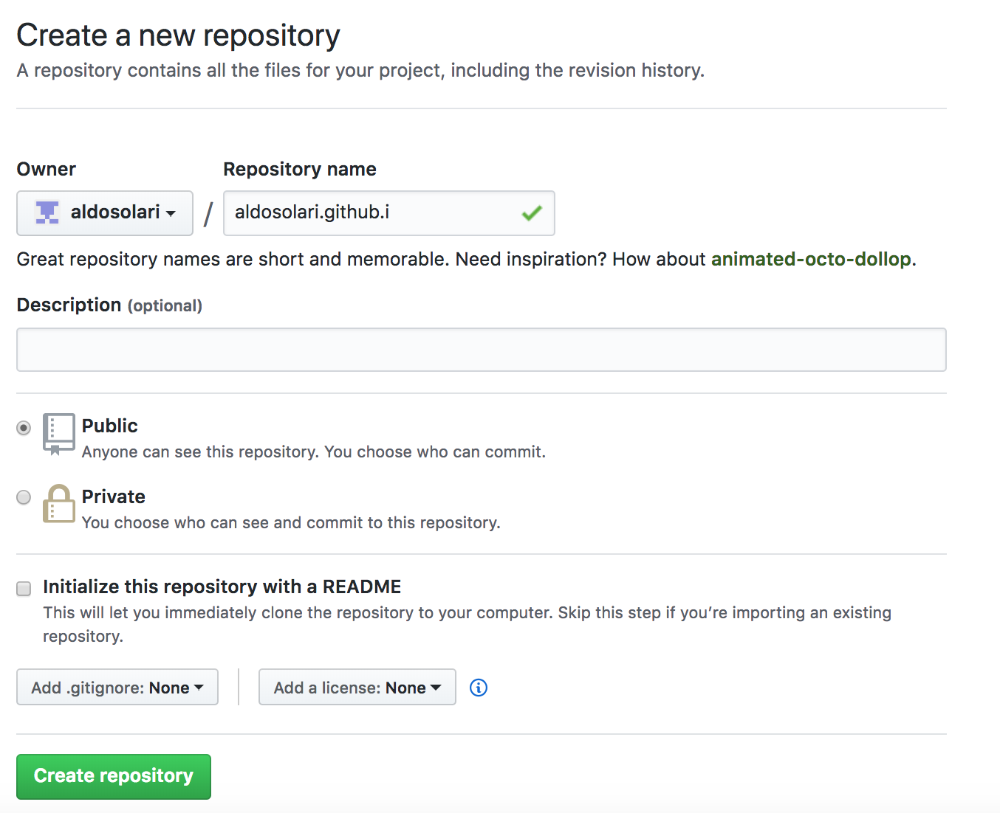
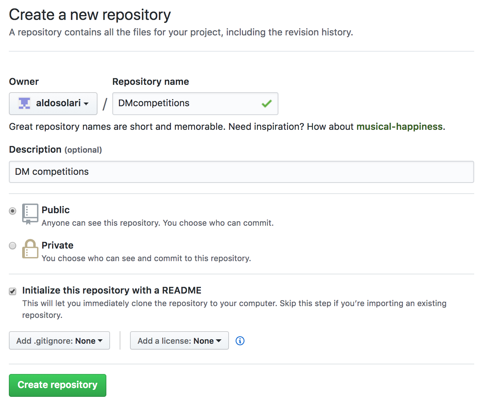
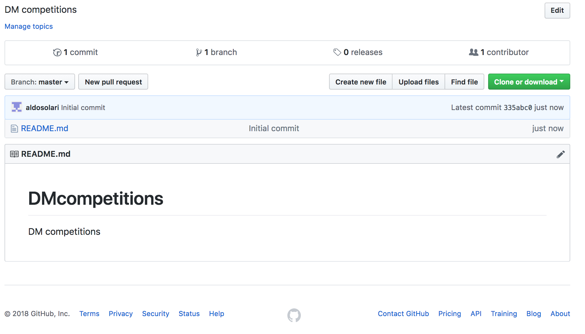
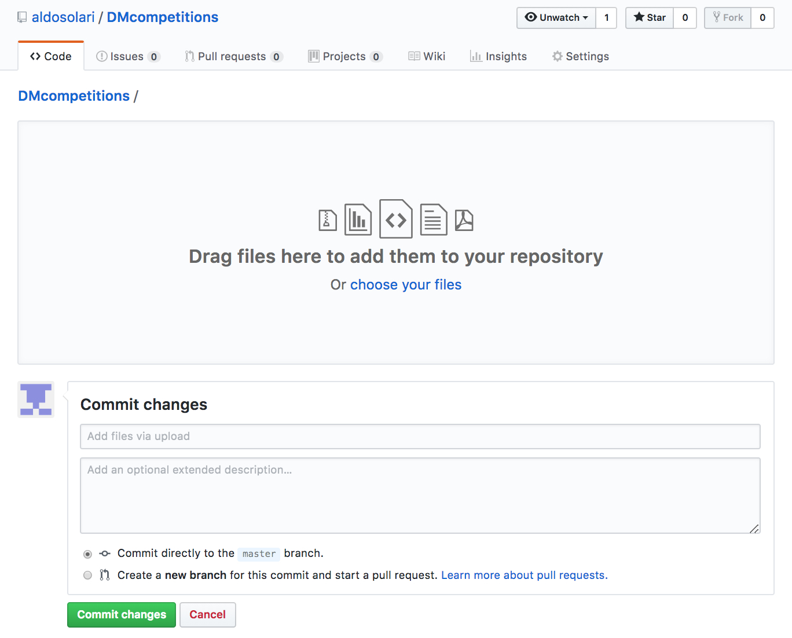
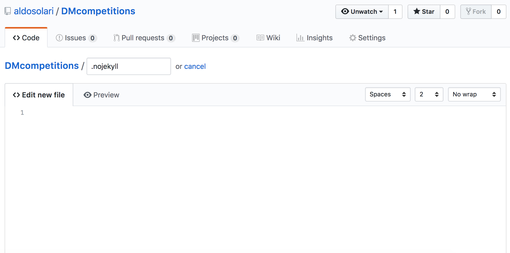
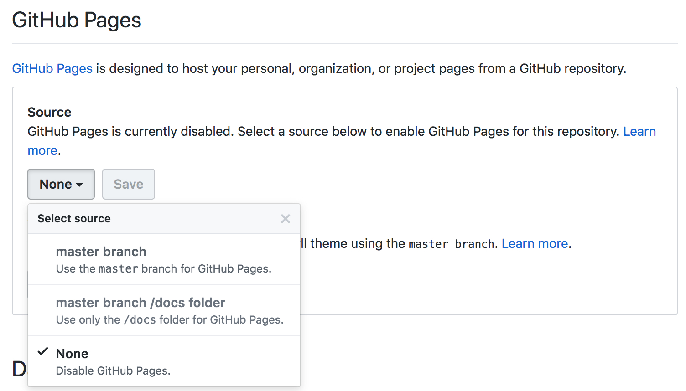

```{r startup, include = FALSE, message = FALSE, warning = FALSE}
knitr::opts_chunk$set(echo = T, eval=T, message=F, warning=F, error=F, comment=NA, cache=F, R.options=list(width=220))
```


# Outline

* Github

* How to Create an Account on GitHub

* What is Git, GitHub, and GitHub Pages?

* Getting Started with GitHub Pages

* Publish your repository

---

# Github

* GitHub Inc. is a web-based hosting service for version control using Git

* In 2018, [Microsoft](https://blog.github.com/2018-06-04-github-microsoft/) acquired GitHub for US$7.5 billion

* This is a step-by-step beginner's guide to creating a personal website and hosting it for free using GitHub Pages

---

# HTML file

* At this point I'm assuming you have produced HTML file with Rmarkdown containing the description of the analysis and the R code used in the last submission

* Here is an [example](https://aldosolari.github.io/DM/docs/competitions/publish_example.html)

* We will see how to publish your HTML file on GitHub Pages

---

# How to Create an Account on GitHub

1. Go to the GitHub sign up page [https://github.com/login](https://github.com/login)

2. Enter a username, valid email address, and password (use at least one lowercase letter, one numeral, and seven characters)

3. Review carefully the GitHub Terms of Service and Privacy Policy before continuing

4. Verify your account

5. Sign up for an account on the free plan

5. Tailor experience

6. You finished!

---

# What is Git, GitHub, and GitHub Pages?

Very shortly:

* __Git__ is a version control system that tracks changes to files in a project over time

* __GitHub__ is a web hosting service for the source code of software and web development projects that use Git

* __GitHub Pages__ are public webpages hosted for free through GitHub

---

# Getting Started with GitHub Pages

Sign in to GitHub


On your profile, go to __Repositories__ tab and click __New__

```{r, echo=FALSE, fig.align = 'center', out.width = '67%', out.height = '67%'}

```

---

Create a new repository named __{username}.github.io__

Make sure to initialize the repository with a README file

```{r, echo=FALSE, fig.align = 'center', out.width = '60%', out.height = '60%'}

```

---

# {username}.github.io

Congrats! You just built your first GitHub Pages site

View it at https://{username}.github.io

Usually the first time your GitHub Pages site is created it takes 5-10 minutes to go live

Now we will create a new repository containing the HTML file

---

Create a new repository named e.g. DMcompetitions 

Make sure to initialize the repository with a README file

```{r, echo=FALSE, fig.align = 'center', out.width = '60%', out.height = '60%'}

```

---

Once you’re in your new repository, click __Upload files__



---

Drag and drop in your HTML file and click __Commit changes__:

```{r, echo=FALSE, fig.align = 'center', out.width = '67%', out.height = '67%'}

```

---

Next to Upload files, click __Create new file__

Name it __.nojekyll__ and click Commit new file

This tells GitHub Pages to not process your site with the Jekyll engine

```{r, echo=FALSE, fig.align = 'center', out.width = '100%', out.height = '100%'}

```

---

Go to the __Settings__ tab of your repository

Scroll down to the Github Pages section and click __None__

Select __master branch__ as your Source and then hit __Save__

```{r, echo=FALSE, fig.align = 'center', out.width = '67%', out.height = '67%'}

```

Navigate to {username}.github.io/{reponame}/{filename}.html 


