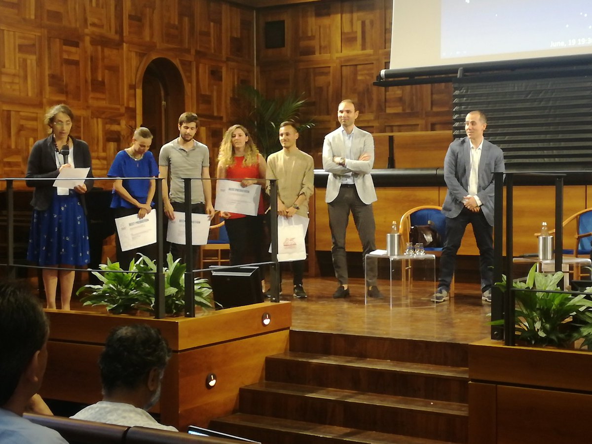
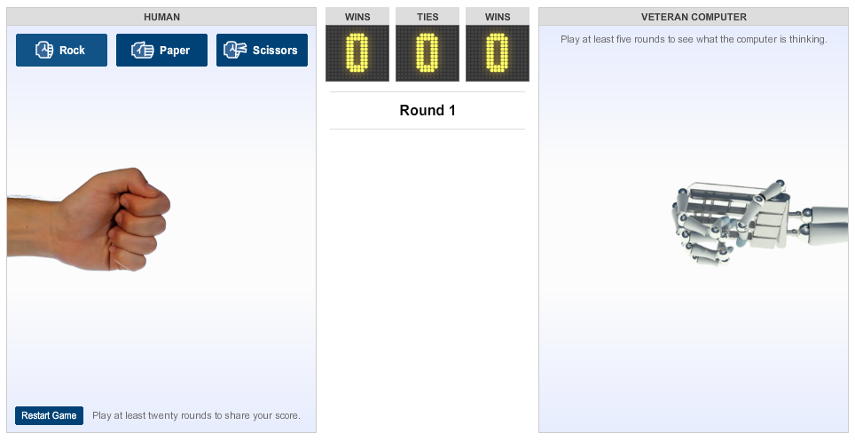
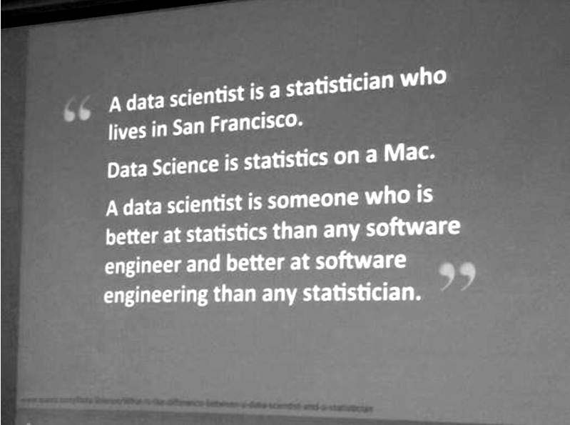
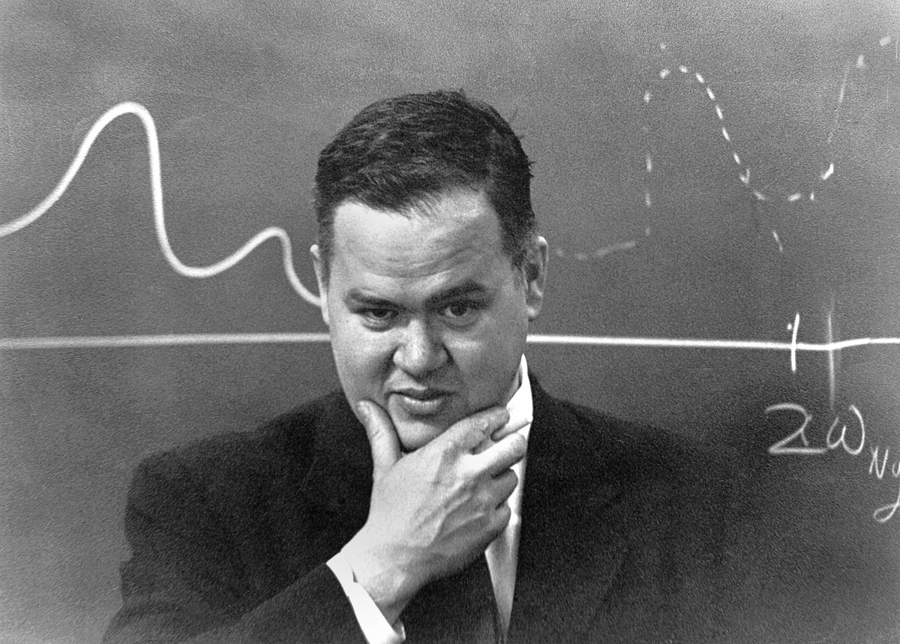
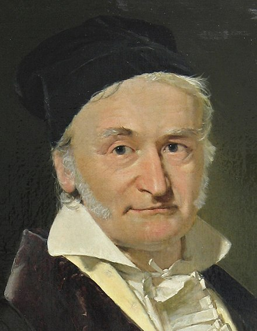

```{r startup, include = FALSE, message = FALSE, warning = FALSE}
knitr::opts_chunk$set(echo = T, eval=T, message=F, warning=F, error=F, 
                      comment=NA, cache=F, R.options=list(width=220),
                      fig.align='center', out.width='75%', fig.asp=.5)
```


# Outline

* Course overview
* The two cultures
* Polynomials

---
layout: false
class: inverse, middle, center

# Course overview

---

# Teacher

Aldo Solari

**E-mail** aldo.solari@unimib.it

**Office hours** Wednesday, 17:30-18:30, room 2030, building U7, II floor

**Personal page** https://aldosolari.github.io/

**Course page** https://aldosolari.github.io/DM/


| When | Where | Hours |
|---|---|----|
| Monday | Lab717 | 13:30-15:30 |
| Tuesday | Lab717 | 13:30-16:30|
| Thursday | Lab717 | 9:30-12:30 |
.center[**Time table**]

---

# The course


* This course aims to provide **statistical** and **computational** tools for data mining and supervised learning by using the R software environment for statistical computing

* In particular, you will learn how to use **statistical (machine) learning** for buildind **predictive models** that generate accurate predictions for future, yet-to-be-seen data

* This framework includes 
    - data visualization
    - exploratory data analysis
    - feature engineering
    - splitting the data into training and testing sets
    - building models
    - selecting an approach for identifying optimal tuning parameters
    - estimating predictive performance

---

# Exam

* The exams consists of two parts:

    - **Test** (in lab)
        - Questions about theory (open and/or multiple choice)
        - Data Analysis in R 
  
    - **Competitions** (homework)
        - Attending students can form a team (max. 3 persons)

* The final grade is a weighted average of Test (25% Questions, 25% Data Analysis) and Competitions (50%)

* You must reach a **minimum passing score** for the Questions 

---


# Competitions

* Participating in predictive modelling __competitions__ can help you gain practical experience and improve your data modelling skills in various domains such as credit, insurance, marketing, sales' forecasting etc. 

* At the same time you get to do it in a competitive context against dozens of participants where each one tries to build the most predictive algorithm

* Inspired by [kaggle](https://www.kaggle.com/), the world's largest community of data scientists and machine learners

* Since 2015, this course utilises [BeeViva](http://www.bee-viva.com/competitions), an Italian public data platform for hosting competitions

* Beeviva is also used for the event [Stats Under the Stars](http://sus.stat.unipd.it/)

---

# Stats Under the Stars 

.pull-left[


.center[Caffè Pedrocchi, Padua]

]

.pull-left[
* [SUS](http://sus.stat.unipd.it/) Padua 8.9.15)
* [SUS^2](http://www.labeconomia.unisa.it/sus2/) Salerno 7.6.16
* [SUS^3](http://local.disia.unifi.it/sus3/) Florence 27.6.17
* [SUS^4](https://www.unipa.it/dipartimenti/seas/sus4/) Palermo 19.6.18
* [SUS^5](http://www.sus5.unibocconi.eu/wps/wcm/connect/Site/SUS5/Home) Milan 18.6.19
* [SUS^6] Pisa
]


---

# SUS5


```{r, echo=FALSE, fig.align = 'center', out.width = '70%', out.height = '70%'}

```
.center[Team **GoldFisher** (from the left): Beatrice Somaschini, Federico Melograna, Alice Giampino, Nicholas Missineo  - **Best Predictive Performance**]


---

# Books

Primary references:

- [Analisi dei dati e data mining](http://azzalini.stat.unipd.it/Book-DM/index.html) (AS)

- [Introduction to Statistical Learning with Applications in R](http://www-bcf.usc.edu/~gareth/ISL/) (ISLR)

Advanced reading:

- [The Elements of Statistical Learning](https://web.stanford.edu/~hastie/ElemStatLearn/) (ESL)

For improving R programming and predictive modeling skills: 

- [R for Data Science](http://r4ds.had.co.nz/) (r4ds)

- [Applied Predictive Modeling](http://appliedpredictivemodeling.com/) (APM)

- [Feature Engineering and Selection](http://www.feat.engineering/) (FEV)

---
layout: false
class: inverse, middle, center

# The two cultures

---

# The two cultures

1. Data Mining and Statistics: What's the connection?

2. Statistical Modeling: The Two Cultures

3. 50 years of Data Science

4. Data Science vs. Statistics: Two Cultures?


**Reading**: 

1. [Friedman (1998)](http://docs.salford-systems.com/dm-stat.pdf)

2. [Breiman (2001)](http://www2.math.uu.se/~thulin/mm/breiman.pdf)

3. [Donoho (2015)](https://courses.csail.mit.edu/18.337/2015/docs/50YearsDataScience.pdf)

4. [Carmichael and Marron (2018)](https://arxiv.org/pdf/1801.00371.pdf)

---

# Two goals

Leo Breiman (2001) says

> Statistics starts with data. Think of the data as being generated by a black box in
which a vector of input variables $x$ go in one side, and on the
other side the response variables $y$ come out. Inside the black box, nature functions to
associate the predictor variables with the response variables...
There are two goals in analyzing the data:

1. **Prediction**
To be able to predict what the responses are going to be to future input
variables
  - Machine learning algorithms
  - 2% of the academic statisticians
  
2. **Inference** 
To infer how nature is associating the response variables to the input variables
  - Stochastic models (true model generating the data)
  - 98% of the academic statisticians

---

# To explain or to predict?

**True model**

$$Y = \beta_0 + \beta_1 X_1 + \beta_2 X_2 + \varepsilon$$

**Underspecified model**

$$Y = \gamma_0+ \gamma_1 X_1 + \epsilon$$

Explanation requires estimating the coefficients of the true model,
but **a wrong model can sometimes predict better**:
  - when the predictors $X_1$ and $X_2$ are highly correlated
  - when the data are very noisy
  - when $\beta_2$ is small
  
**Reading**: 

[Shmueli (2010)](https://www.stat.berkeley.edu/~aldous/157/Papers/shmueli.pdf)

---

# Rock-Paper-Scissor algorithm

```{r, echo=FALSE, fig.align = 'center', out.width = '80%', out.height = '80%'}

```

.center[http://www.nytimes.com/interactive/science/rock-paper-scissors.html]

---

# What the computer is thinking

* Four last throws

    - **PAPER, SCISSORS, SCISSORS, ROCK** <- HUMAN 

    - **SCISSORS, PAPER, PAPER, SCISSORS** <- COMPUTER

* COMPUTER is going to search over 200,000 rounds of Rock-Paper-Scissors data and find
all the times that HUMAN played **P, S, S, R**  when COMPUTER played **S, P, P, S**

* Of all the times HUMANS played **P, S, S, R**  when COMPUTER played **S, P, P, S**, HUMANS played **PAPER** at their next throw the most. 

* COMPUTER thinks that you will do the same this time

---

# Is this machine learning or statistics?

* **Theorem** 
A truly random game would result in a tie

* **Hypothesis** 
A human is not truly random

* **Algorithm** 
Learn humans non-random patterns from the data

* **Counter-attack?** 

---

# Same thing, different name?

| Machine Learning       |             | Statistics | 
|------------------------|--------------------|-------------|
| target variable | $Y$ | response variable |
| attribute, feature | $X$ | predictor, explanatory variable |
| supervised learning | model $Y$ as a function of $X$ | regression |
| hypothesis | $Y= f(X) + \varepsilon$ | model, regression function |
| instances, examples | $(Y_1,X_1),\ldots,(Y_n,X_n)$ | samples, observations |
| learning | $\displaystyle \hat{f} = \underset{f}{\arg\min} \sum_{i=1}^{n} \mathrm{loss}(Y_i,f(X_i))$ | estimation, fitting |
| classification | $\hat{Y} = \hat{f}(X)$ | prediction |
| generalization error | $\mathbb{E} [\, \mathrm{loss}(Y,\hat{f}(X))\,]$ | risk |


---

# So, what's the difference? 


| Machine Learning       |             | Statistics | 
|------------------------|--------------------|-------------|
| | FOCUS | |
|prediction |  | inference |
| | CULTURE | |
|algorithmic/optimization |  | modeling |
| | METHODS |  |
|decision trees |  | linear/logistic regression |
|k-nearest-neighbors | | discriminant analysis |
|neural networks | | mixed models |
|support vector machines || ridge/lasso regression |
|adaboost | | GAM |
|...||...|
|random forests | | random forests |

---

# Working together

* Leo Breiman's fundamental contributions:
    - Bagging
    - Random Forests
    - Boosting

* Breiman's work helped to bridge the gap between statistical
modeling and machine learning

* __Statistical Learning__ = __Statistical__ Modeling + Machine __Learning__

---

# Statistical learning

* **Unsupervised learning**
    - the data consists of $p$ variables $X_1,\ldots,X_p$; no variable has a special status
    - the goal is 
          - clustering
          - dimensionality reduction
          - etc.

* **Supervised learning**
    - the data consists of both response $Y$ and predictors $X_1,\ldots,X_p$
    - the problem is called supervised learning since the response supervises the learning process
    - the goal is prediction of the response
        - $Y$ continuous : __regression__ problem 
        - $Y$ binary/multi-class : __classification__ problem 

---

# Evolution of multivariate statistics

1. **Classic**
    - **Multivariate Analysis** <br>
      Books by Anderson (1958) and Mardia, Kent & Bibby (1979)

    - **Statistical Modeling** <br>
      Nelder & Wedderburn (1972) paper on GLM

2. **Computer-age**
    - **Data Mining**: process of discovering patterns in data
    
    - **Machine Learning**: algorithms that can learn from data

3. **Modern**
    - **Statistical Learning** <br>
      Hastie, Tibshirani & Friedman ESL (2001) book
      
    - **Data Science**
    

---
layout: false
class: inverse, middle, center

# Data science

---

# What is data science?

```{r, echo=FALSE, fig.align = 'center', out.width = '60%', out.height = '60%'}

```


---

# Data science

> is an interdisciplinary field [...]

> to extract knowledge or insights from data [...]

> Wikipedia

---

# Interdisciplinary field


---

# Statistics ⊂ Data science

> While statistics - as the science of learning from data -
is necessary for turning data into knowledge and action,
it's not the only critical component within data science

> When statistics, database management, and
distributed/parallel computing combine, we will see
growth in cross-trained experts who are better equipped
to solve complex challenges in today's massive data
revolution

> Jessica Utts, ASA president

---

# Key word

Most people hyping Data Science have focused on the first word:
Data

> The key word in "Data Science" is not Data, it is Science

> Jeff Leek 

Data Science is only useful when the data are used to answer a
scientific question

---

# The future of data analysis 

```{r, echo=FALSE, fig.align = 'center', out.width = '60%', out.height = '60%'}

```
.center[John Tukey (1915-2000)]

Reading: 

[Tukey (1962)](https://projecteuclid.org/download/pdf_1/euclid.aoms/1177704711)


---

# Is Gauss a data scientist?


```{r, echo=FALSE, fig.align = 'center', out.width = '30%', out.height = '30%'}

```
.center[Carl Friedrich Gauss (1777 - 1855)]


---

# Gauss' problems

__Astronomy problem__ 

Predict the position of the asteroid Ceres at 31 December 1801 on the basis of data provided by the italian astronomer Giuseppe Piazzi

__Statistical problem__

Find $\boldsymbol{\beta}$ such that minimizes $(\mathbf{y} - \mathbf{X}\boldsymbol{\beta})^\mathsf{T}(\mathbf{y} - \mathbf{X}\boldsymbol{\beta})$

Gauss solution: least squares $\hat{\boldsymbol{\beta}}=(\mathbf{X}^\mathsf{T}\mathbf{X})^{-1}\mathbf{X}^\mathsf{T} \mathbf{y}$


__Computational problem__

Solve (by hand!) the system of equations $\mathbf{X}^\mathsf{T}\mathbf{X}\boldsymbol{\beta} = \mathbf{X}^\mathsf{T} \mathbf{y}$

Gauss solution: fast optimization algorithm (Gaussian elimination)

---
layout: false
class: inverse, middle, center

# Polynomials

---

# Training set and test set

* From AS, chapter 3 (Yesterday-tomorrow data)

* Yesterday we observed $n=30$ pairs of data, the __training set__
$$(x_1,y_1), (x_2,y_2), \ldots, (x_n,y_n)$$ 

* Tomorrow we will observe $n=30$ pairs of data, the __test set__
$$(x_1,y^*_1), (x_2,y^*_2), \ldots, (x_n,y^*_n)$$

```{r, echo=FALSE}
library(readr)
df <- read_table2("http://azzalini.stat.unipd.it/Book-DM/yesterday.dat")[-31,]
head(data.frame(x.train=df$x, y.train=df$y.yesterday, x.test=df$x, y.test=NA))
```


---

# Fixed-X view

For simplicity:

* the training predictor values $x_1,\ldots,x_n$ are treated as fixed (i.e. non-random)
* the test predictor values $x_1,\ldots,x_n$ exactly match the the training predictor values $x_1,\ldots,x_n$

Reading: 
[Rosset and Tibshirani (2018)](https://arxiv.org/pdf/1704.08160.pdf)

The responses in training data were generated artificially by 
$$Y_i = f(x_i)+ \varepsilon_i, \quad i=1,\ldots,n$$
and the responses in test data by
$$Y^*_{i}=f(x_i)+\varepsilon^*_i, \quad i=1,\ldots,n$$
where $\varepsilon_1,\ldots,\varepsilon_n$ and $\varepsilon^*_1,\ldots,\varepsilon^*_n$ are i.i.d. $N(0,\sigma^2)$ with $\sigma=0.01$ and $f$ is a function which we leave unspecified
  

---


```{r}
# import data
library(readr)
{{df <- read_table2("http://azzalini.stat.unipd.it/Book-DM/yesterday.dat")[-31,]}}
train <- data.frame(x=df$x, y=df$y.yesterday)
test <- data.frame(x=df$x, y=df$y.tomorrow)

# scatterplot
plot( y ~ x , train)
```

---

# Mean squared error

* Suppose we have estimated $f$ by $\hat{f}$

* For yesterday data (training set), we can compute the __mean squared error__ 
$$\mathrm{MSE}_{\mathrm{Tr}} = \frac{1}{n}\sum_{i=1}^{n}(y_i - \hat{f}(x_i))^2$$ 

* However, we would like to have a good performance on tomorrow data (test set)
$$\mathrm{MSE}_{\mathrm{Te}} = \frac{1}{n}\sum_{i=1}^{n}( y^*_i - \hat{f}(x_i))^2$$ 


---

# Polynomials


* Consider the polynomial regression model of degree $d$
$$f(x) = \beta_0 + \beta_1 x + \beta_2 x^2 + \ldots + \beta_d x^{d}$$

* Use the training set to get the estimate 
$$\hat{f}(x)=\hat{\beta}_0 + \hat{\beta}_1 x + \hat{\beta}_2 x^2 + \ldots + \hat{\beta}_d x^{d}$$ and predict tomorrow $y_i^*$ by using
$$\hat{y}_i^*=\hat{f}(x_i), \quad i=1,\ldots,n$$

* Find the degree $d$ that minimizes the expected value of  $\mathrm{MSE}_{\mathrm{Te}}=\frac{1}{n}\sum_{i=1}^{n}( y^*_i - \hat{f}(x_i))^2$


---

```{r}
# 3rd degree polynomial regression fit
{{fit <- lm( y ~ poly(x, degree=3), train)}}
{{yhat <- predict(fit, newdata=test)}}

# plot
plot( y ~ x , train)
lines( yhat ~ x, train)

# MSE.tr
( MSE.tr <- mean( (train$y - yhat)^2 ) )
```


---


```{r}
n <- nrow(train)
ds = 0:(n-1)
ps = ds + 1

# function to fit polynomial model of degree d
{{fun <- function(d) if (d==0) lm(y~1, train) else lm(y~poly(x,degree=d, raw=T), train)}}
{{fits <- sapply(ds, fun)}}

# compute MSE.tr for all degrees
MSEs.tr <- unlist( lapply(fits, deviance) )/n
plot(ps, MSEs.tr, type="b", xlab="p", ylab="MSE.tr")
```


---


```{r}
# compute predictions for all degrees
yhats <- lapply(fits, predict)
# compute MSE.te for all degrees
MSEs.te <- unlist(lapply(yhats, 
           function(yhat) mean((test$y - yhat)^2)
           ))
# plot
plot(ps, MSEs.te, type="b", col=4, xlab="p", ylab="MSE.te")
# best?
ps[which.min(MSEs.te)]
```

