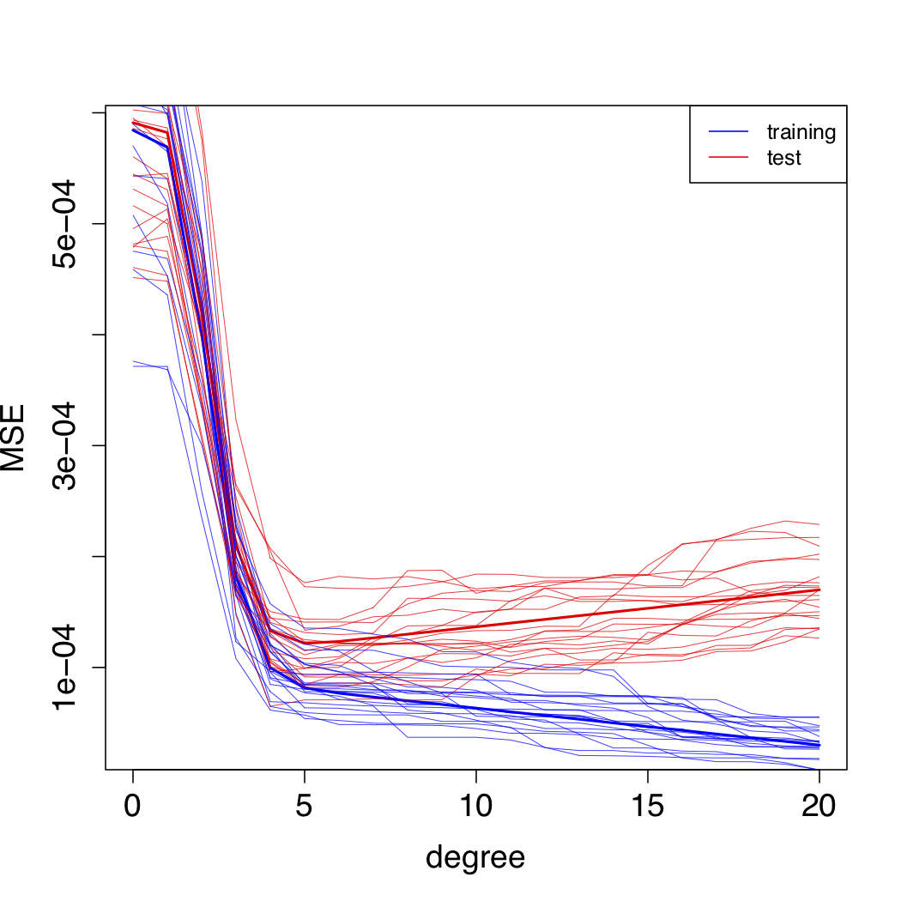

```{r startup, include = FALSE, message = FALSE, warning = FALSE}
knitr::opts_chunk$set(echo = T, eval=T, message=F, warning=F, error=F, comment=NA, cache=T, R.options=list(width=220))
```

# Outline

* Optimism
* Information criteria
* Cross-validation


---

layout: false
class: inverse, middle, center

# Optimism 

---

# Optimism

* The definition of __optimism__ is the expected difference of the test error and training error
\begin{aligned}
\mathrm{Opt} &= \mathbb{E}(\mathrm{MSE}_{\mathrm{Te}}) - \mathbb{E}(\mathrm{MSE}_{\mathrm{Tr}})
\end{aligned}

* For the fixed-X setting, we have
$$\mathrm{OptF} = \mathbb{E}\left[ \frac{1}{n}\sum_{i=1}^{n}( y^*_i - \hat{f}(x_i))^2 - \frac{1}{n}\sum_{i=1}^{n}( y_i - \hat{f}(x_i))^2 \right]$$

* Optimism can be also expressed as 
$$\mathrm{OptF} =  \frac{2}{n}\sum_{i=1}^{n}\mathbb{C}\mathrm{ov}(y_i,\hat{f}(x_i))$$
So the higher the correlation between $y_i$ and its fitted value $\hat{f}(x_i)$, the greater the optimism. 

---

```{r, echo=FALSE, fig.align = 'center', out.width = '50%', out.height = '50%'}

```


---

# Optimism in the linear model

* Prediction error is given by $\mathrm{ErrF} = \mathbb{E}(\mathrm{MSE}_{\mathrm{Te}}) = \mathbb{E}(\mathrm{MSE}_{\mathrm{Tr}}) + \mathrm{OptF}$

* Optimism is important  because an 
estimate of $\widehat{\mathrm{OptF}}$ of $\mathrm{OptF}$ leads to an estimate of $\mathrm{ErrF}$:
\begin{aligned}
\widehat{\mathrm{ErrF}} &= \mathrm{MSE}_{\mathrm{Tr}} + \widehat{\mathrm{OptF}}\\
\end{aligned}

* For the linear model, it can be shown that
$$\mathrm{OptF} =  \frac{2\sigma^2 p}{n}$$

* The above formula assumes that $\sigma^2$ is known, which is not realistic. We can plug-in its estimate $$\hat{\sigma}^2= \frac{\mathrm{RSS}}{n-p}= \frac{\sum_{i=1}^{n}( y_i - \hat{f}(x_i))^2}{n-p}$$ where $\mathrm{RSS} = n \mathrm{MSE}_{\mathrm{Tr}}$ is the __residual sum of squares__.

* This estimator is also known as __Mallows' Cp__ : 
$$\mathrm{Cp} = \mathrm{MSE}_{\mathrm{Tr}}  + \frac{2 \hat{\sigma}^2 p}{n}$$

---

```{r}
rm(list=ls())
library(readr)
df <- read_table2("http://azzalini.stat.unipd.it/Book-DM/yesterday.dat")[-31,]
train <- data.frame(x=df$x, y=df$y.yesterday)
# compute MSE.tr
n <- nrow(train)
ds = 1:15
ps = ds + 1
x = seq(.5,3,length=30)
fun <- function(d) if (d==0) lm(y~1, train) else lm(y~poly(x,degree=d), train)
fits <- lapply(ds, fun)
MSEs.tr <- unlist( lapply(fits, deviance) )/n
# compute ErrF
sigmatrue = 0.01
ftrue <- c(0.4342,0.4780,0.5072,0.5258,0.5369,0.5426,0.5447,0.5444,0.5425,0.5397,0.5364,0.5329,0.5294,0.5260,0.5229,0.5200,0.5174,0.5151,0.5131,0.5113,0.5097,0.5083,0.5071,0.5061,0.5052,0.5044,0.5037,0.5032,0.5027,0.5023)
x = seq(.5,3,length=30)
Bias2s = sapply(ps, function(p) 
  mean( ( ftrue - fitted(lm(ftrue ~ poly(x,degree=(p-1)))) )^2 )
)
Vars = ps*(sigmatrue^2)/n
ErrFs = Bias2s + Vars + sigmatrue^2
```

---

```{r}
{{hatErrFs = MSEs.tr + (2*sigmatrue^2*ps)/n}}
plot(ps, MSEs.tr, type="b", xlab="p", ylab="ErrF")
lines(ps, hatErrFs, type="b", col=2)
lines(ps, ErrFs, type="b", col=4)
legend("topright",c("ErrF","MSE.tr","MSE.tr + Opt"), col=c(4,1,2), pch=19)
ps[which.min(hatErrFs)]
```

---

```{r}
{{hatsigma2 = (n*MSEs.tr)/(n-ps)}}
Cps = MSEs.tr + (2*hatsigma2*ps)/n 
plot(ps, MSEs.tr, type="b", xlab="p", ylab="ErrF")
lines(ps, Cps, type="b", col=2)
lines(ps, ErrFs, type="b", col=4)
legend("topright",c("ErrF","MSE.tr","MSE.tr + hatOpt"), col=c(4,1,2), pch=19)
ps[which.min(Cps)]
```

---

```{r}
plot(ps, hatsigma2, type="b", xlab="p", ylab="Sigma2")
abline(h=sigmatrue^2, col=4)
```

---

layout: false
class: inverse, middle, center

# Information criteria

---

# AIC and BIC

* __AIC__ is given by
$$\mathrm{AIC} =  -2 \cdot \mathrm{loglikelihood}(\hat{\beta},\hat{\sigma}^2) + 2p$$
where for the linear model $-2 \cdot \mathrm{loglikelihood}(\hat{\beta},\hat{\sigma}^2) = n \log(\mathrm{MSE}_{\mathrm{Tr}})$

* For linear models, Cp and AIC are proportional to each other, and the lowest Cp corresponds to the lowest AIC. 

* __BIC__ is given by
$$\mathrm{BIC} =  -2 \cdot \mathrm{loglikelihood}(\hat{\beta},\hat{\sigma}^2) + \log(n)p$$

* Since $\log(n) > 2$ for any $n > 7$,
the BIC statistic generally results in the selection of smaller models than AIC

---

```{r}
AICs <- unlist( lapply(fits, AIC) )
BICs <- unlist( lapply(fits, BIC) )
plot(ps, AICs, type="b", col=5, ylab="Information Criteria", xlab="p")
lines(ps, BICs, type="b", col=6)
legend("topright",c("AIC","BIC"), col=c(5,6), lty=1)
ps[which.min(AICs)]
ps[which.min(BICs)]
```

---

layout: false
class: inverse, middle, center

# Cross-validation

---

# Cross-validation

* As noticed earlier, training an algorithm and evaluating
its statistical performance on the same data yields an overoptimistic result

* __Cross-validation__ (CV) considers the output of the algorithm on new data to yield a good estimate $\widehat{\mathrm{Err}}$ of the expected test error $\mathbb{E}(\mathrm{MSE}_{\mathrm{Te}})$ 

* The idea is of __splitting the data__: part of data (the training set) is used
for training the algorithm, and the remaining data (the __validation set__) are used for evaluating the performance of the algorithm

* The major interest of CV lies in the universality of the data splitting
heuristics. Therefore, CV is a __non-parametric method__ which can be applied to any algorithm in any framework. This universality is not shared by e.g. Cp, which is specific to linear regression


---

# Validation set approach

* A simple approach is to randomly divide the $n$ observations
into two parts: a training set and a __validation__ or hold-out set

* [ISLR Fig. 5.1](http://www-bcf.usc.edu/~gareth/ISL/Chapter5/5.1.pdf)

* The model is fitted on the training set $T \subset \{1,\ldots,n\}$, and the fitted model $\hat{f}^{-V}$ is used to predict the responses for the
observations in the validation set $V = \{1,\ldots,n\} \setminus T$

* This results in the estimate of the expected test error
$$\widehat{\mathrm{Err}} = \frac{1}{\# V} \sum_{i \in V} (y_i - \hat{f}^{-V}(x_i))^2$$

* This scheme reduces the sample size used for fitting the
model, but this is not a problem when $n$ is very large. 

* If $n$ is not very large, however, the validation estimate of the
test error can be highly variable

---

# Cross-validation

* One way of partially overcoming this arbitrariness is to split
the data into equal parts $V_1,\ldots,V_K$.

* [ISLR Fig. 5.5](http://www-bcf.usc.edu/~gareth/ISL/Chapter5/5.5.pdf)

* In __K-fold cross-validation__ we use observations $i\notin V_k$ for training the model and $i \in V_k$ for evaluating it:
$$\frac{1}{\# V_k} \sum_{i \in V_k} (y_i - \hat{f}^{-V_k}(x_i))^2$$
and finally we take the average to estimate the expected test error:
$$\widehat{\mathrm{Err}} = \frac{1}{K} \sum_{k=1}^{K}\left[ \frac{1}{\# V_k} \sum_{i \in V_k} (y_i - \hat{f}^{-V_k}(x_i))^2 \right]$$

---

```{r}
# K-fold CV
d = 3
K = 5
set.seed(123)
# create folds
folds <- sample( rep(1:K,length=n) )
# initialize vector
KCV <- vector()
# loop
for (k in 1:K){
  fit <- lm(y~poly(x,degree=d), train, subset=which(folds!=k))
  x.out <- train$x[which(folds==k)]
  yhat <- predict(fit, newdata=list(x=x.out))
  y.out <- train$y[which(folds==k)]
  KCV[k]<- mean( ( y.out - yhat )^2 )
}
# KCV estimate 
mean(KCV)
```

---

```{r}
library(boot)
set.seed(123)
KCV = sapply(ds, function(d) 
     cv.glm(train, glm(y~poly(x,degree=d), 
     train, family = gaussian), K=K )$delta[1] )
plot(ps, KCV, type="b", log="y")
ps[which.min(KCV)]
```

---

# Leave-one-out cross validation

* In __leave-one-out cross validation__ (LOOCV), each data point is successively left out from the sample and used for validation

* [ISLR Fig. 5.3](http://www-bcf.usc.edu/~gareth/ISL/Chapter5/5.3.pdf)


* For $i=1,\ldots,n$:

    - Hold out the $i$th training observation $(x_i,y_i)$
    - Use $n-1$ training observations for training the model $\hat{f}^{-i}$ and the hold-out observation $(x_i,y_i)$ to evaluate it by $(y_i - \hat{f}^{-i}(x_i))^2$
    - Finally take the average
$$\widehat{\mathrm{Err}} = \frac{1}{n} \sum_{i=1}^{n} (y_i - \hat{f}^{-i}(x_i))^2$$

* Note that LOOCV is a special case of $K$-fold CV corresponding to $K = n$. 

---

```{r}
# LOOCV
oneout <- vector()
# loop
for (i in 1:n){
fit_i <- lm( y~poly(x,degree=d), data=train[-i,])
yhat_i <- predict(fit_i, newdata=data.frame(x=train$x[i]) )
oneout[i] <- ( train$y[i] -  yhat_i )^2
}
# LOOCV estimate
mean(oneout)
```

---

# LOOCV for the linear model

* For the linear model, there is a __shortcut__ for computing LOOCV:
$$\frac{1}{n}\sum_{i=1}^{n}\Big( y_i - \hat{f}^{-i}(x_i) \Big)^2 = \frac{1}{n} \sum_{i=1}^{n}\left( \frac{y_i - \hat{f}(x_i)}{1-h_{ii}} \right)^2$$

* $\underset{n\times p}{\mathbf{X}}$ is the design matrix. 

* $h_{ii}$ is the $i$th diagonal element of the projection (hat) matrix 
$$\underset{n\times n}{\mathbf{H}} = \mathbf{X}(\mathbf{X}^\mathsf{T}\mathbf{X})^{-1}\mathbf{X}^\mathsf{T}$$

---

```{r}
fit <-  lm(y~poly(x,d), train)
# design matrix
X <- model.matrix(fit)
# hat matrix
H <- X %*% solve(t(X)%*% X) %*% t(X)
# LOOCV estimate
mean(
   ( (train$y - predict(fit)) / (1-diag(H))  )^2 
) 
```

---

```{r}
LOOCV = sapply(ds, function(d) 
     cv.glm(train, glm(y~poly(x,degree=d), 
     train, family = gaussian) )$delta[1] )
plot(ps, LOOCV, type="b")
ps[which.min(LOOCV)]
```

---

# Generalized cross-validation

* In __generalized cross-validation__ we compute
$$\widehat{\mathrm{Err}} =\frac{ \mathrm{MSE}_{\mathrm{Tr}}}{\left(1 - \frac{p}{n}\right)^2}$$
where we approximate each $h_{ii}$ by their average
$\frac{1}{n}\sum_{i=1}^{n} h_{ii} = \frac{p}{n}$

```{r}
GCV = MSEs.tr/(1-(ps)/n )^2
plot(ps, GCV, type="b")
ps[which.min(GCV)]
```

---

# Bias-variance trade-off for CV

* A common choice for $K$ other than $K = n$ is to choose $K = 5$ or $K = 10$

* However, drawing a general conclusion on CV is nearly an impossible task because of the variety of frameworks.

__Bias__

* $K$-fold CV with $K=5$ or 10 gives a biased (upward) estimate of $\mathbb{E}(\mathrm{MSE}_{\mathrm{Te}})$ because it uses less information (4/5 or $9/10$ of the observations)

* LOOCV has very low bias (it uses $n-1$ observations)


__Variance__

* Usually, LOOCV has high variance because it is an average of $n$ extremely correlated quantities (because the fits $\hat{f}^{-i}$ and $\hat{f}^{-l}$ are based on $n-2$ common observations), and $K$-fold CV with $K=5$ or 10 has less variance because it is an average of quantities that are less correlated.  
Remember that the variance of the sum of highly correlated quantities is larger than that with midly correlated quantities:
$$\mathbb{V}\mathrm{ar}(A+B) = \mathbb{V}\mathrm{ar}(A) + \mathbb{V}\mathrm{ar}(B) + 2\mathbb{C}\mathrm{ov}(A,B)$$

* However, in general the variance of different CV methods seems strongly framework-dependent