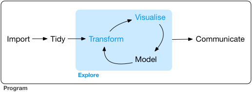

```{r startup, include = FALSE, message = FALSE, warning = FALSE}
knitr::opts_chunk$set(echo = T, eval=T, message=F, warning=F, error=F, comment=NA, cache=T, R.options=list(width=220))
```

# Outline

* Exploratory data analysis
* The modelling process
* Feaure engineering
* Important concepts

---
layout: false
class: inverse, middle, center

# Exploratory data analysis

---

# Explore

Data exploration is the art of looking at your data, rapidly generating hypotheses, quickly testing them, then repeating again and again and again



---

# Exploratory data analysis


* In statistics, exploratory data analysis (__EDA__) is an approach to analyzing data sets to summarize their main characteristics, often with visual methods

* A statistical model can be used or not, but primarily EDA is for seeing what the data can tell us beyond the formal modeling or hypothesis testing task

* Exploratory data analysis was promoted by __John Tukey__ to encourage statisticians to explore the data

---

# Visualization and data transformation

* __Visualisation__ is a great place to start with R programming, because the payoff is so clear: you get to make elegant and informative plots that help you understand data

* Visualisation alone is typically not enough, so  __data transformation__ allows you to select important variables, filter out key observations, create new variables, and compute summaries

* Finally, in __exploratory data analysis__, you'll combine visualisation and transformation with your curiosity and scepticism to ask and answer interesting questions about data

---
layout: false
class: inverse, middle, center

# The modelling process

---

# The modelling process


* The process of developing an effective model is both iterative and heuristic

* It is difficult to know the needs of any data set prior to working with it

---


* __(a)__ *Exploratory data analysis*. The initial activity begins with EDA investigate the data

* __(b)__ *Early data analysis*. This could include evaluating simple summary measures or identifying predictors that have strong correlations with the outcome. The process might iterate between visualization and analysis until the modeler feels confident that the data are well understood. 

* __(c)__ *Early feature engineering*. The first draft for how the predictors will be represented in the models is created based on the previous analysis.

---


* __(d)__ *Early parameter tuning*. At this point, several different modeling methods might be evaluated with the initial feature set. However, many models can contain hyperparameters that require tuning

* __(e)__ *Early evaluation of performance*. Once the four models have been tuned, they are numerically evaluated on the data to understand their performance characteristics. Summary measures for each model, such as MSE,  accuracy, etc. are used 

* __(f)__ *Residual analysis*. Based on these results, more EDA can be conducted on the model results, such as residual analysis. 

* __(g)__ *Systematic issues*. If there is any systematic issues with the model, another round of feature engineering might be used to compensate for these obstacles


---


* __(h)__ *Parameter tuning*. By this point, it may be apparent which models tend to work best for the problem at hand and another, more extensive, round of model tuning can be conducted on fewer models

* __(i)__ *Evaluation of performance*. After more tuning and modification of the predictor representation, the two candidate models (#2 and #4) have been finalized. These models can be evaluated on an external test set as a final bake off between the models 

* __(h)__ *Final model*. The final model is then chosen and this fitted model will be used going forward to predict new samples 

---

# No Free Lunch theorem

> The "No Free Lunch" Theorem (Wolpert 1996) is the idea that, without any specific knowledge of the problem or data at hand, no one predictive model can be said to be the best

* There have been experiments to judge which models tend to do better than others on average

* However, the rate of "winning" is not high enough to enact a strategy of "always use model X"


---
layout: false
class: inverse, middle, center

# Feature engineering

---

# Preprocessing and feature engineering

Key relationships that are not directly available as predictors may be between the response and:

* a transformation of a predictor,
* an interaction of two or more predictors such as a product or ratio,
* a functional relationship among predictors, or
* an equivalent re-representation of a predictor.

Adjusting and reworking the predictors to enable models to better uncover predictor-response relationships has been termed __feature engineering__

---

# Models sensitivities and needs

* Some models cannot tolerate predictors that measure the same underlying quantity (multicollinearity or correlation between predictors)

* Many models cannot use observations with any missing values

* Some models are severely compromised when irrelevant predictors are in the data

Feature engineering and variable selection can help mitigate many of these issues

---


