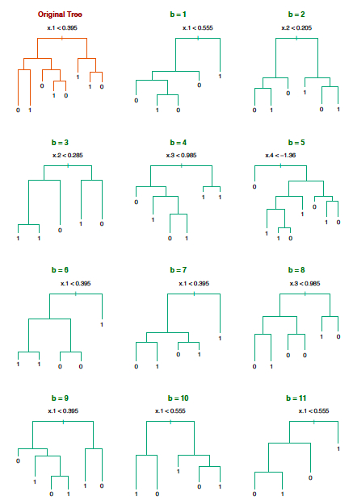
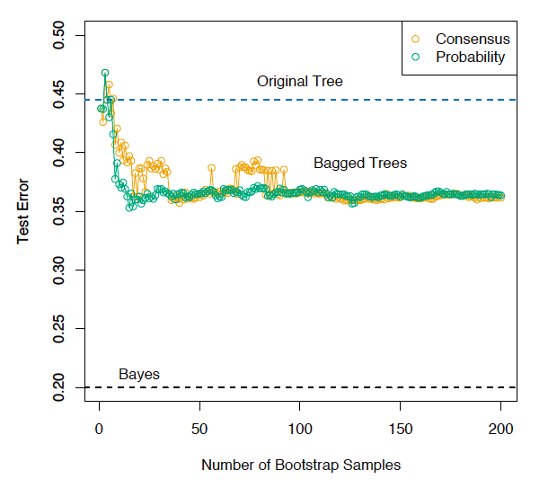
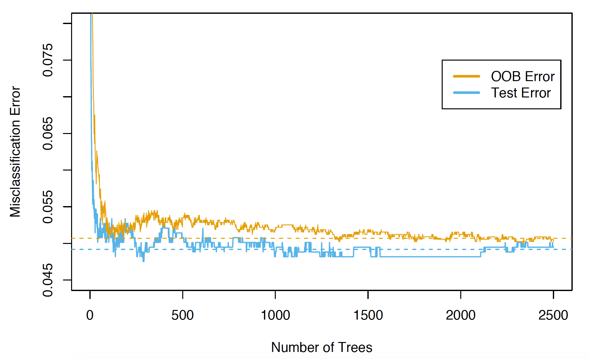

```{r startup, include = FALSE, message = FALSE, warning = FALSE}
knitr::opts_chunk$set(echo = T, eval=T, message=F, warning=F, error=F, comment=NA, cache=F, R.options=list(width=220))
```


# Outline

* Introduction
* Bagging
* Spam data

---
layout: false
class: inverse, middle, center

# Introduction

---

# Ensemble methods

* Ensemble methods are techniques that create multiple
models and then combine them to produce improved results

* These models, when used as inputs of ensemble methods,
are often called __base learners__ or __weak learners__

* Ensemble learning is appealing because that it is able to
boost weak learners which are slightly better than random
guess to strong learners which can make very accurate
predictions

* However, ensemble methods increases __computation time__ and
reduces __interpretability__

* For example, classification and regression trees are simple and useful for interpretation. However they  are typically not competitive with other approaches in terms of prediction accuracy

* We will see that ensemble methods such as __bagging__ and __random forests__ grow multiple trees which are then combined to yield a single prediction. Combining a large number of trees can often result in
dramatic improvements in prediction accuracy, at the
expense of some interpretation loss

---

# Instability of trees

* The primary disadvantage of trees is that they are rather
unstable (high variance)

* In other words, a small change in the data often results in a completely different tree

* One major reason for this instability is that if a split changes, all the splits under it change as well, thereby propagating the variability

* We will learn how to  control the variance, or __stabilize__ the predictions made by trees

* In  doing so, we can greatly improve prediction accuracy but we suffer in terms of interpretability

---

# The boostrap 

* The __bootstrap__ is an useful resampling tool in statistics

* A bootstrap sample of size $n$ from the training data is
$$(\tilde{x}_1, \tilde{y}_1), (\tilde{x}_2, \tilde{y}_2), \ldots, (\tilde{x}_n, \tilde{y}_n)$$
where each $(\tilde{x}_i, \tilde{y}_i)$ are drawn from uniformly at random from $$(x_1, y_1), (x_2, y_2), \ldots, (x_n, x_n)$$ with __replacement__

* Not all of the training points are represented in a bootstrap
sample, and some are represented more than once. The probability for one observation not to be drawn in one draw is $1 - \frac{1}{n}$

* For large $n$, the probability for one observation not to be drawn in any of the $n$ draws is
$$\lim_{n\rightarrow \infty} \left(1- \frac{1}{n}\right)^n = \frac{1}{e} \approx 0.368$$

* We can expect $\approx 1/3$ of the $n$ original observations to be __out-of-bag__ (OOB)

---
layout: false
class: inverse, middle, center

# Bagging

---

# Bagging trees

* Bootstrap AGGregation, or __bagging__, is a general procedure for reducing the variance of a model and it is particularly useful in the case of regression or classification trees

1. Generate $B$ different bootstrapped training sets
$$(\tilde{x}_1^b, \tilde{y}_1^b), (\tilde{x}_2^b, \tilde{y}_2^b), \ldots, (\tilde{x}_n^b, \tilde{y}_n^b), \qquad b=1,\ldots,B$$

2. Fit a regression tree $\hat{f}^{b}$ or a classification tree $\hat{c}^{b}$ for each bootstrapped training set (simple strategy: grow fairly large trees on each bootstrapped training set, with no pruning)

3. Average all the predictions:
$$\bar{f}(x) = \frac{1}{B} \sum_{b=1}^{B} \hat{f}^{b}(x)$$
for regression trees and
$$\bar{c}(x) = \mathrm{Mode}\{\hat{c}^{b}(x),b=1,\ldots,B\}$$
for classification trees (consensus)

---

.pull-left[

]

.pull-right[
Hastie, Tibshirani and Friedman (2009) [The Elements of Statical Learning: Data Mining, Inference, and Prediction](https://web.stanford.edu/~hastie/ElemStatLearn/) (ESL) p. 284: $n = 30$ training data points, $p = 5$
predictors, and $K = 2$ classes. No pruning used in growing trees
]

---


ESL p. 285: Bagging helps decrease the misclassification rate of the classifier
(evaluated on a large independent test set). Look at the orange
curve:




---

# Bagging estimates of class probabilities

* For a classification problem with $K$ classes, we may want to estimate the class probabilities out of our bagging procedure. What about using the proportion of votes that were for each class? This is generally not a good estimate

* Classification trees already gives us a set of
predicted class probabilities at $x$: $\hat{p}_k^b(x), k=1,\ldots,K$. These are simply the proportion of points in the appropriate region that
are in each class

* The bagging estimates of class probabilities are given by
$$\bar{p}_k(x) = \frac{1}{B} \sum_{b=1}^{B} \hat{p}_k^{b}(x), \quad k=1,\ldots,K$$

* The final bagged classifier just chooses the class with the highest
probability

* This form of bagging is preferred if it is desired to get estimates of
the class probabilities. Also, it can sometimes help the overall
prediction accuracy

---

# Breiman (1996) Bagging predictors

Example from the original Breiman paper on bagging: comparing
the misclassification error of the CART tree (pruning performed by
cross-validation) and of the bagging classifier (with $B = 50$):

| Data set | CART | Bagging | Decrease |
|---|---|----|---|
| waveform | 29.1 | 19.3 | 34% |
| heart | 4.9 | 2.8 | 43% |
| breast cancer | 5.9 | 3.7 | 37% |
| ionosphere | 11.2 | 7.9 | 29% |
| diabetes | 25.3 | 23.9 | 6% |
| glass | 30.4 | 23.6 | 22% |
| soybean | 8.6 | 6.8 | 21% |

---

# Why is bagging working?

* Why is bagging working? Here is a simplified setup with $K = 2$
classes "1" and "2" to help understand the basic phenomenon

* Suppose that for a given $x$, we have $B$ independent classifiers $\hat{c}^b(x), b=1,\ldots,B$, and each classifier has a misclassification rate of 40%. Assume without loss of generality that the true class at $x$ is "1", so
$$\mathrm{Pr}(\hat{c}^b(x) = 2 ) = 0.4$$

* Let $Z = \sum_{b=1}^{B}I\{\hat{c}^b(x) = 2\}$ be the number of votes for class "2", and note that 
$$Z \sim \mathrm{Binomial}(B,0.4)$$

* Therefore the misclassification rate of the bagged classifier is
$$\mathrm{Pr}(\bar{c}^b(x) = 2 ) = \mathrm{Pr}(Z \geq B/2)$$
which goes $\rightarrow 0$ as $B\rightarrow \infty$. In other words, the
bagged classifier has perfect predictive accuracy as the number of
sampled data sets $B\rightarrow \infty$

* Of course, the caveat here is __independence__. The classifiers that we
use in practice, $\hat{c}^b$ are clearly not independent, because they
are fit on very similar data sets (bootstrap samples from the same
training set)

---

# Wisdom of crowds

* The wisdom of crowds is a concept popularized outside of statistics
to describe the same phenomenon. It is the idea that the collection
of knowledge of an __independent__ group of people can exceed the
knowledge of any one person individually

* Assume that we have an odd number $n>1$ of independent individuals, and each individual has probability $\pi$ of making a correct guess

* The number of correct guesses is 
$$Z \sim \mathrm{Binomial}(n, \pi)$$

* The majority vote makes the correct guess when $Z \geq z$ with $z=(n+1)/2$, i.e.
$$\mathrm{Pr}(Z \geq z) = \sum_{k=z}^{n}{n\choose k}\pi^{k}(1-\pi)^{n-k}$$

* e.g. if $n=3$ and $\pi = 70\%$, then the majority vote makes the correct guess with probability $78.4\%$

---

```{r}
pi = seq(0,1,by=0.01)
n = 3
z = (n+1)/2
Pr = sapply(pi, function(p) sum(dbinom(z:n, size=n, prob=p) ))
plot(pi, Pr, type="l", xlab="Probability of being correct (individual)", ylab="Probability of being correct (group)")
```

---

# When will bagging fail?

* Now suppose that we consider the same simplified setup as before
(independent classifiers), but each classifier has a misclassification
rate:
$$\mathrm{Pr}(\hat{c}^b(x) = 2 ) = 0.6$$

* Then by the same arguments,  
$$\lim_{B\rightarrow \infty }\mathrm{Pr}(\bar{c}^b(x) = 2 )  \rightarrow 1$$
 In other words, the
bagged classifier is perfectly inaccurate as the number of bootstrapped
data sets 

* Again, the independence assumption doesn’t hold with trees, but
the take-away message is clear: bagging a good classifier can
improve predictive accuracy, but bagging a bad one can seriously
degrade predictive accuracy

---

# Disadvantages

It is important to discuss some disadvantages of bagging:

* __Loss of interpretability__: the final bagged classifier is not a
tree, and so we forfeit the clear interpretative ability of a
classification tree

* __Computational complexity__: we are essentially multiplying the
work of growing a single tree by $B$ (especially if we are using
the more involved implementation that prunes and validates
on the original training data)

---

# Out-of-bag error

* Each bagged tree makes use of $\approx 2/3$ of the original observations

* We can predict the response for the $i$th observation using
each of the bagged trees in which that observation was OOB

* This yields $\approx B/3$ predictions for the $i$th observation, which
we average (probability or consensus)

* This estimate is essentially the LOOCV error for bagging, if $B$ is large

---

ESL p. 592:




---
layout: false
class: inverse, middle, center

# Spam data

---

# Spam data

* 4601 email messages sent to "George" at HP-Labs

* The goal is to build a customized spam filter for George: predict whether an e-mail message is spam (junk mail) or good

* Recorded for each email message is the relative frequency of certain key words (e.g. `business`, `address`, `free`,  `George`) and certain characters: (, [, !, \$, \#. Included as well are three different recordings of capitalized letters

* For this problem not all errors are equal; we want to avoid filtering
out good e-mail, while letting spam get through is not desirable but
less serious in its consequences

---

```{r}
#Load the data and split into training and test sets.
rm(list=ls())
spam <- read.csv("https://web.stanford.edu/~hastie/CASI_files/DATA/SPAM.csv",header=T)
spam$spam = as.factor(ifelse(spam$spam==T,"spam","email"))
train = spam[!spam$testid, -2]
test = spam[spam$testid, -2]
n = nrow(train)
m = nrow(test)
```

---

```{r}
# Use all the predictors 
preds <- setdiff(colnames(train),"spam")
fml <- as.formula(paste("spam",
                  paste(preds,collapse=' + '),sep=' ~ '))
fml
# A function to calculate and return various measures on the model: prediction accuracy and specificity (the proportion of correctly predicted emails to all true emails)
score <- function(pred, truth, name="model") {
  ctable <- table(truth=truth,
                  pred=(pred>0.5))
  accuracy <- sum(diag(ctable))/sum(ctable)
  specificity <- ctable[1,1]/sum(ctable[1,])
  data.frame(model=name, accuracy=accuracy, specificity=specificity)
}
```

---

```{r}
# Load the rpart library and fit a classification tree model
library(rpart)
fit.tree <- rpart(fml, train)
library(rpart.plot)
rpart.plot(fit.tree)
```

---

```{r}
#Confusion matrix
phat = predict(fit.tree, newdata=test)[,"spam"]
yhat = ifelse(phat>.5,"spam","email")
table(pred=yhat, truth=test$spam)
#Evaluate the bagged classification trees in test set
score(predict(fit.tree, newdata=test)[,"spam"], test$spam, name="tree, test")
```

---

```{r}
# Use B bootstrap samples of the training set
set.seed(123)
B <- 50

samples <- sapply(1:B,
                  FUN = function(iter)
                  {sample(1:n, size=n, replace=T)})

# Train the individual classification trees and return them in a list.
# Note: this step can take a few minutes.
treelist <-lapply(1:B,
                  FUN=function(iter)
                  {samp <- samples[,iter];
                  rpart(fml, train[samp,])})

# predict.bag assumes the underlying classifier returns decision probabilities, not decisions
predict.bag <- function(treelist, newdata) {
  preds <- sapply(1:length(treelist),
                  FUN=function(iter) {
                  predict(treelist[[iter]], newdata=newdata)[,"spam"]})
  predsums <- rowSums(preds)
  predsums/length(treelist)
}
```

---

```{r}
#Evaluate the bagged classification trees in the test set
score(predict.bag(treelist, newdata=test),
                 test$spam,
                 name="bagging, test")
```


