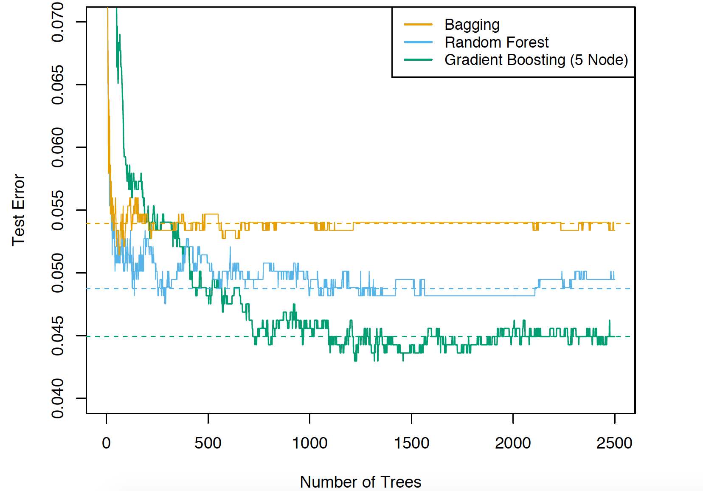
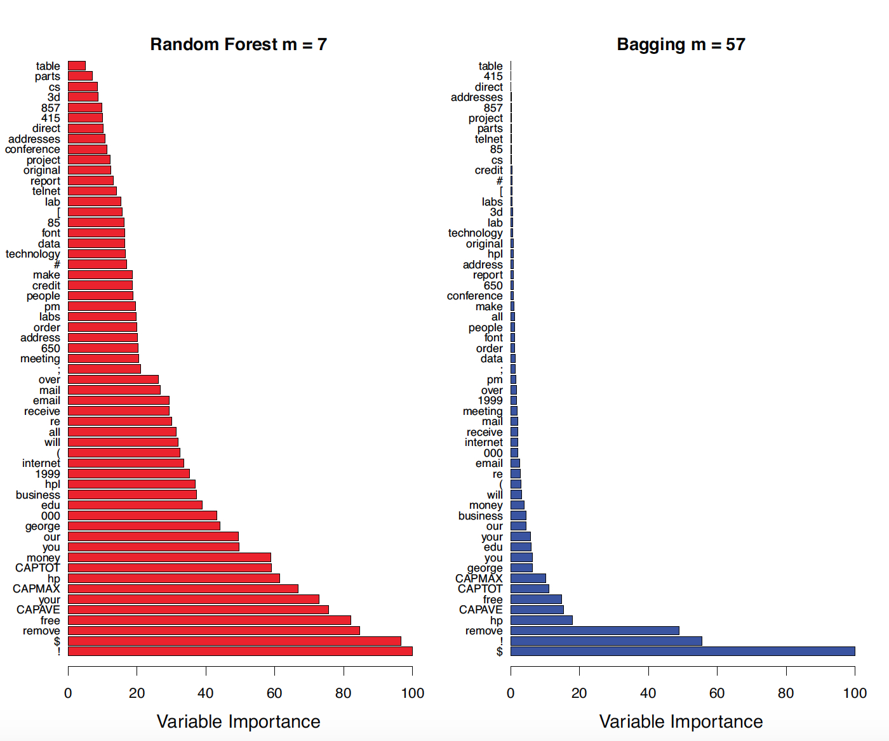

```{r startup, include = FALSE, message = FALSE, warning = FALSE}
knitr::opts_chunk$set(echo = T, eval=T, message=F, warning=F, error=F, comment=NA, cache=F, R.options=list(width=220))
```


# Outline

* Random Forests
* Spam data


# Random Forests intuition

* Create even more variation in individual trees

* Bagging varies the __rows__ of the training set (randomly draw observations)

* Random forests varies also the __columns__ of the training set (randomly draw predictors)

---

# Random Forests tuning parameter

* Before each split, select $m \leq p$ of the predictors at random as candidates for splitting

* $m$ is the \alert{tuning parameter}

* Typically $m = \sqrt{p}$ for classification and $m=p/3$ for regression

* $m=p$ gives Bagging as a special case


---

# Why is Random Forests working?

* Random sampling of the predictors __decorrelates__ the trees. This reduces the variance when we 
average the trees

* Recall that given a set of identical distributed (but not necessarily independent) variables $Z_1,\ldots,Z_B$ with pairwise correlation $\mathbb{C}\mathrm{orr}(Z_j, Z_l) = \rho$, mean $\mathbb{E}(Z_j) = \mu$ and variance $\mathbb{V}\mathrm{ar}(Z_j) = \sigma^2$, then (see next slide)

$$
\displaystyle \mathbb{V}\mathrm{ar}(\bar{Z}) = \rho \sigma^2 + \frac{(1-\rho)}{B} \sigma^2
$$
 
* The idea in random forests is to improve the variance
reduction of bagging by reducing the correlation $\rho$ between the
trees, without increasing the variance $\sigma^2$ too much

---

*  $\displaystyle \rho = \frac{1}{\sigma^2}[ \mathbb{E}(Z_i Z_j) - \mathbb{E}(Z_i) \mathbb{E}(Z_j)]$

* $\mathbb{E}(Z_i Z_j) = \rho \sigma^2 + \mu^2$ if $i\neq j$ 

* $\mathbb{E}(Z_i^2) = \sigma^2 + \mu^2$

* $\displaystyle \mathbb{E}[(\sum_{j=1}^{B}Z_j)^2] = \sum_{i=1}^{B}\sum_{j=1}^B \mathbb{E}(Z_i Z_j)  =  B \mathbb{E}(Z_i^2) + (B^2-B)\mathbb{E}(Z_i Z_j)$

* $\displaystyle \mathbb{E}(\sum_{j=1}^{B}Z_j) = \sum_{j=1}^{B} \mathbb{E}(Z_j)=  B \mu$

\begin{eqnarray*}
\mathbb{V}\mathrm{ar}(\bar{Z}) &=& \frac{1}{B^2} \mathbb{V}\mathrm{ar}(\sum_{j=1}^{B}Z_j) \\
&=&  \frac{1}{B^2} \{ \mathbb{E}[(\sum_{j=1}^{B}Z_j)^2] - [ \mathbb{E}(\sum_{j=1}^{B}Z_j) ]^2  \} 
\end{eqnarray*}

---

ESL p. 589 Bagging and random forest applied to the
spam data



---

* [ISL, Fig. 8.10](http://www-bcf.usc.edu/~gareth/ISL/Chapter8/8.10.pdf) 

* Results from random forests for the 15-class gene expression
data set with $p = 500$ predictors. The test error is displayed as a function of
the number of trees. Each colored line corresponds to a different value of $m$, the
number of predictors available for splitting at each interior tree node. Random
forests $(m < p)$ lead to a slight improvement over bagging $(m = p)$. A single
classification tree has an error rate of 45.7%

---

# Variable importance

* We can calculate the importance of a predictor $X_j$

* The function `importance` of the R package `randomForests` with argument `type=1` :

1. For each tree, record the accuracy on the OOB observations

2. Do the same is done but with $X_j$ values randomly permuted in the OOB observations

3. Compute the decrease in each tree's accuracy 

* If the average decrease over all the trees is large, then the predictor
is considered important - its value makes a big difference in predicting the response

* If the average decrease is small, then the predictor doesn't make much difference to the response

---

[Efron and Hastie (2016) Computer Age Statistical Inference:
Algorithms, Evidence and Data Science](https://web.stanford.edu/~hastie/CASI/) (CASI) p. 332

```{r, echo=FALSE, fig.align = 'center', out.width = '70%', out.height = '70%'}

```


---

# randomForest()

```{r, eval=FALSE}
fit <- randomForest(y ~ ., 
           data = train,
           ntree = B,
           mtry = m, # default sqrt(p) or p/3
           nodesize = ns, # default 1 or 5
           importance=TRUE) # default: F
```

* In bagging and random forests trees are grown large without pruning, only the minimum number of observations per node - `nodesize` -  is fixed $=1$ for classification and $=5$ for regression

* Number of randomly selected predictors `mtry` $=\sqrt{p}$ for classification and $=p/3$ for regression. Note that `mtry` $=p$ is bagging

---

# Bagging and random forest takeaways

* Bagging stabilizes decision trees and improves accuracy by reducing variance

*  Random forests further improve decision tree performance by de-correlating
the individual trees in the bagging ensemble

*  Random forests' variable importance measures can help you determine which
variables are contributing the most strongly to your model

* Because the trees in a random forest ensemble are unpruned and potentially
quite deep, there's still a danger of overfitting

---
layout: false
class: inverse, middle, center

# Spam data

---

```{r}
#Load the data and split into training and test sets.
rm(list=ls())
spam <- read.csv("https://web.stanford.edu/~hastie/CASI_files/DATA/SPAM.csv",header=T)
spam$spam = as.factor(ifelse(spam$spam==T,"spam","email"))
train = spam[!spam$testid, -2]
test.y = spam[spam$testid,1]
test = spam[spam$testid, -c(1,2)]
n = nrow(train)
m = nrow(test)
```

---

```{r}
library("caret")

cv <- trainControl(
  method = "cv",
  number = 10
)
```

---

```{r, message=FALSE, warning=FALSE}
tree <- train(
  spam ~ ., train,
  method = "rpart2",
  tuneLength = 9,
  trControl=cv)
plot(tree)

rf <- train(
  spam~., train,
  ntree = 50,
  method = "rf",
  trControl=cv)
```

--

```{r}
rf
```

---

```{r}
plot(rf)
```

---

```{r}
plot(varImp(rf))
```

---

```{r, message=FALSE, warning=FALSE}
models = list(
    tree=tree,
    rf=rf
  )

resamps = resamples(models)
bwplot(resamps, metric = "Accuracy")
```

---

```{r, message=FALSE, warning=FALSE}
yhat.tree = predict(tree, newdata=test)
confusionMatrix(yhat.tree, test.y)

yhat.rf = predict(rf, newdata=test)
confusionMatrix(yhat.rf, test.y)
```

---

```{r}
models = list(
  tree = tree,
  rf = rf)

phats.all <- extractProb(models, testX = test, testY = test.y)
phats <- subset(phats.all, dataType == "Test")

plotClassProbs(phats)
```


