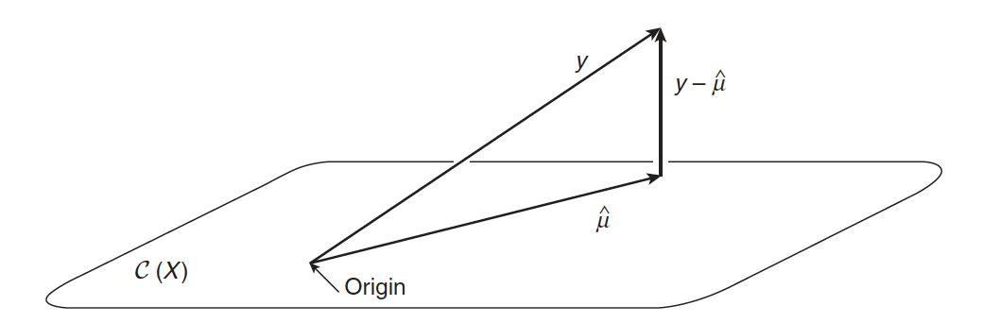
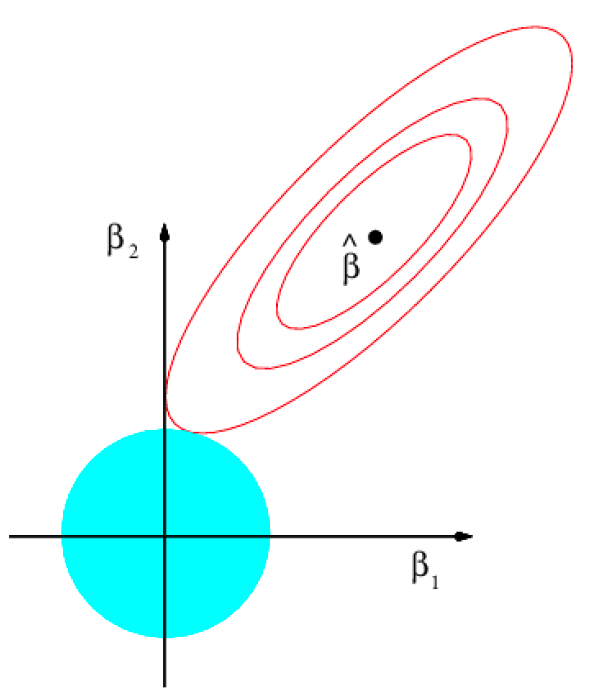

```{r startup, include = FALSE, message = FALSE, warning = FALSE}
knitr::opts_chunk$set(echo = T, eval=T, message=F, warning=F, error=F, comment=NA, cache=F, R.options=list(width=220))
```


# Outline

* Alternatives to least squares
* Ridge regression
* Boston housing data
* Bias-variance trade-off
* Principal components regression

---

# Matrix notation

* Vector of response: 
$$\underset{n\times 1}{\mathbf{y}} = 
\left[
\begin{array}{c}
y_1   \\
\cdots\\
y_i  \\
\cdots\\
y_n \\
\end{array}\right]$$

* Design matrix:
$$\underset{n\times p}{\mathbf{X}} = [\mathbf{x}_1 \cdots \mathbf{x}_p] =  \left[
\begin{array}{cccccc}
x_{1}^\mathsf{T}   \\
x_{2}^\mathsf{T}  \\
\cdots   \\
x_{i}^\mathsf{T}    \\
\cdots\\
x_{n}^\mathsf{T}\\
\end{array}\right] = \left[
\begin{array}{cccccc}
x_{11}  & x_{12}  & \cdots   &  x_{1j}  & \cdots   &   x_{1p}  \\
x_{21}  & x_{22} & \cdots   &  x_{2j}  & \cdots   &   x_{2p}  \\
\cdots   & \cdots   &  \cdots & \cdots   &  \cdots  \\
x_{i1}  & x_{i2} & \cdots   &  x_{ij}& \cdots   & x_{ip}    \\
\cdots   & \cdots   &  \cdots  &  \cdots   &  \cdots\\
x_{n1}   & x_{n2} & \cdots   & x_{nj}    &  \cdots   &   x_{np}\\
\end{array}\right]$$

---

# Linear regression

* Assume $\mathrm{rank}(\mathbf{X}) = p$

* Least squares problem: 
$$\hat{\boldsymbol{\beta}} = \underset{\boldsymbol{\beta} \in \mathbb{R}^p}{\arg\min} \| \mathbf{y} - \mathbf{X}\boldsymbol{\beta} \|^2_2 = \underset{\boldsymbol{\beta} \in \mathbb{R}^p}{\arg\min} \sum_{i=1}^{n}(y_i - x_i^\mathsf{T}\boldsymbol{\beta} )^2$$
where  $\| \underset{p \times 1}{ \mathbf{v}} \|_{2} = (\mathbf{v}^\mathsf{T}\mathbf{v})^{1/2} = \sqrt{\sum_{j=1}^{p} v_j^2}$ denotes the $L_2$ norm

* OLS estimator: $$\underset{p\times 1}{\hat{\boldsymbol{\beta}}} = (\mathbf{X}^\mathsf{T}\mathbf{X})^{-1}\mathbf{X}^\mathsf{T} \mathbf{y}$$

* Fitted values: $\underset{n\times 1}{\hat{\mathbf{y}} } =  \mathbf{X}\hat{\boldsymbol{\beta}}$

* Test data: $\underset{m\times 1}{\mathbf{y}^*}$, $\underset{m\times p}{\mathbf{X}^*}$, prediction on test data: $\underset{m\times 1}{\hat{\mathbf{y}}^*} = \mathbf{X}^*\hat{\boldsymbol{\beta}}$

---

# The Geometry of Least Squares



From AS, Figure A.2

* $\mathcal{C}(\mathbf{X})$ : column space of $\mathbf{X}$

* $\hat{\boldsymbol{\mu}}  = \hat{\mathbf{y}} =  \mathbf{X}\hat{\boldsymbol{\beta}} = \mathbf{H} \mathbf{y}$ : projection of $\mathbf{y}$ on $\mathcal{C}(\mathbf{X})$

* $\mathbf{H} = \mathbf{X} (\mathbf{X}^\mathsf{T}\mathbf{X})^{-1}\mathbf{X}^\mathsf{T}$ : projection (hat) matrix on $\mathcal{C}(\mathbf{X})$

* $\mathbf{y} - \hat{\boldsymbol{\mu}} = (\mathbf{I}_n - \mathbf{H})\mathbf{y}$ : residuals

---

layout: false
class: inverse, middle, center

# Alternatives to least squares

---

# Why consider alternatives to least squares?

* In the Fixed-X setting, the variance of the OLS estimator is
$$\frac{\sigma^2 p}{n}$$
    - If $n \gg p$, then the least squares estimates tend to have low variance 

    - If $n>p$ but $n \approx p$, then there can be a lot of variability in the least squares fit, resulting in overfitting and poor predictions

    - If $n=p$, then the least squares estimates fit the data exactly, i.e. $\hat{y}_i = y_i$, resulting in complete overfitting and horrible predictions

    - If $n<p$, then there is no longer a unique least squares coefficient estimate: the variance is infinite so the method cannot be used at all

* We need to keep the variance in check

---

# $n \approx p$

* $n=10$ and $p=9$
* $Y = \beta_1 X_1 + \beta_2 X_2 + \ldots + \beta_9X_9 +  \varepsilon$
* True $\boldsymbol{\beta} = (1,0,0,\ldots,0)^\mathsf{T}$

```{r}
n = 10
p = 9
set.seed(1793)
X = matrix(rnorm(n*p), nrow=n, ncol=p)
y = X[,1] + rnorm(n,0,0.5)
fit = lm(y~ 0 + X)
coef(fit)
```

* Large estimates of regression coefficients (in absolute value) are often an indication of overfitting

---


```{r}
yhat = predict(fit)
plot(X[,1],y, xlab="x1")
ix = sort(X[,1], index.return=T)$ix
lines(X[ix,1], yhat[ix])
abline(a=0,b=1, col=4)
```

---

# The failure of least squares in high dimensions

* When $\mathrm{rank}(\mathbf{X}) < p$, there are infinitely many solutions in the least square problem

* Suppose $p > n = \mathrm{rank}(\mathbf{X})$. Let $\mathcal{C}(\mathbf{X})$ be the $n$-dimensional space spanned by the columns of $\mathbf{X}$ and $\mathcal{V}=\mathcal{C}(\mathbf{X})^\bot$ the $p-n$ dimensional space orthogonal complement of $\mathcal{C}(\mathbf{X})$, i.e.  the non-trivial null space of $\mathbf{X}$

* Then $\mathbf{X}\mathbf{v} = \mathbf{0}_p$ for all $\mathbf{v} \in \mathcal{V}$, and $\mathbf{X}^\mathsf{T}\mathbf{X}\mathbf{v} = \mathbf{X}^\mathsf{T}\mathbf{0}_p = \mathbf{0}_n$, the solution of the normal equations $\mathbf{X}^\mathsf{T}\mathbf{X}\boldsymbol{\beta} = \mathbf{X}^\mathsf{T}\mathbf{y}$ is
$$\underset{p\times 1}{\hat{\boldsymbol{\beta}}} = (\mathbf{X}^\mathsf{T}\mathbf{X})^{-}\mathbf{X}^\mathsf{T} \mathbf{y} + \mathbf{v} \quad \forall\,\, \mathbf{v} \in \mathcal{V}$$
where $\mathbf{A}^-$ denotes the Moore-Penrose inverse of the matrix $\mathbf{A}$

---

# Three classes of methods

1. **Subset Selection** <br> We identify a subset of the $p$ predictors
that we believe to be related to the response. We then fit a
model using least squares on the reduced set of variables.

2. **Dimension Reduction** <br> We project the $p$ predictors into a $q$-dimensional subspace, where $q < p$. Then these $q$ projections are used as predictors to fit a linear regression model by least squares

3. **Regularization** <br> We fit a model involving all $p$ predictors, but the estimated coefficients are shrunken towards zero relative to the least squares estimates.  By *constraining* or *shrinking* the estimated coefficients, we can substantially reduce the variance at the cost of a neglige increase in bias


---

# Constrained estimation

```{r, echo=FALSE, fig.align = 'center', out.width = '50%', out.height = '50%'}

```

From ISLR, Figure 6.7

---

layout: false
class: inverse, middle, center

# Ridge regression

---

# Constrained estimation

* Solve the constrained minimization problem

\begin{aligned}
& \min_{\boldsymbol{\beta} \in \mathbb{R}^p} \| \mathbf{y} - \mathbf{X}\boldsymbol{\beta} \|^2_2\\ & \mathrm{\,\,subject\,\,to\,\,}\|\boldsymbol{\beta}\|^2_2 \leq t
\end{aligned}

* The constrained problem can be solved by means of the Karuch-Kuhn-Tucker (KTT) multiplier method, which minimizes a function subject to inequality constraint


---

# Penalized estimation

* Penalized least squares
$$\min_{\boldsymbol{\beta} \in \mathbb{R}^p} \left\{ \sum_{i=1}^{n}(y_i - x_i^\mathsf{T}\boldsymbol{\beta} )^2 + \lambda\sum_{j=1}^{p}\beta_j^2 \right\} = \min_{\boldsymbol{\beta} \in \mathbb{R}^p} \left\{ \underbrace{ \| \mathbf{y} - \mathbf{X}\boldsymbol{\beta} \|^2_2 }_{\mathrm{RSS} }+ \underbrace{\lambda\| \boldsymbol{\beta}\|^2_2}_{\mathrm{penalty}} \right\}$$

* Here $\lambda \in [0,\infty)$ is the __tuning parameter__ which controls the strenght of the penalty term

* The minimum of the RSS is attained at $\boldsymbol{\beta}=\hat{\boldsymbol{\beta}}$ while the minimum of the ridge penalty is attained at $\boldsymbol{\beta}=\mathbf{0}_p$. The effect of the penalty in this balancing act is to __shrink__ the
coefficient estimates towards zero

---

# Ridge estimate


\begin{aligned}
& \frac{\partial}{\partial \boldsymbol{\beta}} \left( \| \mathbf{y} - \mathbf{X}\boldsymbol{\beta} \|^2_2 + \lambda\| \boldsymbol{\beta}\|^2_2 \right)\\
& -2 \mathbf{X}^\mathsf{T} (\mathbf{y} - \mathbf{X}\boldsymbol{\beta}) + 2\lambda \boldsymbol{\beta} = \mathbf{0}_p
\end{aligned}

* The solution of the minimization problem is the __ridge estimate__ :
$$\hat{\boldsymbol{\beta}}(\lambda) = (\mathbf{X}^\mathsf{T}\mathbf{X} + \lambda \mathbf{I}_p )^{-1}\mathbf{X}^\mathsf{T} \mathbf{y} = \mathbf{H}(\lambda)\mathbf{y}$$
where $\mathbf{I}_p$ is the $p\times p$ identity matrix

* For any design matrix $\mathbf{X}$, the quantity
$(\mathbf{X}^\mathsf{T}\mathbf{X} + \lambda \mathbf{I}_p )$ is always invertible provided that $\lambda > 0$; thus,
there is always a unique solution $\hat{\boldsymbol{\beta}}(\lambda)$

---

# Solution path

* As $\lambda \rightarrow 0$, $\hat{\boldsymbol{\beta}}(\lambda) \rightarrow \hat{\boldsymbol{\beta}}$

* As $\lambda \rightarrow \infty$, $\hat{\boldsymbol{\beta}}(\lambda) \rightarrow \mathbf{0}_p$

* __Solution path__ of the ridge estimator:
$$\{\hat{\boldsymbol{\beta}}(\lambda): \lambda \in [0,\infty) \}$$

* All regression coefficients are shrunken towards zero as the tuning parameter $\lambda$ increases

* This behaviour is not strictly monotone in $\lambda$: $\lambda_a > \lambda_b$ does not necessarily imply $|\hat{\beta}_j(\lambda_a)| < |\hat{\beta}_j(\lambda_b)|$

---

# Intercept term

* Usually the *intercept term* is not included in the penalty

$$\min_{\boldsymbol{\beta} \in \mathbb{R}^p} \left\{ \sum_{i=1}^{n}\Big(y_i - \beta_0 -  \sum_{j=1}^{p}x_{ij}\beta_j \Big)^2 + \lambda\sum_{j=1}^{p}\beta_j^2 \right\}$$

* If we center the columns of $\mathbf{X}$ to have mean 0 before ridge regression is performed, i.e.
$$\tilde{\mathbf{x}}_{j} = \mathbf{x}_{j} - \mathbf{1}_n \bar{x}_j$$ where
$\bar{x}_j = \frac{1}{n}\sum_{i=1}^{n}x_{ij}/n$ and $\mathbf{1}_n$ is the $n$-vector of 1s, then the intercept estimate ends up just being $\hat{\beta}_0=\bar{y}$

---

# Standardization

* The linear model is *equivariant* under scale changes of the predictors. What it means is that the space of fits using linear combinations of the predictors is the same as the space of linear combinations using scaled versions 

* Some care is needed in the application of ridge regression

* The penalty term $\| \boldsymbol{\beta}\|^2_2 = \sum_{j=1}^{p}\beta^2_j$ treats all the coefficients as equals. This penalty is most natural if all predictors are measured on the same scale

* Therefore, it is best to apply ridge regression after standardizing the predictors to have mean 0 and standard deviation 1, i.e.
$\mathbf{z}_{j} = (\mathbf{x}_{j} - \mathbf{1}_n \bar{x}_j )/s_j$ where $s_j = \sqrt{\frac{1}{n}\sum_{i=1}^{n} (x_{ij}-\bar{x}_j)^2}$

* This can be accomplished without any loss of generality because the coefficients can be returned on the original scale

* Usually the response is also standardized to have mean zero and standard deviation 1

---

layout: false
class: inverse, middle, center

# Boston housing data

---

# Boston housing data

* The Boston Housing data is a standard benchmark data set for regression models. It contains data for 506 census tracts of Boston from the 1970 census

* The main objective of the Boston Housing data is to investigate variables associated with predicting the median value of homes (continuous `medv` response) within 506 suburban areas of Boston

* We will use the data contained in the `MASS` package

---

| Variable | Description | type |
|---|---|---|
| crim | Crime rate by town | numeric |
| zn |  Proportion of residential land zoned for lots over 25,000 sq.ft | numeric |
| indus | Proportion of non-retail business acres per town | numeric |
| chas | Charles River (tract bounds river) | logical |
| nox | Nitrogen oxides concentration (10 ppm) | numeric |
| rm | Number of rooms per dwelling | numeric |
| age | Proportion of units built prior to 1940 | numeric |
| dis | Distances to Boston employment center | numeric |
| rad | Accessibility to highways | integer |
| tax | Property-tax rate per $10,000 | numeric |
| ptratio | Pupil-teacher ratio by town | numeric |
| black | Proportion of blacks by town | numeric |
| lstat | Lower status of the population (percent) | numeric |
| medv | Median value of homes ($1000s) | numeric |

---

```{r}
rm(list=ls())
library(MASS)
data(Boston)

# least squares
fit.lm = lm(medv ~ ., Boston)
# lm.ridge (MASS)
fit.ridge = lm.ridge(medv ~ ., Boston, lambda=1) 
# coefficients
round(data.frame(lm=coef(fit.lm), ridge=coef(fit.ridge)),4)
```

---

```{r}
# design matrix and response
X = model.matrix(fit.lm)
y = Boston$medv
n = nrow(X)

# standardization
Xstd = scale(X[,-1])[,]*sqrt((n-1)/n)
ystd = scale(y)[,]*sqrt((n-1)/n)

# ridge solution path
lambdas = c(0,exp(seq(-4,12,length.out = 100)))
hatbetas =sapply(lambdas, function(lambda)
  solve(t(Xstd)%*%Xstd + lambda*diag(ncol(Xstd))) %*% t(Xstd) %*% ystd
)
```

---

```{r}
matplot(log(lambdas), t(hatbetas), type="l", lty=1, ylab="standardized coefficients")
```

---

# glmnet()

```{r, eval=F}
glmnet(X, y,
family="gaussian",
alpha = 0, # default = 1 (LASSO), 0 = ridgde
nlambda = 100, # default
standardize = TRUE, # default
intercept=TRUE # default
)
```

* See the [glmnet vignette](https://web.stanford.edu/~hastie/glmnet/glmnet_alpha.html)

---

```{r}
library(glmnet)
fit = glmnet(Xstd, ystd, alpha = 0, family="gaussian", lambda=lambdas/n)
# solution path
plot(fit, xvar="lambda")
```

---

```{r}
# Original scale
fit = glmnet(X, y, alpha = 0, family="gaussian")
plot(fit, xvar="lambda")
```

---

# Choice of the penalty parameter

* Throughout the introduction of ridge regression and the
subsequent discussion of its properties the penalty parameter is considered known or given

* In practice, it is unknown and the user needs to make an informed decision on its value

* Usually by cross-validation or generalized cross-validation

---

```{r}
# K-fold cross validation
K <- 5
fit.cv <-cv.glmnet(X[,-1],y, alpha=0, nfolds = K, grouped=FALSE)
plot(fit.cv)
```

---

```{r}
# lambda selected by K fold cross validation
hatlambda <-fit.cv$lambda.min
hatlambda
predict(fit.cv, s="lambda.min", type ="coefficients")
```

---

# LOOCV trick

It can be proven that
\begin{aligned}
\hat{\lambda} &= \underset{\lambda}{\arg\min}\frac{1}{n}\sum_{i=1}^{n}( y_i - x_i^\mathsf{T} \hat{\boldsymbol{\beta}}^{-i}(\lambda) )^2\\
&= \underset{\lambda}{\arg\min} \frac{1}{n} \| \mathbf{B}(\lambda)[\mathbf{I}_n -\mathbf{H}(\lambda)]\mathbf{y} \|^2_2
\end{aligned}
where $\mathbf{B}(\lambda)$ is diagonal with $\{\mathbf{B}(\lambda)\}_{ii} = \frac{1}{1-\{\mathbf{H}(\lambda)\}_{ii}}$

Hence, the prediction performance for a given $\lambda$
can be assessed directly from the ridge hat matrix $\mathbf{H}(\lambda)$ and the response vector without the recalculation of
the $n$ leave-one-out ridge estimators.  Computationally, this is a considerable gain

---

```{r}
rm(list=ls())
data(Boston)
m = 156
n = nrow(Boston)-m
set.seed(123)
test.id = sample(nrow(Boston),m)
test = Boston[test.id,-14]
ytest = Boston[test.id,14]
train = Boston[-test.id,]

lambda.vals = exp(seq(-15,4,by=0.1))
fits = lm.ridge(medv~.,data=train, lambda=lambda.vals)
preds = as.matrix(test) %*% t(coef(fits)[,-1]) +  rep(1,m) %o% coef(fits)[,1]
resids = matrix(data=ytest, nrow=dim(preds)[1], ncol=dim(preds)[2], byrow=F)-preds
RMSEs = sqrt( apply(resids^2, 2, sum)/m )
```

---

```{r}
plot(fits$lambda, RMSEs, type="l", xlab="lambda", ylab="RMSE")
points(fits$lambda[which.min(RMSEs)],min(RMSEs))
```

---

layout: false
class: inverse, middle, center

# Bias-variance trade-off

---


# Ridge regression bias-variance trade-off

* Consider the Fixed-X setting

* Assume that the true model is 
$\mathbf{y} = \mathbf{X} \boldsymbol{\beta} + \boldsymbol{\varepsilon}$
with  $\boldsymbol{\varepsilon} \sim N(\mathbf{0}_n,\sigma^2 \mathbf{I}_{n})$

* The linear operator 
$$\mathbf{W}(\lambda) = [\mathbf{I}_{p\times p} + \lambda(\mathbf{X}^\mathsf{T}\mathbf{X})^{-1}]^{-1}$$
transforms the OLS estimator into the ridge estimator 
$$\mathbf{W}(\lambda) \hat{\boldsymbol{\beta}} = \hat{\boldsymbol{\beta}}(\lambda)$$

* Bias $$\mathbb{E}[\hat{\boldsymbol{\beta}}(\lambda)] =  \mathbf{X}^\mathsf{T}\mathbf{X}(\lambda\mathbf{I}_{p}  + \mathbf{X}^\mathsf{T}\mathbf{X})^{-1} \boldsymbol{\beta}$$


* Variance
$$\mathbb{V}\mathrm{ar}[\hat{\boldsymbol{\beta}}(\lambda)] = \sigma^2 \mathbf{W}(\lambda) (\mathbf{X}^\mathsf{T}\mathbf{X} )^{-1}(\mathbf{W}(\lambda)^\mathsf{T}$$

---

# Does ridge regression improve over least squares?

**Theorem 2 of Theobald (1974)**

> Consider the Fixed-X setting. 
Assume that the true model is 
$\mathbf{y} =  \mathbf{X} \boldsymbol{\beta} + \boldsymbol{\varepsilon}$ with $\boldsymbol{\varepsilon} \sim N(\mathbf{0}_n,\sigma^2 \mathbf{I}_{n})$. 
Then there exists $\lambda > 0$ such that $$(\mathbb{B}\mathrm{ias} )^2 +   \mathbb{V}\mathrm{ar}$$ of the ridge regression estimator is lower than the OLS estimator 

* For a certain value of $\lambda$, the decrease in variance of the ridge regression estimator exceeds the increase in its bias

* The optimal choice of $\lambda$ depends on the quantities $\boldsymbol{\beta}$ and $\sigma^2$. These are unknown in practice

---

```{r, echo=FALSE}
f <- function(rho, lam, n) {
  G <- matrix(c(1, rho, rho,1), 2, 2)

  ## OLS
  bias.ols <- rep(0, 2)
  var.ols <- solve(G)/n
  mse.ols <- sum(diag(var.ols)) + crossprod(bias.ols)

  ## ridge
  W <- solve(G + lam/n*diag(2))
  var.ridge <- W %*% G %*% W / n
  bias.ridge <- lam/n * W %*% matrix(c(1,1), 2, 1)
  mse.ridge <- sum(diag(var.ridge)) + crossprod(bias.ridge)
  val <- c(mse.ols, mse.ridge, crossprod(bias.ridge), sum(diag(var.ridge)))
  names(val) <- c("mse.ols", "mse.ridge", "bias.ridge", "var.ridge")
  val
}
lam <- c(0, exp(seq(log(0.001), log(10), length=99)))
Y <- matrix(NA, 100, 4)
for (i in 1:100) {
  Y[i,] <- f(0.5, lam[i], 20)
}
matplot(lam, Y, type="l", col=c("gray50", 1:3), lwd=3, lty=1, xlab=expression(lambda), las=1, ylab="", bty="n")
text(5.5, 0.10, "MSE", xpd=T)
text(9, 0.03, "Var", xpd=T)
text(9, 0.085, expression(Bias^2), xpd=T)
```

---

# Predicting a Gaussian random variable

* $Y = \mu + \varepsilon$ with $\varepsilon \sim N(0,\sigma^2)$

* Training data: $Y_1,\ldots,Y_n$

* Sample mean: $\bar{Y} = \frac{1}{n}\sum_{i=1}^{n} Y_i$

* Bias-Variance decomposition 
$$
\begin{aligned}
\mathbb{E}\{[Y - \bar{Y} ]^2 \} & = \sigma^2 + [\mathbb{B}\mathrm{ias}( \bar{Y} ) ]^2 + \mathbb{V}\mathrm{ar}( \bar{Y} )\\
& = \sigma^2 + 0 + \sigma^2/n
\end{aligned}
$$

* Rao-Blackwell theorem says that $\bar{Y}$ has lower variance than any other unbiased estimator

* Is $\bar{Y}$ the optimal prediction for $Y$ ?

---

# Shrunken sample mean

* Shrunken sample mean: $\hat{Y} = \lambda \bar{Y}$ with $\lambda \in [0,1]$ 

* Bias-Variance decomposition 
$$
\begin{aligned}
\mathbb{E}\{[Y - \hat{Y} ]^2 \} & = \sigma^2 + [\mathbb{B}\mathrm{ias}( \hat{Y} ) ]^2 + \mathbb{V}\mathrm{ar}( \hat{Y} )\\
& = \sigma^2 + [\mu - \lambda \mu]^2 + \lambda^2(\sigma^2/n)
\end{aligned}
$$

* Solving $\displaystyle \frac{d}{d \lambda} \mathbb{E}\{[Y - \hat{Y} ]^2 \}  = 0$ gives the value
$$\lambda=\frac{\mu^2}{\mu^2 + \sigma^2/n}$$ 
that minimizes $\mathbb{E}\{[Y - \hat{Y} ]^2 \}$

* However, the optimal $\lambda$ depends on unknown parameters

---

layout: false
class: inverse, middle, center

# Principal components regression

---

# Singular value decomposition

* Consider singular value decomposition (SVD) of the centered matrix $\mathbf{X}$ with $\mathrm{rank}(\mathbf{X})=p$, i.e. 
$$\mathbf{X} = \mathbf{U} \mathbf{D} \mathbf{V}^\mathsf{T}$$

* $\underset{n\times p}{\mathbf{U}}$ with orthonormal columns, i.e. $\mathbf{V}^\mathsf{T}\mathbf{V}= \mathbf{I}_p$ $\mathbf{U}^\mathsf{T}\mathbf{U}=\mathbf{U}\mathbf{U}^\mathsf{T} = \mathbf{I}$

*  $\underset{p\times p}{\mathbf{V}}$ orthogonal matrix, i.e. $\mathbf{V}^\mathsf{T}\mathbf{V}=\mathbf{V}\mathbf{V}^\mathsf{T} = \mathbf{I}_p$

*  $\underset{p\times p}{\mathbf{D}}=\mathrm{diag}(d_1,\ldots,d_p)$ where $d_1\geq \ldots d_p\geq 0$ are the singular values 

---

# Principal components analysis

* Principal components analysis (PCA) is a popular unsupervised learning approach for deriving a low-dimensional set of features from a large set of variables

* From a centered matrix $\mathbf{X}$, construct the $p$ principal components
$\mathbf{z}_1, \ldots, \mathbf{z}_p$, i.e. the $p$ columns of 
$\mathbf{Z} = \mathbf{X}\mathbf{V}$
and then use the first $q<p$ components
as the predictors in a linear regression model

* The first principal component is that (normalized) linear combination of the variables with the largest variance
$$\mathbf{z}_1 = \mathbf{X} \mathbf{v}_1 = \mathbf{u}_1 d_1, \qquad \mathbb{V}\mathrm{ar}(\mathbf{z}_1)=\frac{d_1^2}{n}$$
where $\mathbf{v}_1,\ldots,\mathbf{v}_p$ are the columns of $\mathbf{V}$

* The second principal component has largest variance, subject to being uncorrelated with the first

$$\mathbf{z}_2 = \mathbf{X} \mathbf{v}_2 = \mathbf{u}_2 d_2, \qquad \mathbb{V}\mathrm{ar}(\mathbf{z}_1)=\frac{d_2^2}{n}, \qquad \mathbf{v}_2 \bot \mathbf{v}_1$$

* And so on

---

# Comparing principal components regression to least squares and ridge


* Least squares regression

$$
\hat{\boldsymbol{\beta}}  = \mathbf{V}\mathrm{\,\,diag}\Big(\frac{1}{d_1},\ldots,\frac{1}{d_p}\Big) \mathbf{U}^\mathsf{T}\mathbf{y}
$$

* Ridge regression

$$
\hat{\boldsymbol{\beta}}(\lambda)  = \mathbf{V}\mathrm{\,\,diag}\Big(\frac{d_1}{d^2_1 + \lambda},\ldots,\frac{d_p}{d^2_p + \lambda}\Big) \mathbf{U}^\mathsf{T}\mathbf{y}
$$

* Principal components regression

$$
\hat{\boldsymbol{\beta}}(q)  = \mathbf{V}\mathrm{\,\,diag}\Big(\frac{1}{d_1},\ldots,\frac{1}{d_q},0,\ldots,0\Big) \mathbf{U}^\mathsf{T}\mathbf{y}
$$

* Both ridge and principal components regression operate on the singular values of the (centered) design matrix $\mathbf{X}$

* But where principal component regression
thresholds the singular values of $\mathbf{X}$, ridge regression shrinks them (depending on their size). Note that since $\lambda\geq 0$, we have $\frac{d^2_j}{d^2_j + \lambda}\leq 1$

